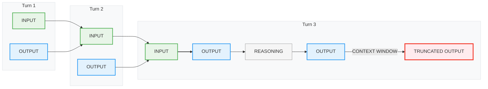
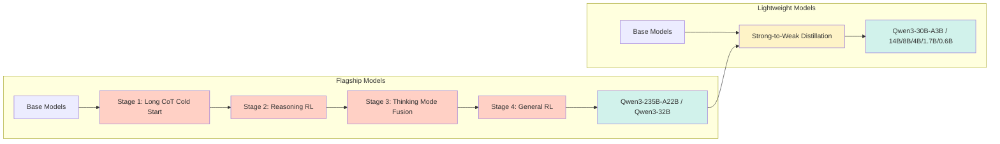

import Sidenote from '../../components/Sidenote.astro';
import Image from '../../components/Image.astro';
import HtmlEmbed from '../../components/HtmlEmbed.astro';
import Note from '../../components/Note.astro';
import Wide from '../../components/Wide.astro';
import Quote from '../../components/Quote.astro';
import Reference from '../../components/Reference.astro';
import FullWidth from '../../components/FullWidth.astro';
import image_27c1384e_bcac_807c_807b_fac08be1d884 from '../assets/image/image_27c1384e-bcac-807c-807b-fac08be1d884.png';
import image_2931384e_bcac_80c4_ab02_f22c53e6fdee from '../assets/image/image_2931384e-bcac-80c4-ab02-f22c53e6fdee.png';
import image_2931384e_bcac_8062_bc11_d1ee3706d996 from '../assets/image/image_2931384e-bcac-8062-bc11-d1ee3706d996.png';
import Capture_decran_2025_10_20_a_13_25_47_2921384e_bcac_8087_83e5_fa7a40c1f342 from '../assets/image/Capture_decran_2025-10-20_a_13_25_47_2921384e-bcac-8087-83e5-fa7a40c1f342.png';
import Capture_decran_2025_10_20_a_13_26_08_2921384e_bcac_80b5_ac36_fb73d6374208 from '../assets/image/Capture_decran_2025-10-20_a_13_26_08_2921384e-bcac-80b5-ac36-fb73d6374208.png';
import img_75ae60ff_50be_48e1_aad2_a8fc56120d3d_2921384e_bcac_80c2_984b_d81404e4bb7c from '../assets/image/75ae60ff-50be-48e1-aad2-a8fc56120d3d_2921384e-bcac-80c2-984b-d81404e4bb7c.png';
import Capture_decran_2025_10_21_a_11_11_38_2931384e_bcac_8008_ad8d_d5ab0c539d3a from '../assets/image/Capture_decran_2025-10-21_a_11_11_38_2931384e-bcac-8008-ad8d-d5ab0c539d3a.png';
import Capture_decran_2025_10_21_a_15_34_27_2931384e_bcac_8066_834b_c485ae8d1fa5 from '../assets/image/Capture_decran_2025-10-21_a_15_34_27_2931384e-bcac-8066-834b-c485ae8d1fa5.png';
import image_2471384e_bcac_8059_84a4_d4ce5ae3847c from '../assets/image/image_2471384e-bcac-8059-84a4-d4ce5ae3847c.png';
import Capture_decran_2025_10_27_a_22_10_05_2991384e_bcac_802a_a6e6_dab0f9f410ec from '../assets/image/Capture_decran_2025-10-27_a_22_10_05_2991384e-bcac-802a-a6e6-dab0f9f410ec.png';
import Screenshot_2025_10_24_at_09_37_24_2961384e_bcac_8055_9e8e_ffbd3a1aa368 from '../assets/image/Screenshot_2025-10-24_at_09_37_24_2961384e-bcac-8055-9e8e-ffbd3a1aa368.png';
import Screenshot_2025_09_26_at_22_36_40_27a1384e_bcac_8063_94e0_f1c689e7d9b9 from '../assets/image/Screenshot_2025-09-26_at_22_36_40_27a1384e-bcac-8063-94e0-f1c689e7d9b9.png';
import GtU8DnoWsAAruEG_28e1384e_bcac_8051_8122_ed6cacf8f632 from '../assets/image/GtU8DnoWsAAruEG_28e1384e-bcac-8051-8122-ed6cacf8f632.png';
import Screenshot_2025_10_01_at_11_31_19_28e1384e_bcac_8005_8c5e_f0af3bf70372 from '../assets/image/Screenshot_2025-10-01_at_11_31_19_28e1384e-bcac-8005-8c5e-f0af3bf70372.png';
import Screenshot_2025_10_30_at_13_02_36_29c1384e_bcac_80d6_a72d_ff34bc221b60 from '../assets/image/Screenshot_2025-10-30_at_13_02_36_29c1384e-bcac-80d6-a72d-ff34bc221b60.png';
import image_2881384e_bcac_80d6_84fe_d705cb1eae0a from '../assets/image/image_2881384e-bcac-80d6-84fe-d705cb1eae0a.png';
import image_2881384e_bcac_801d_9f3d_c875181b9dd1 from '../assets/image/image_2881384e-bcac-801d-9f3d-c875181b9dd1.png';
import image_2881384e_bcac_80ed_9bdf_c077977d77b8 from '../assets/image/image_2881384e-bcac-80ed-9bdf-c077977d77b8.png';
import lstopo_29c1384e_bcac_80c9_9715_cbfe9e73d86b from '../assets/image/lstopo_29c1384e-bcac-80c9-9715-cbfe9e73d86b.jpg';

<Image src={lstopo_29c1384e_bcac_80c9_9715_cbfe9e73d86b} alt="Image" />
import image_2891384e_bcac_80e2_9cc5_c2c46c7ab39b from '../assets/image/image_2891384e-bcac-80e2-9cc5-c2c46c7ab39b.png';
import image_27d1384e_bcac_80b1_9ffb_ec29d0021ccc from '../assets/image/image_27d1384e-bcac-80b1-9ffb-ec29d0021ccc.png';

## 引言

在今天训练一个高性能LLM究竟需要什么？

<Sidenote>

阅读时间：2-4天。

</Sidenote>

已发表的研究让它看起来很简单：战略性架构选择、精心策划的数据集和充足的计算资源。结果经过修饰，消融实验结构清晰、干净。每个决策在事后看来都显而易见。但这些报告只展示了有效的方法，并添加了一些玫瑰色的回顾——它们没有捕捉到凌晨2点的数据加载器调试会话、损失峰值，或者悄然破坏你训练的细微张量并行bug（见后文！）。现实更加混乱、更加迭代，充满了无法进入最终论文的决策。

<Image src={Capture_decran_2025_10_27_a_22_10_05_2991384e_bcac_802a_a6e6_dab0f9f410ec} alt="Image" />

加入我们，一起揭开[SmolLM3](https://huggingface.co/HuggingFaceTB/SmolLM3-3B)背后的幕后故事，这是一个在11T tokens上训练的3B参数多语言推理模型。这不是一份普通指南，而是对导致深刻见解的决策、发现和死胡同蜘蛛网的解开，这些见解关于构建世界级语言模型需要什么。

这也是我们长篇模型训练系列的最后一章。我们已经完成了大规模构建数据集（[FineWeb](https://huggingface.co/spaces/HuggingFaceFW/blogpost-fineweb-v1)）、协调数千个GPU齐声歌唱（[Ultra-Scale Playbook](https://huggingface.co/spaces/nanotron/ultrascale-playbook)），以及在流程每一步选择最佳评估（[LLM Evaluation Guidebook](https://github.com/huggingface/evaluation-guidebook)）。现在，我们将所有东西整合在一起，构建一个强大的AI模型。我们将带你走过完整的旅程——不仅是在工作中有效的最终配方，还有塑造每个决策的失败、基础设施故障和调试过程。你将看到有前景的小规模消融有时无法扩展到大规模；为什么我们在1T tokens后重新启动训练运行；我们如何在保持强大英语语言能力的同时，平衡多语言性、数学和编码的竞争目标；最后，我们如何后训练一个混合推理模型。

我们试图避免只是列出我们做的所有事情，而是呈现一个关于我们冒险的有组织故事。将此视为给任何试图从"我们拥有优秀数据集和GPU"到"我们构建了一个真正强大的模型"的人的指南。我们希望这种开放性将有助于缩小研究和生产之间的差距，让你的下一次训练运行少一些混乱。

### 如何阅读本指南

你不需要从头到尾阅读整个指南，在这一点上它太长了，不现实地一次性读完。它被结构化为几个不同的部分，可以跳过或单独阅读：

- **训练罗盘：** 关于你是否应该预训练自己模型的高层讨论。我们带你走过在耗尽所有VC资金之前应该问自己的基本问题，以及如何系统地思考决策过程。这是一个高层部分；如果你想直接跳到技术内容，那没问题。

<HtmlEmbed frameless src="/embeds/training-compass.html" />
- **预训练：** 训练罗盘之后的部分涵盖了构建你自己的预训练运行所需的一切知识：如何运行消融实验、选择评估、混合数据源、做出架构选择、调整超参数，最后忍受训练马拉松。如果你不计划从头预训练，而是有兴趣继续预训练（又名中期训练），这个部分也相关。
- **后训练：** 在本指南的这部分中，你将学习从预训练模型中获得最大收益所需的所有技巧。我们将涵盖整个后训练字母表，从SFT、DPO和GRPO开始，以及模型合并的黑暗艺术和炼金术。使这些算法良好工作的大部分知识是通过痛苦的教训学到的，我们将在这里分享我们的经验，希望能为你们省去一些。
- **基础设施：** 如果预训练是蛋糕，后训练是糖霜和顶部的樱桃，那么基础设施就是工业级烤箱。没有它，什么都不会发生，如果它坏了，你快乐的周日烘焙会话会变成火灾危险。关于如何理解、分析、调试GPU集群的知识分散在互联网上的各种库、文档和论坛中。本节将走过GPU布局、CPU/GPU/节点/存储之间的通信模式，以及如何识别和克服瓶颈。

那么我们从哪里开始？选择你觉得最令人兴奋的部分，让我们开始吧！

<Sidenote>

如果你有问题或备注，请在 <a href="https://huggingface.co/spaces/HuggingFaceTB/smol-training-playbook/discussions">社区标签</a> 上打开一个讨论！

</Sidenote>

## 训练罗盘：为什么 → 做什么 → 怎么做

<HtmlEmbed frameless src="/embeds/training-compass-zh.html" />

机器学习领域与优化有着痴迷的关系。我们专注于损失曲线、模型架构和吞吐量；毕竟，机器学习从根本上说是关于优化模型的损失函数。然而，在深入研究这些技术细节之前，有一个更基本的问题经常没有被问到：**我们甚至应该训练这个模型吗？**

如下图所示，开源AI生态系统几乎每天都会发布世界级模型：Qwen、Gemma、DeepSeek、Kimi、Llama 🪦、OLMo，列表每个月都在变长。这些不仅仅是研究原型或玩具示例：它们是生产级模型，涵盖了从多语言理解到代码生成和推理的惊人广度的用例。它们大多数都带有宽松的许可证和随时准备帮助你使用它们的活跃社区。

<iframe class="card card--p0" frameborder="0" width="100%" height="600px" src="https://cfahlgren1-model-release-heatmap.hf.space/"/>

这就提出了一个令人不安的观点：也许 *你* *不需要训练你自己的模型* *。*

这看起来可能是开始"LLM训练指南"的奇怪方式。但许多失败的训练项目并不是因为糟糕的超参数或有bug的代码而失败；它们失败是因为有人决定训练一个他们不需要的模型。所以，在你承诺训练并深入研究 *如何* 执行它之前，你需要回答两个问题：**为什么** 你要训练这个模型？**做什么** 模型你应该训练？没有清晰的答案，你可能会浪费数月的计算和工程时间，构建世界已经拥有的东西，或者更糟的是，构建没人需要的东西。

让我们从 *为什么* 开始，因为如果不理解你的目的，你就无法对接下来发生的事情做出连贯的决策。

<Note title="关于本节" emoji="📍" variant="info">

本节与本指南的其他部分不同：它较少关于实验和技术细节，
更多关于战略规划。我们将带你走过决定<b>你是否需要从头训练以及构建什么模型</b>。

如果你已经深入思考过你的为什么和做什么，
请随意跳到["每个大模型都从小消融开始"](#every-big-model-starts-with-a-small-ablation)进行技术深度探讨。
但如果你不确定，在这里投入时间很可能会为你节省很多后期的努力。

</Note>

### **为什么：没人想回答的问题**

让我们直言不讳地谈谈实践中会发生什么。某人（如果他们幸运的话）获得访问GPU集群的权限，也许是通过研究资助，也许是通过公司的闲置容量，然后思维过程大致如下："我们有100个H100三个月。让我们训练一个模型！"模型大小被任意挑选，数据集从任何可用的东西组装而成。训练开始了。六个月后，在耗尽计算预算和团队士气之后，得到的模型闲置不用，因为从来没有人问过 *为什么。*

以下是一些你不应该训练模型的原因：

<HtmlEmbed frameless src="/embeds/wrong-reasons-zh.html" />

"我们训练了自己的模型"的诱惑很强大，但在投入大量时间和资源之前，有必要问：**为什么我们需要训练这个模型？**

以下流程图指导在开始大型预训练项目之前应该经历的思考过程。从技术角度来看，你基本上应该首先查明是否有现有模型可以提示或微调来完成工作。

<HtmlEmbed frameless src="/embeds/train-model-decision-flowchart-zh.html" />

基本上有三个常见领域，自定义预训练可能有意义：你想做新颖的研究，你对生产用例有非常具体的需求，或者你想填补开放模型生态系统中的空白。让我们快速看看每一个。

#### **研究：你想理解什么？**

在LLM领域可以做很多研究。LLM研究项目的共同点是，你通常从一个明确定义的问题开始：

- 我们可以在这个新优化器上扩展到10B+模型吗？（见["Muon对LLM训练可扩展"](https://huggingface.co/papers/2502.16982)）
- 仅通过强化学习，没有监督微调（SFT），能产生推理能力吗？（见["DeepSeek-R1：通过强化学习激励LLM中的推理能力。"](https://huggingface.co/papers/2501.12948)）
- 我们可以在纯合成教科书数据上训练好的小模型吗？（见["Textbooks Are All You Need。"](https://huggingface.co/papers/2306.11644)）
- 我们可以仅通过使用公开许可的数据来取得竞争性能吗？（见["The Common Pile v0.1：一个8TB的公有领域和开放许可文本数据集。"](https://huggingface.co/papers/2506.05209)）

使假设尽可能具体并思考必要的实验规模会增加成功的机会。

#### **生产：为什么不能使用现有模型？**

公司不能将现成模型用于其用例的三个主要原因。其中两个是技术性的，另一个是由于治理。

训练自己模型的第一个原因是 **领域特定性** ：当你的数据或任务涉及现有模型无法很好处理的极专业词汇或结构时。例如，你可能想训练：

- 具有独特词汇表和长距离依赖关系的DNA模型
- 需要深度熟悉领域特定术语和逻辑的法律或金融模型

第二个相关原因是 **部署约束** ：当你需要为硬件、延迟或隐私要求量身定制模型时。这里的例子可能是运行在无人机上的LLM或具有定制硬件的本地系统，如FPGA。

这里有一个简单的测试：花费几天时间在Qwen3、Gemma 3或另一个当前最先进（SOTA）模型之上构建。你能否通过提示、工具使用或后训练达到你的性能目标？如果不能，那可能就是时候训练你自己的模型了。

即使满足你要求的后训练预算巨大，它可能仍然比从头开始训练10T+ tokens更经济。为1T tokens微调你的模型比从头开始训练更经济。

<Sidenote>

在这一点上，LLM训练器开始奇迹般地称之为中期训练
而不是后训练。

</Sidenote>

建立自己内部语言模型的第三个原因是 **安全和治理** ：你需要完全控制训练数据、模型行为和更新周期，因为你在受监管的行业中或高风险应用中。你需要 *确切地* 知道什么进入了模型，并能够向监管机构证明这一点。在某些情况下，除了构建你自己的模型，你可能别无选择。

这些是公司训练内部模型的主要原因——但那些发布开放模型的公司或组织呢？

#### **战略开源：你看到你可以填补的空白吗？**

经验丰富的AI实验室发布新开放模型的最常见原因之一是，他们已经确定了开放源代码生态系统中的一个特定空白或新的AI用例。

模式通常看起来像这样：你注意到一个未被充分探索的领域——也许没有具有非常长上下文的强大设备上模型，或者多语言模型存在但在低资源语言上很弱，或者该领域正在向像[Genie 3](https://deepmind.google/discover/blog/genie-3-a-new-frontier-for-world-models/)这样的交互式世界模型发展，但没有好的开放权重模型存在。

你有理由相信你可以做得更好；也许你已经策划了更好的训练数据，开发了更好的训练配方，或者有计算资源在别人不能的地方过度训练。你的目标是具体的：不是"有史以来最好的模型"，而是"用于设备上使用的最好3B模型"或"第一个具有1M-token上下文窗口的小模型"。

这是一个真正的目标，成功创造价值：开发者采用你的模型，它成为其他人的基础设施，或者它建立了技术信誉。但成功需要经验。你需要知道什么实际上是可行的，以及如何在竞争空间中可靠地执行。为了使这一点具体化，让我们看看我们在Hugging Face是如何思考这个问题的。

#### **Hugging Face的旅程**

那么为什么Hugging Face要训练开放模型？答案很简单：我们构建对开放源代码生态系统有用的东西，并填补很少有人正在填补的空白。

<Sidenote>

尽管有数百万个开放权重模型，但训练完全开放模型的组织非常少。除了Hugging Face，还有[AI2](https://allenai.org/)和[Stanford's Marin community](https://marin.community/)。

</Sidenote>

这包括数据集、工具链和训练模型。我们开始的每一个LLM训练项目都始于注意到一个空白，并相信我们可以贡献一些有意义的东西。

我们在GPT-3 [@gpt3]发布后开始了我们的第一个LLM项目。当时，感觉没有其他人正在构建开放替代方案，我们担心知识最终会锁定在少数行业实验室中。所以我们启动了[BigScience workshop](https://bigscience.huggingface.co/)来训练GPT-3的开放版本。得到的模型是[BLOOM](https://huggingface.co/bigscience/bloom)，由数十个贡献者创建，他们工作了一年来构建训练栈、分词器和预训练语料库，以预训练一个175B参数模型。

BLOOM的继任者是StarCoder，在2022年[@starcoder]。OpenAI已经为GitHub Copilot开发了Codex [@codex]，但它是闭源的。构建一个开源替代方案显然会为生态系统提供价值。因此，在与ServiceNow的合作下，在[BigCode](https://huggingface.co/bigcode)的保护伞下，我们构建了[The Stack](https://huggingface.co/datasets/bigcode/the-stack)数据集，并且我们训练了[StarCoder 15B](https://huggingface.co/bigcode/starcoder)来重现Codex。[StarCoder2](https://huggingface.co/collections/bigcode/starcoder2-65de6da6e87db3383572be1a) [@starcoder2]来自于我们认识到可以训练更长时间，并认识到在小模型上训练更长时间可能比一个大模型更有价值。我们在一个多万亿tokens上训练了一个家族（3B/7B/15B），远超当时任何人为开放代码模型所做的事情。

[SmolLM家族](https://huggingface.co/HuggingFaceTB)遵循了类似的模式。我们注意到很少有强大的小模型，并且我们刚刚构建了[FineWeb-Edu](https://huggingface.co/datasets/HuggingFaceFW/fineweb-edu) [@fineweb]，这是一个强大的预训练数据集。[SmolLM](https://huggingface.co/collections/HuggingFaceTB/smollm-6695016cad7167254ce15966) (135M/360M/1.7B)是我们的第一个版本。[SmolLM2](https://huggingface.co/collections/HuggingFaceTB/smollm2-6723884218bcda64b34d7db9) [@smollm2]专注于更好的数据和更长时间的训练，在多个前沿达到SOTA性能。[SmolLM3](https://huggingface.co/HuggingFaceTB/SmolLM3-3B)扩展到3B参数，同时添加了混合推理、多语言性和长上下文，这些都是社区在2026年重视的功能。

这种模式延伸到预训练之外：我们训练[Zephyr](https://huggingface.co/HuggingFaceH4/zephyr-7b-alpha) [@zephyr]来展示直接偏好优化（DPO）在规模上工作，启动了[Open-R1](https://github.com/huggingface/open-r1)来重现DeepSeek-R1的蒸馏流程，并为竞技编程发布了[OlympicCoder](https://huggingface.co/open-r1/OlympicCoder-7B)，在国际信息学奥林匹克中具有SOTA性能。我们还通过[SmolVLM](https://huggingface.co/collections/HuggingFaceTB/smolvlm-6740bd584b2dcbf51ecb1f39) [@smolvlm]用于视觉和[SmolVLA](https://huggingface.co/lerobot/smolvla_base) [@smolvla]用于机器人技术，探索了其他模态。

<Sidenote>

如果你对我们的HF科学项目感到好奇，
你可以在这里找到概述 <a href="https://huggingface.co/science" target="_blank">https://huggingface.co/science</a>

</Sidenote>

希望本节已经说服你，深入思考为什么要训练模型是有价值的。

对于本指南的其余部分，我们将假设你已经完成了这种灵魂搜索，并且有合法的理由进行训练。

### 做什么：将目标转化为决策

现在你知道 *为什么* 你要训练，*做什么* 你应该训练？通过"做什么"，我们指的是模型类型（稠密、专家混合、混合、新东西）、模型大小、架构细节和数据混合。一旦你确定了为什么，你就可以推导出做什么。例如：

- 用于设备上的快速模型 → 高效小模型
- 多语言模型 → 大型分词器词汇表
- 超长上下文 → 混合架构

除了由用例驱动的决策外，还有一些选择可以优化训练本身，通过更稳定、更样本高效或更快。这些决策并不总是那么明确，但你可以将决策过程大致划分为这些阶段：

- **规划：** 在运行实验之前，将你的用例映射到你需要决定的组件。你的部署环境决定了模型大小约束。你的时间线决定了你可以承担哪些架构风险。你的目标能力决定了数据集要求。这个阶段是关于将你的"为什么"中的每个约束连接到你"做什么"中的具体规格。
- **验证：** 一旦你有一个起点和潜在修改列表，系统地测试。由于测试是昂贵的，专注于可能对你的用例性能产生有意义改进或优化训练的变更。这就是消融实验发挥作用的地方，在["每个大模型都从小消融开始，"](#every-big-model-starts-with-a-small-ablation)中有介绍。

<Note title="学会识别什么是值得测试的，而不仅仅是如何运行测试。" emoji="📍" variant="info">

对不相关选择进行完美的消融实验浪费的计算资源与对重要选择进行草率的消融实验一样多。

</Note>

在接下来的章节中，你将学习所有你可以用来定义模型的选项，以及如何通过系统的实验缩小选择范围。在去那里之前，我们想分享一些关于如何建立我们已经从训练我们自己的模型以及观察其他令人惊叹的团队构建伟大LLM中学到的团队和项目的经验。

### 超级力量：速度和数据

当然，有很多方法可以到达罗马，但我们发现，持续将成功的LLM训练团队区分开来的是 *迭代速度* 。训练LLM真的是一种边做边学的学科：你训练得越频繁，你的团队就会变得越好。因此，在每年训练一个模型的团队和每季度训练一个模型的团队之间，后者将改进得更快。你可以看看Qwen和DeepSeek的团队作为例子。现在是家喻户晓的名字，他们有一长串在快速节奏上持续发布新模型的记录。

除了迭代速度，迄今为止LLM训练中最有影响力的方面是 *数据策划* 。有一种自然的倾向，即深入架构选择以改善模型，但擅长LLM训练的团队是那些对高质量数据着迷超过其他任何东西的团队。

与迭代速度相关的另一个方面是 *团队规模* 。对于主要的预训练任务，你只需要少数几个人，配备足够的计算资源来执行。今天要预训练像Llama 3这样的模型，你可能只需要两到三个人。一旦你开始冒险进入更多样的训练和下流任务（多模态、多语言、后训练等），你将需要添加更多几个人在每个领域表现出色。

所以，从一个小而装备精良的团队开始，每两到三个月构建一个新模型，在很短的时间内，你就会爬到顶部。本指南的其余部分将专注于这个团队的技术日常活动！

## 每个大模型都从小消融开始

在我们能够开始训练LLM之前，我们需要做出许多决策，这些决策将塑造模型的性能和训练效率。哪种架构最能服务于我们的用例？我们应该使用什么优化器和学习率调度器，以及我们应该混合哪些数据源？

这些决策是如何做出的，这是一个经常被问到的问题。人们有时期望它们需要深度思考。虽然战略思维至关重要——正如我们在[上一节](#training-compass-why--what--how)中介绍的——但仅凭推理是不够的。LLM的很多东西并不总是直观的，关于什么应该有效的假设有时在实践中不会成功。

例如，使用看起来像"最高质量数据"的东西并不总是产生更强大的模型。以[arXiv](https://arxiv.org/)为例，这是人类科学知识的巨大集合。直观地说，在如此丰富的STEM数据上训练应该产生 superior 模型，对吧？在实践中，它不会，特别是对于较小的模型，它甚至可能损害性能[@grpo]。为什么？虽然arXiv论文充满了知识，但它们是高度专业化的，并且以狭窄的学术风格撰写，这与模型学习最好的多样化、通用文本截然不同。

那么，如果长时间努力盯着问题没有帮助，我们怎么知道什么有效？我们像好的经验主义者一样运行大量实验！机器学习不是纯数学，但实际上非常实验性。

<Sidenote>

在许多方面，机器学习类似于在统计力学发现之前的 thermodynamics：我们有可靠的经验定律和设计原则，效果非常好，即使更深层理论解释仍在出现。

</Sidenote>

由于这些实验将指导我们的许多关键决策，所以很好地设置它们非常重要。我们实际上希望从这些实验中获得两个主要属性：

1. **速度：** 它们应该尽可能快地运行，这样我们就可以经常迭代。我们可以运行的消融实验越多，我们可以测试的假设就越多。
2. **可靠性：** 它们应该提供强大的判别能力。如果我们早期查看的指标无法有意义地区分不同的设置，我们的消融实验可能揭示很少（如果它们有噪声，我们风险追逐噪声！）。有关更多细节，请查看我们关于将FineWeb扩展到1000+语言的[博客文章](https://huggingface.co/spaces/HuggingFaceFW/blogpost-fine-tasks)。

但在我们可以设置消融实验之前，我们需要关于架构类型和模型大小做出一些基础性选择。这些决策——由我们的罗盘指导——影响要使用什么训练框架、如何分配我们的计算预算，以及从哪个基线开始。

对于SmolLM3，我们选择了具有3B参数的稠密Llama风格架构，因为我们的目标是小型设备上模型。但正如你将在["设计模型架构"](#designing-the-model-architecture)中看到的，专家混合（MoE）或混合模型可能更适合你的用例，不同的模型大小伴随着不同的权衡。我们稍后将深入探讨这些选择，并向你展示如何做出这些决策。现在，让我们从最实际的第一步开始：选择你的基线。

### **选择你的基线**

每个成功的模型都建立在经过验证的基础上，并根据其需求进行修改。当Qwen训练他们的第一个模型家族[@qwen1]时，他们从Llama的架构开始。当Meta训练Llama 3时，他们从Llama 2开始。Kimi K2从DeepSeek-V3的MoE架构开始。这不仅适用于架构，也适用于训练超参数和优化器。

为什么？设计好的架构和训练设置需要跨许多组织的多年迭代。标准transformer和像Adam这样的优化器已经通过数千次实验进行了改进。人们已经发现了它们的故障模式，调试了不稳定性，优化了实现。从经过验证的基础开始意味着继承了所有那些积累的知识。从零开始意味着自己重新发现每个问题。

要做一个好的起点，架构应该：

- **匹配你的约束** ，与你的部署目标和用例对齐
- **在规模上得到验证** （在类似或更大尺寸的多万亿token运行中得到了证明）
- **有良好文档** ，具有已被证明在开放模型中有效的已知超参数
- **有良好的框架支持** （理想情况下，它应该在你正在考虑的训练框架和你计划使用的推理框架中得到支持）

以下是写这篇文章时（2026年初），针对各种架构和模型大小的一个不详尽的强大2025基线选项列表：

| 架构类型 | 模型家族 | 大小 |
| --- | --- | --- |
| **稠密** | [Llama 3.1](https://huggingface.co/collections/meta-llama/llama-31-669fc079a0c406a149a5738f) | 8B, 70B |
| **稠密** | [Llama 3.2](https://huggingface.co/collections/meta-llama/llama-32-66f448ffc8c32f949b04c8cf) | 1B, 3B |
| **稠密** | [Qwen3](https://huggingface.co/collections/Qwen/qwen3-67dd247413f0e2e4f653967f) | 0.6B, 1.7B, 4B, 14B, 32B |
| **稠密** | [Gemma 3](https://huggingface.co/collections/google/gemma-3-release-67c6c6f89c4f76621268bb6d) | 12B, 27B |
| **稠密** | [SmolLM2](https://huggingface.co/collections/HuggingFaceTB/smollm2-6723884218bcda64b34d7db9), [SmolLM3](https://huggingface.co/HuggingFaceTB/SmolLM3-3B) | 135M, 360M, 1.7B, 3B |
| **MoE** | [Qwen3 MoE](https://huggingface.co/collections/Qwen/qwen3-67dd247413f0e2e4f653967f) | 30B-A3B, 235B-A122B |
| **MoE** | [gpt-oss](https://huggingface.co/collections/openai/gpt-oss-68911959590a1634ba11c7a4) | 21B-A3B, 117B-A5B |
| **MoE** | [Kimi Moonlight](https://huggingface.co/moonshotai/Moonlight-16B-A3B-Instruct) | 16B-A3B |
| **MoE** | [Kimi K2](https://huggingface.co/collections/moonshotai/kimi-k2-6871243b990f2af5ba60617d) | 1T-A32B |
| **MoE** | [DeepSeek-V3](https://huggingface.co/deepseek-ai/DeepSeek-V3) | 671B-A37B |
| **混合** | [Zamba2](https://huggingface.co/Zyphra/models?search=zamba2) | 1.2B, 2.7B, 7B |
| **混合** | [Falcon-H1](https://huggingface.co/collections/tiiuae/falcon-h1-6819f2795bc406da60fab8df) | 0.5B, 1.5B, 3B, 7B, 34B |
| **MoE + 混合** | [Qwen3-Next](https://huggingface.co/Qwen/Qwen3-Next-80B-A3B-Instruct) | 80B-A3B |
| **MoE + 混合** | [MiniMax-01](https://huggingface.co/MiniMaxAI/MiniMax-Text-01) | 456B-A46B |
| **MoE + 混合** | [MiMo-V2-Flash](https://huggingface.co/XiaomiMiMo/MiMo-V2-Flash) | 309B-A15B |

找到你的架构类型，并选择一个接近你希望模型具有的参数数量级的基线。不要过度思考它，因为你开始的架构不是一成不变的。在下一节中，你将看到如何从基线到为你的目标优化的最终架构。

#### **修改你的基线：去风险化的纪律**

你现在有一个有效的基线，并且适合你的用例。你可以在这里停止，训练它，并且（假设你的数据混合是好的）可能会得到一个不错的模型。许多成功的项目正是这样做的。但基线并没有针对你的特定约束进行优化；它们是为构建它们的人的用例和部署目标设计的。这意味着可能有值得进行的修改，以更好地与你的目标对齐。然而，每个架构变更都带有风险：它可能提升性能，破坏它，或者在浪费你的消融计算资源的同时什么都不做。

使你能保持正轨的纪律是 *去风险化* ：除非你已经测试过它有帮助，否则永远不要改变任何东西。

<Note title="什么算作去风险化？" emoji="📍" variant="info">

当测试显示它要么在你的目标能力上提升性能，
要么提供有意义的好处
（例如，更快的推理、更低的内存、更好的稳定性）而不在
你可接受的限度之外损害性能时，
变更就被去风险化了。

</Note>

棘手的部分是，你的基线和训练设置有许多组件可以修改：注意力机制、位置编码、激活函数、优化器、训练超参数、归一化方案、模型布局等等。每一个都代表一个潜在的实验，并且这些组件经常以非线性方式相互作用。你既没有时间也没有计算资源来测试所有东西或探索每一个相互作用。

所以，从针对你当前基线测试有希望的变更开始。当某些东西有效时，将其整合以创建一个新的基线，然后针对该基线测试下一个变更。如果你的计算预算允许，你可以单独测试变更并运行逐一离开分析。不要陷入对每一个超参数或测试每一个出现的架构变体进行详尽网格搜索的陷阱。

<Sidenote>

查看ScaleRL论文[@scalerl]了解这种方法在实践中的例子。

</Sidenote>

<Note title="战略实验" emoji="🎯" variant="success">

知道如何运行实验是不够的；你需要知道哪些实验值得运行。
在测试任何修改之前问自己两个问题：
- 这会帮助我的特定用例吗？
- 这会优化我的训练吗？

如果修改不能清楚地解决任何一个目标，就跳过它。

</Note>

既然你知道如何通过战略规划识别什么是有希望的，现在是时候转向经验验证了。在接下来的部分中，我们将向你展示如何在实践中实际测试这些变更。我们将涵盖如何设置可靠的实验、解释结果，并避免常见的陷阱。然后，在接下来的章节中，我们将走过测试流行架构、数据、基础设施和训练决策的具体例子。

### 选择训练框架

我们需要做的第一个决策是使用哪个框架来训练我们的模型，以及扩展来说，运行我们所有的消融实验。

<Sidenote>

不要做英雄，在消融实验和最终运行之间切换训练框架。那是通往痛苦的道路。

</Sidenote>

这个选择涉及平衡三个关键考虑因素：

1. 框架必须支持我们的目标架构，或者让我们容易扩展它。
2. 它需要稳定且生产就绪，并且不会在训练中途神秘地崩溃。
3. 它应该提供强大的吞吐量，这样我们就可以快速迭代，并充分利用我们的计算预算。

在实践中，这些要求可能会相互拉扯，造成权衡。让我们看看一些可用的选项：

<Wide>

| 框架 | 功能 | 战斗测试 | 优化 | 代码行数（核心/总计） | 可扩展性和调试 |
| --- | --- | --- | --- | --- | --- |
| **Megatron-LM** | ✅ 广泛 | ✅ Kimi K2, Nemotron | ✅ 3D并行性的先驱 | 93k / 269k | ⚠️ 对初学者困难 |
| **DeepSpeed** | ✅ 广泛 | ✅ BLOOM, GLM | ✅ ZeRO和3D并行性的先驱 | 94k / 194k | ⚠️ 对初学者困难 |
| **TorchTitan** | ⚡ 不断增长的功能集 | ⚠️ 较新但由PyTorch团队测试 | ⚡ 针对稠密模型优化，MoE改进正在进行中 | 7k / 9k | ⚡ 中等：需要并行性知识 |
| **Nanotron** | 🎯 最小化，为HF预训练量身定制 | ✅ 是（StarCoder, SmolLM） | ✅ 优化（Ultra-Scale Playbook） | 15k / 66k | ⚡ 中等：需要并行性知识 |

</Wide>

此表总结了流行框架之间的关键权衡。前三个框架的代码行数来自TorchTitan技术报告[@torchtitan]。让我们更详细地讨论每一个：

- NVIDIA的[Megatron-LM](https://github.com/NVIDIA/Megatron-LM)已经存在多年，并且经过了战斗测试。它是像Kimi的K2 [@kimik2]这样的模型的动力；它提供稳定的吞吐量，并拥有我们想要的大多数生产功能。但这种成熟度伴随着复杂性：代码库可能难以导航和修改，当你刚接触它时。
- [DeepSpeed](https://github.com/deepspeedai/DeepSpeed)属于类似类别。它是ZeRO优化的先驱，并为BLOOM和GLM等模型提供动力。像Megatron-LM一样，它经过了广泛的战斗测试和优化，但它共享相同的复杂性挑战。大型代码库（总计194k行）可能在你开始时会令人生畏，特别是对于实现自定义功能或调试意外行为。
- 另一方面，PyTorch最近的[TorchTitan](https://github.com/pytorch/torchtitan)库由于其紧凑和模块化的代码库，导航起来要轻得多，也更简单。它拥有预训练所需的核心功能，并且非常适合快速实验。然而，由于较新，它没有经过那么多的战斗测试，并且由于正在积极开发，可能仍然有些不稳定。
- [Nanotron](https://github.com/huggingface/nanotron)是我们从头开始构建的框架。这给了我们完全的灵活性和对大规模预训练的深度理解——这些见解后来演变成[Ultra-Scale Playbook](https://huggingface.co/spaces/nanotron/ultrascale-playbook)。由于我们开源了这个库，我们也从社区获得了宝贵的反馈，尽管在大多数情况下，我们必须首先自己战斗测试功能。该框架现在支持我们训练所需的所有生产功能，但我们仍在构建像MoE支持这样的领域。

从头开始构建在我们的案例中是有意义的，但它要求在团队专业知识和调试问题以及添加缺失功能方面进行重大投资。一个强大的替代方案是fork现有框架并针对你的需求进行增强。例如，Thinking Machines Lab将他们的内部预训练库构建为[TorchTitan的一个分支](https://x.com/cHHillee/status/1949470943291805832)。

<HtmlEmbed src="embeds/d3-sft-think-follow-0.html" />

最终，你的选择将取决于你团队的专业知识、你的目标功能，以及你愿意在开发上投入多少时间而不是使用最生产就绪的选项。

如果多个框架支持你的需求，在你的特定硬件上比较它们的吞吐量。对于快速实验和速度运行，更简单的代码库通常获胜。

### 消融设置

随着框架的选择，我们现在需要设计我们的消融设置。我们需要足够快的实验来快速迭代，但又要足够大，以便结果给我们信号并转移到最终模型。

#### 设置我们的消融框架

消融的目的是在小规模上运行实验，并获得我们可以自信地外推到我们最终生产运行的结果。

有两种主要方法。首先，我们可以采用我们的目标模型大小并在更少的tokens上训练它。对于SmolLM3消融，我们在100B tokens而不是最终的11T上训练完整的3B模型。其次，如果我们的目标模型太大，我们可以训练一个更小的代理模型进行消融。例如，当Kimi开发他们具有32B活跃参数的1T参数K2模型时，对所有消融使用完整大小将非常昂贵，所以他们在具有0.5B活跃参数的3B MoE上运行一些消融[@kimik2]。

一个关键问题是，这些小规模发现是否真的转移。根据我们的经验，如果某些东西在小规模上损害性能，你可以自信地将其排除在大规模之外。但如果某些东西在小规模上有效，你需要确保你已经训练了合理数量的tokens，以便以高概率得出结论，这些发现将外推到更大规模。你训练的时间越长，消融模型越接近最终模型，效果就越好。

我们决定使用基线vanilla transformer进行所有消融。我们的主要设置是一个遵循[Llama 3.2 1B](https://huggingface.co/meta-llama/Llama-3.2-1B)架构的1B transformer，在45B tokens上训练。使用八个H100的节点，使用[这个](https://huggingface.co/datasets/HuggingFaceTB/training-guide-nanotron-configs/blob/main/baseline_config_1B.yaml) Nanotron配置（每个GPU每秒42k tokens），训练大约需要一天半。

<Sidenote>

我们训练45B tokens以确保获得稳定信号，尽管对于这个模型大小，~35B是<a href="https://arxiv.org/abs/2203.15556" target="_blank">Chinchilla最优</a>的。

</Sidenote>

我们的基线1B配置以结构化YAML格式捕获所有基本训练细节。以下是关键部分：

```yaml
## 数据集和混合权重
data_stages:
- data:

    dataset:
      - fineweb-edu
      - stack-edu-python
      - finemath-3plus

    dataset_weights:
      - 0.7
      - 0.2
      - 0.1

## 模型架构，Llama 3.2 1B配置
model:
  model_config:
    hidden_size: 2048
    num_hidden_layers: 16
    num_attention_heads: 32
    num_key_value_heads: 8  
    intermediate_size: 8192
    max_position_embeddings: 4096
    rope_theta: 50000.0
    tie_word_embeddings: true

## 训练超参数，带余弦调度器的AdamW
optimizer:
  clip_grad: 1.0
  learning_rate_scheduler:
    learning_rate: 0.0005
    lr_decay_starting_step: 2000
    lr_decay_steps: 18000
    lr_decay_style: cosine
    lr_warmup_steps: 2000
    lr_warmup_style: linear
    min_decay_lr: 5.0e-05
  optimizer_factory:
    adam_beta1: 0.9
    adam_beta2: 0.95
    adam_eps: 1.0e-08
    name: adamW

## 并行性，1个节点
parallelism:
  dp: 8  # 跨8个GPU的数据并行
  tp: 1  # 在1B规模不需要张量或流水线并行性
  pp: 1 

## 分词器
tokenizer:
  tokenizer_max_length: 4096
  tokenizer_name_or_path: HuggingFaceTB/SmolLM3-3B

## 批次大小、序列长度和总共训练30B tokens
tokens:
  batch_accumulation_per_replica: 16
  micro_batch_size: 3 # GBS（全局批次大小）=dp * batch_acc* MBS * sequence=1.5M tokens
  sequence_length: 4096
  train_steps: 20000 # GBS * 20000 = 30B
 
...
```

对于我们的消融，我们将根据我们测试的内容修改不同的部分，同时保持其他一切不变：用于[架构选择](#architecture-choices)的`model`部分，用于[优化器和训练超参数](#optimiser-and-training-hyperparameters)的`optimizer`部分，以及用于[数据策划](#the-art-of-data-curation)的`data_stages`部分。

<Note title="一次修改一件事" emoji="☝️" variant="danger">

一次只改变一个变量，同时保持其他一切不变。
如果你改变多个东西并且性能提升，你将不知道是什么
导致的。单独测试修改，然后结合成功的部分并重新评估。

</Note>

运行消融时，一些架构变更可能会显著改变参数计数。例如，从绑定切换到未绑定嵌入会使我们的嵌入参数翻倍，而使用分组查询或多查询注意力而不是多头注意力会大幅减少我们的注意力参数（我们很快就会讨论所有这些东西）。

为了确保公平比较，我们需要跟踪参数计数，并偶尔调整其他超参数（如隐藏大小或层数）以保持模型大小大致相同。这是一个用于估计不同配置的参数计数的简单函数：

```python
from transformers import LlamaConfig, LlamaForCausalLM

def count_parameters(
    tie_embeddings=True,
    num_key_value_heads=4,
    num_attention_heads=32,
    hidden_size=2048,
    num_hidden_layers=16,
    intermediate_size=8192,
    vocab_size=128256,
    sequence_length=4096,
):
    config = LlamaConfig(
        hidden_size=hidden_size,
        num_hidden_layers=num_hidden_layers,
        num_attention_heads=num_attention_heads,
        num_key_value_heads=num_key_value_heads,
        intermediate_size=intermediate_size,
        vocab_size=vocab_size,
        max_position_embeddings=sequence_length,
        tie_word_embeddings=tie_embeddings,
    )
    model = LlamaForCausalLM(config)  
    return f"{sum(p.numel() for p in model.parameters())/1e9:.2f}B"
```

我们还提供了一个交互式工具来可视化LLM参数分布，在稠密transformer的情况下。这在做出架构决策或为消融设置配置时可能会派上用场。

<HtmlEmbed src="/embeds/parameter-calculator.html" />

<Sidenote>

这个计算器假设标准架构选择：门控前馈网络、注意力的标准头维度（*hidden_size* / *num_heads*），以及每个transformer层的两个层归一化。它不包括偏置项（如果使用）。

</Sidenote>

#### **理解什么有效：评估**

一旦我们启动消融，我们怎么知道什么有效，什么无效？

任何训练模型的人的第一个本能可能是看损失，是的，这很重要。你希望看到它平稳下降，没有疯狂的峰值或不稳定性。对于许多架构选择，损失与下游性能相关性很好，并且可能足够[@chen2025]。然而，只看损失并不总是可靠的。以数据消融为例，你会发现训练在Wikipedia上比训练在网页上给出更低的损失（下一个token更容易预测），但那并不意味着你会得到一个更有能力的模型。类似地，如果我们在运行之间更改分词器，损失不能直接比较，因为文本的分隔方式不同。一些变更也可能特别影响某些能力，如推理和数学，但在平均损失中被冲刷掉。最后但同样重要的是，即使在预训练损失已经收敛[@liu2022]之后，模型也可以继续在下游任务上改进。

我们需要更细粒度的评估来看到全貌，并理解这些微妙的效果。一种自然的方法是使用测试知识、理解、推理和任何其他对我们重要的领域的下游评估。

<Image src={img_75ae60ff_50be_48e1_aad2_a8fc56120d3d_2921384e_bcac_80c2_984b_d81404e4bb7c} alt="Image" />

对于这些消融，关注给出良好早期信号并避免噪声基准测试是有用的。在[FineTasks](https://huggingface.co/spaces/HuggingFaceFW/blogpost-fine-tasks)和[FineWeb2](https://arxiv.org/pdf/2506.20920)中，可靠评估任务由四个关键原则定义：

- **单调性：** 随着模型训练时间更长，基准测试分数应该一致改进。
- **低噪声：** 当我们用相同设置但不同随机种子训练模型时，基准测试分数不应该剧烈变化。
- **高于随机性能：** 许多能力只在后训练期出现，所以长时间显示随机水平性能的任务对消融没有用。例如，对于多项选择格式的MMLU来说，情况就是如此，我们稍后将解释。
- **排名一致性：** 如果一种方法在早期阶段表现优于另一种方法，这种排序应该随着训练继续而保持稳定。

任务的质量还取决于任务表述（我们如何向模型提问）和度量选择（我们如何计算答案分数）。

三种常见的任务表述是 *多项选择格式（MCF）* 、 *完形填空格式（CF）* 和 *自由形式生成（FG）* 。MCF要求模型从提示中明确呈现的多个选项中选择一个选项，并以A/B/C/D为前缀（例如，正如在MMLU中所做的那样）。在CF中，我们比较不同选项的可能性，看看哪个更有可能，而没有在提示中提供它们。在FG中，我们查看给定提示的贪婪生成的准确性。FG需要模型中大量的潜在知识，对于模型来说通常太困难了，在完整训练运行之前的短期预训练消融中真的很有用。因此，我们在运行小规模消融时专注于多项选择表述（MCF或CF）。

<Note title="提前通知" emoji="📍" variant="info">

对于后训练模型，FG成为主要表述，因为
我们正在评估模型是否实际上可以生成有用的响应。
我们将在["超越基础模型——2025年后训练"](#beyond-base-models--后训练-in-2025)中涵盖这些模型的评估。

</Note>

研究还表明，模型在训练早期与MCF斗争，使CF更适合早期信号[@olmes; @du2025; @datacomp]。因此，我们对小规模消融使用CF，并在主运行中加入MCF（因为他在训练的后期阶段给出更好的信号）。为了在像CF这样的序列似然评估中对模型的答案评分，我们将准确率计算为正确答案具有由字符计数归一化的最高对数概率的问题百分比。这种归一化防止了对较短答案的偏见。

<Sidenote>

MMLU MCF变得非随机的点取决于模型大小和训练数据。对于7B transformer，OLMES论文[@olmes]发现模型在500B tokens后开始显示非随机性能。对于1.7B模型，我们发现这在SmolLM2 [@smollm2]中在6T tokens后发生。@du2025认为这从根本上说是关于预训练损失达到某个阈值。

</Sidenote>

我们的消融评估套件包括来自[FineWeb](https://huggingface.co/spaces/HuggingFaceFW/blogpost-fineweb-v1)消融的基准测试，除了SIQA，我们发现它太噪声了。我们添加了数学和代码基准测试，如GSM8K和HumanEval，以及用于长上下文消融的长上下文基准测试RULER。这种任务聚合测试了各种格式的世界知识、推理和常识，如下表所示。为了以一些额外噪声为代价加速评估，我们只评估每个基准测试的1,000个问题（除了GSM8K、HumanEval和RULER，我们在3B SmolLM3消融中使用完整版，但从小实验中省略）。我们使用CF评估所有多项选择基准测试，如前面所解释的。注意，对于多语言消融和实际训练，我们添加更多基准测试来测试多语言性，我们稍后将详细说明。这些评估使用[LightEval](https://github.com/huggingface/lighteval)运行。以下是每个基准测试的关键特征摘要：

| 基准测试 | 领域 | 任务类型 | 问题 | 测试内容 |
| --- | --- | --- | --- | --- |
| MMLU | 知识 | 多项选择 | 14k | 跨57个学科广泛学术知识 |
| ARC | 科学和推理 | 多项选择 | 7k | 年级学校科学推理 |
| HellaSwag | 常识推理 | 多项选择 | 10k | 关于日常情况的常识推理（叙述完成） |
| Winogrande | 常识推理 | 二元选择 | 1.7k | 需要世界知识的代词解析 |
| CommonSenseQA | 常识推理 | 多项选择 | 1.1k | 关于日常概念的常识推理 |
| OpenBookQA | 科学 | 多项选择 | 500 | 带有推理的小学科学事实 |
| PIQA | 物理常识 | 二元选择 | 1.8k | 关于日常物体的物理常识 |
| GSM8K | 数学 | 自由形式生成 | 1.3k | 年级学校数学文字题 |
| HumanEval | 代码 | 自由形式生成 | 164 | 来自文档字符串的Python函数合成 |

让我们从每一个中看几个示例问题，以具体感知这些评估实际测试的内容：

<iframe src="https://huggingface.co/datasets/HuggingFaceTB/llm-benchmarks-viewer/embed/viewer/default/mmlu" class="card card--p0" frameborder="0" width="100%" height="450px"></iframe>

你可以在[交互式版本](https://huggingface.co/datasets/HuggingFaceTB/llm-benchmarks-viewer/viewer)中浏览示例，看看每个基准测试中的问题的类型。注意MMLU和ARC如何使用多项选择测试事实知识，GSM8K需要计算数学问题的数值答案，以及HumanEval需要生成完整的Python代码。这种多样性确保我们在整个消融过程中测试模型能力的不同方面。

**消融使用什么数据混合？**

对于 *架构消融* ，我们在一组固定的高质量数据集上训练，这些数据集在广泛任务范围内提供早期信号。我们使用英语（[FineWeb-Edu](https://huggingface.co/datasets/HuggingFaceFW/fineweb-edu)）、数学（[FineMath](https://huggingface.co/datasets/HuggingFaceTB/finemath)）和代码（[Stack-Edu-Python](https://huggingface.co/datasets/HuggingFaceTB/stack-edu)）。架构发现应该能够很好地外推到其他数据集和领域，包括多语言数据，所以我们可以保持我们的数据混合简单。

对于 *数据消融* ，我们采取相反的方法：我们修复架构并系统地改变数据混合以了解不同数据源如何影响模型性能。

<Sidenote>

有时评估中的差异可能很小。如果你有足够计算资源，可能值得用不同种子重新运行相同的消融，看看结果变化有多大。

</Sidenote>

坚实消融设置的实际价值超越了仅仅构建一个好模型。当我们主训练运行期间出现问题时（并且它们会，无论我们准备得多么充分），我们希望对我们做出的每个决策感到自信，并能够快速识别哪些组件没有经过测试。这种准备节省了调试时间，并保护我们未来的心理 sanity。

#### 估算消融成本

消融是惊人的，但它们需要GPU时间。值得了解这些实验的成本。下表显示了SmolLM3预训练的完计算分解：主运行（考虑了偶尔的停机时间）、之前和期间的消融，加上在计算意外扩展问题上花费的计算，迫使重启和一些调试（我们稍后将详细说明）。

| 阶段 | GPU | 天数 | GPU小时 |
| --- | --- | --- | --- |
| 主预训练运行 | 384 | 30 | 276,480 |
| 消融（预训练） | 192 | 15 | 69,120 |
| 消融（中期训练） | 192 | 10 | 46,080 |
| 训练重置/调试 | 384 / 192 | 3 / 4 | 46,080 |
| **总成本** | - | - | **437,760** |

<Sidenote>

我们估计评估成本略低于10,000 GPU小时。我们的完整评估套件（英语、多语言、数学和代码）每个GPU大约需要1.5小时，我们在整个11T tokens中每10B tokens评估一次，此外还有无数次消融。长上下文评估特别昂贵，每次运行在8个GPU上花费大约1小时。

</Sidenote>

这些数字揭示了一个重要事实：消融和调试总共消耗了161,280 GPU小时，**超过我们主训练运行成本的一半**（276,480 GPU小时）。我们在SmolLM3的开发过程中运行了超过100次消融：我们在预训练消融上花费了20天，在中期训练消融上花费了10天，并在从上述意外训练问题中恢复上花费了7天。

这突出了为什么消融成本必须被纳入你的计算预算：为训练成本加上消融加上意外事件的缓冲区做计划。如果你的目标是SOTA性能，实施新架构变更，或者还没有经过验证的配方，消融将成为实质性的成本中心而不是小型实验。

<Sidenote>

当[DeepSeek-V3](https://huggingface.co/deepseek-ai/DeepSeek-V3)出来时，[世界聚焦于](https://www.forbes.com/sites/markminevich/2025/02/06/the-6-million-ai-bombshell-how-deepseek-shook-wall-street-and-ai-leadership/)其报告的560万美元训练成本。许多人将那个数字解释为完整的研发成本。实际上，它只反映了最终的训练运行。更大——而且通常看不见——的支出是在研究本身：导致最终配方的消融、失败的运行和调试。鉴于模型的比例和新颖性，研究成本肯定更高。

</Sidenote>

在我们继续设计模型架构之前，让我们建立一些每个运行实验的人都应该遵循的基本规则。

### 参与规则

<Quote>

TL;DR：偏执一点。

</Quote>

**验证你的评估套件。** 在训练任何模型之前，确保你的评估套件能够重现你将比较的模型的已发布结果。如果任何基准测试本质上是生成性的（例如，GSM8k），要额外偏执，并手动检查一些样本，以确保提示格式正确，并且任何后处理都在提取正确信息。由于评估将指导每一个单一决策，所以正确完成这一步对项目的成功至关重要！

**测试每一个变更，无论多么小。** 不要低估那个看似无辜的库升级或"只改了两行"的提交的影响。这些小变更可能会引入微妙的bug或性能转变，从而污染你的结果。你需要一个库，在你关心的案例上拥有强大的测试套件，以避免回归。

<Sidenote>

在某些情况下，bug可以通过升级库到最新版本来解决。有关这个的美丽例子和一些侦探调试，请参见Elana Simon的[博客文章](https://elanapearl.github.io/blog/2025/the-bug-that-taught-me-pytorch/?t=1)。

</Sidenote>

**一次改变一件事。** 在实验之间保持其他一切相同。有些变更可能以意想不到的方式相互作用，所以你要首先评估每个变更的个体贡献，然后尝试结合它们以查看它们的整体影响。

**在足够的tokens上训练并使用充分的评估。** 正如我们之前提到的，你需要确保你在评估套件中有良好的覆盖，并训练足够长的时间以获得可靠信号。在这里走捷径将导致噪声结果和糟糕决策。

遵循这些规则可能感觉过于谨慎，但替代方案是花费数天调试神秘的性能下降，结果证明是由数天前不相关的依赖项更新引起的。黄金原则：一旦你有一个好的设置，*没有变更应该未经测试！*
## 设计模型架构

现在我们已经准备好了实验框架，是时候做出定义我们模型的大决策了。我们做出的每一个选择，从模型大小到注意力机制再到分词器，都会创建影响模型训练和使用的约束和机会。

记住[训练罗盘](#training-compass-why--what--how)：在做出任何技术选择之前，我们需要明确*为什么*和*什么*。为什么要训练这个模型，它应该是什么样的？

听起来很明显，但正如我们之前解释的，在这里深思熟虑会塑造我们的决策，防止我们在无尽的可能实验空间中迷失。我们正在追求英语 SOTA 模型？长上下文是优先事项？还是试图验证新架构？训练循环在这些情况下可能看起来相似，但我们运行的实验和接受的权衡会有所不同。尽早回答这些问题有助于我们决定如何在数据和架构工作之间平衡时间，以及在开始运行之前每个方面要创新多少。

所以，让我们以实例为引导，走过指导 SmolLM3 设计的目标。我们需要一个强大的设备上应用模型，具有竞争力的多语言性能、扎实的数学和编码能力，以及稳健的长上下文处理。正如我们之前提到的，这引导我们走向了一个具有 3B 参数的密集模型：足够大以获得强大的能力，但又足够小以适应手机。我们选择了密集 transformer 而不是 MoE 或混合模型，考虑到边缘设备的记忆约束和我们的项目时间线（大约三个月）。

我们有来自较小规模（1.7B 参数）SmolLM2 的英语工作方法，但扩展意味着重新验证一切并应对新的挑战，如多语言性和扩展的上下文长度。明确的目标塑造了我们的方法。例如，在 SmolLM2 中，我们在预训练结束时难以扩展上下文长度，所以在 SmolLM3 中，我们从一开始就做出了架构选择——比如使用 NoPE 和文档内掩码（见后文）——以最大化我们做对的机会，并且它奏效了。

<Sidenote>

SmolLM2 是我们之前的小语言模型系列，有三个变体：135M、360M 和 1.7B 参数，专为设备上部署设计。它们仅支持英语，上下文长度为 8k。
</Sidenote>

一旦我们的目标明确，我们就可以开始做出将它们变为现实的技术决策。在本章中，我们将走过我们对这些核心决策的系统方法：架构、数据和超参数。将此视为战略规划阶段——正确获取这些基础知识将节省您在实际训练马拉松中的代价高昂的错误。

### 架构选择

如果你看看最近像 Qwen3、Gemma 3 或 DeepSeek-V3 这样的模型，你会看到尽管它们有差异，但它们都共享相同的基础：2017 年引入的 transformer 架构 [@transformer]。它的基本结构多年来没有太大变化，但其核心组件已经有了改进。无论您是在构建密集模型、专家混合模型还是混合架构，您都在使用相同的构建块。

这些改进来自推动更好性能和应对特定挑战的团队：推理期间的内存约束、大规模训练不稳定性、处理更长上下文的需求。一些修改，如从多头注意力转移到计算效率更高的注意力变体如分组查询注意力 [@gqa]，已被广泛采用。其他如不同的位置编码方案，仍在争论中。最终，今天的实验将结晶成明天的基线。

那么今天的 LLMs 实际使用什么？让我们看看领先模型已经收敛在什么上。不幸的是，并非所有模型都披露其训练细节，但我们有足够的透明度来自 DeepSeek、OLMo、Kimi 和 SmolLM 等家族，以查看当前的格局：

<Wide>

<Reference id="llms-landscape-pretrain" caption="">

| 模型 | 架构 | 参数 | 训练 Tokens | 注意力 | 上下文长度（最终） | 位置编码 | 精度 | 初始化（标准差） | 优化器 | 最大学习率 | 学习率调度 | 预热步数 | 批次大小 |
| --- | --- | --- | --- | --- | --- | --- | --- | --- | --- | --- | --- | --- | --- |
| DeepSeek LLM 7B | 密集 | 7B | 2T | GQA | 4k | RoPE | BF16 | 0.006 | AdamW | 4.2×10⁻⁴ | 多步 | 2k | 9.4M |
| DeepSeek LLM 67B | 密集 | 67B | 2T | GQA | 4k | RoPE | BF16 | 0.006 | AdamW | 3.2×10⁻⁴ | 多步 | 2k | 18.9M |
| DeepSeek-V2 | MoE | 236B (21B 活跃) | 8.1T | MLA | 128k | 部分 RoPE | - | 0.006 | AdamW | 2.4×10⁻⁴ | 多步 | 2k | 9.4M→37.7M (预热 225B) |
| DeepSeek-V3 | MoE | 671B (37B 活跃) | 14.8T | MLA | 128k | 部分 RoPE | FP8 | 0.006 | AdamW | 2.2×10⁻⁴ | 多步 + 余弦 | 2k | 12.6M→62.9M (预热 469B) |
| MiniMax-01 | MoE + 混合 | 456B (45.9 活跃) | 11.4T | 线性注意力 + GQA | 4M | 部分 RoPE | - | Xavier 初始化与 DeepNorm 缩放 | AdamW | 2×10⁻⁴ | 多步 | 500 | 16M→32M→64M→128M |
| Kimi K2 | MoE | 1T (32B 活跃) | 15.5T | MLA | 128k | 部分 RoPE | BF16 | 可能 0.006 | MuonClip | 2×10⁻⁴ | WSD | 500 | 67M |
| OLMo 2 7B | 密集 | 7B | 5T | MHA | 4k | RoPE | BF16 | 0.02 | AdamW | 3×10⁻⁴ | 余弦 | 2k | 4.2M |
| SmolLM3 | 密集 | 3B | 11T | GQA | 128k | NoPE | BF16 | 0.02 | AdamW | 2×10⁻⁴ | WSD | 2k | 2.3M |

</Reference>

</Wide>

如果您还不理解其中一些术语，如 MLA、NoPE 或 WSD，请不要担心；我们将在本节中解释每一个。现在，只要注意多样性：不同的注意力机制（MHA、GQA、MLA）、位置编码（RoPE、NoPE、部分 RoPE）和学习率调度器（余弦、多步、WSD）。

看着这长长的架构选择列表，甚至弄清楚从哪里开始都有点令人不知所措。在大多数这样的情况下，我们将一步一步来，逐渐建立所有必要的专门知识。我们将首先关注最简单的基础架构（密集模型），并详细研究每个架构方面。稍后，我们将深入探讨 MoE 和混合模型，并讨论何时使用它们是好的选择。最后，我们将探索分词器，这是一个经常被忽视和低评价的组件。我们应该使用现有的还是训练我们自己的？我们如何评估我们的分词器是否良好？

<Note title="Ablation 设置" emoji="📍" variant="info">

在本章的其余部分，我们使用上一章描述的设置来验证大多数架构选择：我们的 1B 基线模型（遵循 Llama 3.2 1B 架构）在来自 FineWeb-Edu、FineMath 和 Python-Edu 的 45B tokens 上训练。对于每个实验，我们展示训练损失曲线和下游评估分数，以评估每个修改的影响。您可以在 [HuggingFaceTB/training-guide-nanotron-configs](https://huggingface.co/datasets/HuggingFaceTB/training-guide-nanotron-configs/tree/main) 中找到所有运行的配置。
</Note>

<Sidenote>

Sebastian Raschka 的["大型 LLM 架构比较"](https://sebastianraschka.com/blog/2025/the-big-llm-architecture-comparison.html) 很好地概述了 2025 年的现代 LLM 架构。
</Sidenote>

我们将从每个 LLM 的核心开始：注意力机制。

#### 注意力

我们将从每个 LLM 的核心开始：注意力机制。

围绕 transformer 架构最活跃的研究领域之一是注意力机制。虽然前馈层在预训练期间主导计算，但注意力在推理时成为主要瓶颈（尤其是长上下文），它推高了计算成本和 GPU 内存需求，降低了吞吐量。让我们快速浏览主要的注意力机制以及它们如何权衡容量和速度。

**我的注意力应该有多少个头？**

*多头注意力（MHA）* 是原始 transformer 架构引入的标准注意力机制 [@transformer]。主要思想是有 *N* 个注意力头，每个独立执行相同的检索任务：将隐藏状态转换为查询、键和值，然后使用当前查询通过匹配键（K）来检索最相关的 token，最后转发与匹配 token 关联的值（V）。在推理时，我们不需要重新计算过去 token 的 KV 值；我们可以重用它们。过去 KV 值的存储在推理时变得至关重要——它被称为 *KV 缓存*。随着上下文窗口的增长，这个缓存会迅速成为推理瓶颈，并消耗大量 GPU 内存。以下是一个简单的计算，用于估算 Llama 3 架构在 MHA 和 8192 序列长度下的 KV 缓存大小 $s_{KV}$：

$$
\begin{equation} 
\begin{aligned} 
s_{KV} &= 2 \times n_{bytes} \times seq \times n_{layers} \times n_{heads} \times dim_{heads} \\
&= 2 \times 2 \times 8192 \times 32 \times 32 \times 128  = 4 \text{ GB} \textit{ (Llama 3 8B)} \\
&= 2 \times 2 \times 8192 \times 80 \times 64 \times 128  = 20 \text{ GB} \textit{ (Llama 3 70B)}
\end{aligned} 
\end{equation}
$$

<Sidenote>

查看 [Jay Alamar 的著名博客文章](https://jalammar.github.io/illustrated-transformer/) 快速复习！
</Sidenote>

请注意，前导因子 2 来自存储键和值缓存。如您所见，缓存大小随序列长度线性增长——但上下文窗口呈指数增长，现在达到数百万 tokens。提高缓存效率将使推理时的上下文扩展变得容易得多。

一个自然的问题是：我们真的需要每个头都有新的 KV 值吗？可能不需要，*多查询注意力（MQA）* [@mqa] 和 *分组查询注意力（GQA）* [@gqa] 都解决了这个问题。最简单的选项是跨所有头共享 KV 值，从而将 KV 缓存的大小除以 $n_{heads}$（对于 Llama 3 70B 是 64× 的减少！）。这就是 MQA 的思想，它被用于一些模型，如 StarCoder，作为 MHA 的替代方案。然而，这种方法可能放弃的注意力容量比我们愿意放弃的更多。另一个选项是在头组之间共享 KV 值——例如，我们可能有四个头共享相同的 KV 值。这就是 GQA 方法，它在 MQA 和 MHA 之间取得了平衡。

最近，DeepSeek-V2 引入了 *多头潜在注意力（MLA）* [@deepseekv2]，它使用不同的策略来压缩缓存（也用于 V3）：而不是减少 KV 值的数量，它减小它们的大小，并简单地存储一个可以在运行时解压缩为 KV 值的潜在变量。通过这种方法，DeepSeek 设法将缓存减少到相当于具有 2.25 个组的 GQA，同时提供比 MHA 更强的性能！为了使它与 RoPE（旋转位置嵌入）一起工作，需要对额外的微小潜在向量进行小的调整。对于 DeepSeek-V2，$4*dim_{head}$ 被选为主潜在变量，$1/2*dim_{head}$ 用于 RoPE 部分，总共 $4.5*dim_{head}$。这同时用于 K 和 V，从而降低了前导因子 2。

<Sidenote>

RoPE（旋转位置嵌入）是一种位置编码方法，通过根据序列中的位置旋转查询和键向量来对位置信息进行编码。它在当今的 LLM 中常用；我们将在本章后面讨论位置编码时进一步讨论它。
</Sidenote>

您可以在下图看到每种注意力机制的可视化解释：

<Wide>

<Reference caption="多头注意力（MHA）、分组查询注意力（GQA）、多查询注意力（MQA）和多头潜在注意力（MLA）的简化图示。通过共同将键和值压缩到潜在向量中，MLA 在推理期间显著减少了 KV 缓存大小。">

<HtmlEmbed src="embeds/attention-mechanisms.html"/>
</Reference>

</Wide>

您可以在以下表格中看到本节省中讨论的注意力机制的比较。为简单起见，我们比较每个 token 使用的参数；如果您想计算总内存，只需乘以每个参数的字节数（通常为 2）和序列长度。

| 注意力机制 | 每个 Token 的 KV 缓存参数 |
| --- | --- |
| MHA | $= 2 \times n_{heads} \times n_{layers} \times dim_{head}$ |
| MQA | $= 2 \times 1 \times n_{layers} \times dim_{head}$ |
| GQA | $= 2 \times g \times n_{layers} \times dim_{head} \text {（通常 g=2,4,8 ）}$ |
| MLA | $= 4.5 \times n_{layers} \times dim_{head}$ |

现在让我们看看这些注意力机制在真实实验中的表现！

**Ablation——GQA 击败 MHA**

我们的 [基线](https://huggingface.co/datasets/HuggingFaceTB/ablations-training-configs/blob/main/baseline_config_1B.yaml) 模型使用 32 个查询头和 8 个 KV 头，对应于比率为 32 / 8 = 4 的 GQA。如果我们使用 MHA，或者如果我们使用更少的 KV 头和更高的 GQA 比率，性能会如何变化？

<Sidenote>

一些库将此称为 GQA 比率：查询组数 = 查询头数 / KV 头数。
</Sidenote>

更改 KV 头数会影响参数计数，尤其是对于 MHA 情况。为保持一致，我们为 MHA 运行调整层数，因为否则它会有 100M+ 的参数差异；对于其余的，我们保持默认的 16 层。我们将比较 MHA、MQA 和 GQA 的四个设置（比率 2、4、8、16）。您可以在 [此处](https://huggingface.co/datasets/HuggingFaceTB/training-guide-nanotron-configs/tree/main/attention) 找到 Nanotron 配置。

| 注意力类型 | 查询头 | KV 头 | 层数 | 参数计数 | 备注 |
| --- | --- | --- | --- | --- | --- |
| MQA | 32 | 1 | 16 | 1.21B | |
| GQA（比率 16）| 32 | 2 | 16 | 1.21B | |
| GQA（比率 8）| 32 | 4 | 16 | 1.22B | **我们的基线** |
| GQA（比率 4）| 32 | 8 | 16 | 1.24B | |
| GQA（比率 2）| 32 | 16 | 15 | 1.22B | 减少的层数 |
| MHA | 32 | 32 | 14 | 1.20B | 减少的层数 |
| GQA（比率 2）| 32 | 16 | 16 | 1.27B | 过大——未 ablation |
| MHA | 32 | 32 | 16 | 1.34B | 过大——未 ablation |

查看 ablation 结果，我们发现 MQA 和具有 16 个组的 GQA（分别仅使用 1 和 2 个 KV 头）明显不如 MHA。另一方面，具有 2、4 和 8 个组的 GQA 配置大致匹配 MHA 性能：

<HtmlEmbed
src="embeds/d3-line-chart.html"
config={{
dataUrl: "../data/attention_loss.csv",
xDomain: [0, 45e9],
yDomain: [2.1, 2.7],
smoothing: true,
title: "注意力损失"
}}
/>

<Wide>

<HtmlEmbed
src="embeds/d3-six-line-charts.html"
config={{
dataUrl: "../data/attention_evals.csv",
charts: [
{ title: "HellaSwag", metric: "hellaswag" },
{ title: "MMLU", metric: "mmlu" },
{ title: "ARC", metric: "arc" },
{ title: "PIQA", metric: "piqa" },
{ title: "OpenBookQA", metric: "openbookqa" },
{ title: "WinoGrande", metric: "winogrande" }
],
smoothing: true,
smoothingWindow: 15
}}
/>

</Wide>

损失曲线和下游评估的结果是一致的。我们在 HellaSwag、MMLU 和 ARC 等基准测试中清楚地看到了这一点，而 OpenBookQA 和 WinoGrande 等基准测试显示了一些噪声。

基于这些 ablations，GQA 是 MHA 的可靠替代方案。它在保持性能的同时在推理时更高效。一些最近的模型采用了 MLA 以获得更大的 KV 缓存压缩，尽管它还没有被广泛采用。我们没有对 MLA 进行 ablation，因为在 ablation 时它还没有在 Nanotron 中实现。对于 SmolLM3，我们使用了具有 4 个组的 GQA。

除了注意力架构本身，我们在训练期间使用的注意力模式也很重要。让我们来看看。

**文档掩码**

我们如何应用注意力跨越训练序列会影响计算效率和模型性能。这将我们带到 *文档掩码* 以及我们如何在数据加载器中构建训练样本的更广泛问题。

在预训练期间，我们使用固定的序列长度进行训练，但我们的文档具有可变长度。一篇研究论文可能有 10k 个 token，而一个简短的代码片段可能只有几百个。我们如何将可变长度的文档适配到固定长度的训练序列中？用填充符填充较短的文档以达到我们的目标长度会浪费计算在无意义的填充 token 上。相反，我们使用 *打包*：我们打乱并用序列结束（EOS）token 连接文档，然后将结果分割成与序列大小匹配的固定长度块。

<Sidenote>

另一个选项是在文档开头添加序列开始（BOS）token。在这种情况下，您会注意到模型/分词器配置中存在不同的 `bos_token_id`。
</Sidenote>

这在实践中看起来像这样：

```markdown
文件 1："格兰诺拉麦片棒食谱..." (400 tokens) <EOS>
文件 2："def hello_world()..." (300 tokens) <EOS>  
文件 3："气候变化影响..." (1000 tokens) <EOS>
文件 4："import numpy as np..." (3000 tokens) <EOS>
...

拼接并分块成 4k 序列后：
序列 1：[文件 1] + [文件 2] + [文件 3] + [文件 4 的一部分]
序列 2：[文件 4 的其余部分] + [文件 5] + [文件 6] + ...
```

训练序列可能包含一个完整文件（如果它足够长以填满我们的 4k 上下文），但大多数文件比这短，所以序列通常包含多个随机文件的拼接。

使用标准的因果掩码，token 可以关注打包序列中的所有先前 token。在上面的示例中，文件 4 的 Python 脚本中的 token 可以关注格兰诺拉麦片棒食谱、函数定义和气候变化文章。

让我们看看典型的 4k 预训练上下文会包含什么。一个快速[分析](https://www.harmdevries.com/post/context-length/) 显示，Common Crawl 和 GitHub 数据集中的大部分文档（约 80-90%）短于 2k token。下图检查了本指南中使用的更新数据集的 token 分布：

<HtmlEmbed src="embeds/token-distribution.html"/>

FineWeb-Edu、DCLM、FineMath 和 Python-Edu 中超过 80% 的文档也包含少于 2k 个 token。这意味着使用 2k 或 4k 训练序列和标准因果掩码，绝大多数 token 将花费计算关注一起打包的无关文档。

<Note title="PDF 中的更长文档" variant="info">

虽然大多数基于网页的数据集由短文档组成，但基于 PDF 的数据集包含实质上更长的内容。[FinePDFs](https://huggingface.co/datasets/HuggingFaceFW/fineweb-2) 文档平均比网页文本长 2×，将它们与 FineWeb-Edu 和 DCLM 文档混合可以改善性能。
</Note>

除了计算效率低下的问题，@zhao2024 发现这种方法引入了来自无关内容的噪声，可能降低性能。他们建议使用 *文档内掩码*，我们修改注意力掩码，使 token 只能关注同一文档内的先前 token。以下可视化说明了差异。

<Wide>

<HtmlEmbed src="/embeds/doc-masking.html" />
</Wide>

SkyLadder 也发现了文档内掩码的类似好处，但他们提供了不同的解释：他们发现较短的上下文长度在训练时表现更好，而文档内掩码有效地减少了平均上下文长度。

<Wide>

<Reference caption="这些来自 SkyLadder 的图表展示了多个发现：(a) 较短的上下文通常在预训练期间表现更好（更低的验证困惑度），(b) 文档内掩码（IntraDoc）实现了比随机打包（Random）和语义分组（BM25）更低的困惑度，(c) 即使没有位置编码，较短上下文优势仍然成立，并且 (d) IntraDoc 创建了一个偏向较短有效上下文长度的分布。">

<Image src={image_27c1384e_bcac_807c_807b_fac08be1d884} alt="Image" />

</Reference>

</Wide>

Meta 也使用文档内掩码训练了 Llama 3 [@llama3]；他们发现短期上下文预训练期间影响有限，但长上下文扩展有显著好处，其中注意力开销变得更重要。此外，ProLong 论文 [@prolong] 显示，在持续预训练中使用文档掩码扩展 Llama 3 8B 的上下文对长上下文和短上下文基准测试都有好处。

我们决定在我们的 1B 基线模型上运行一个 ablation，测试文档掩码是否影响短上下文性能。您可以在 [此处](https://huggingface.co/datasets/HuggingFaceTB/training-guide-nanotron-configs/blob/main/doc_masking/doc_masking.yaml) 找到配置。要在 Nanotron 中启用文档掩码，只需将 `_use_doc_masking` 标志设置为 `true`：

```diff
model_config:
  _attn_implementation: flash_attention_2
  _fused_rms_norm: true
  _fused_rotary_emb: true
- _use_doc_masking: false
+ _use_doc_masking: true

```

结果显示，与标准因果掩码相比，损失曲线和下游评估分数相同，如下图所示。

<HtmlEmbed
src="embeds/d3-line-chart.html"
config={{
dataUrl: "../data/doc-masking_loss.csv",
xDomain: [0, 45e9],
yDomain: [2.1, 2.7],
smoothing: true,
title: "文档掩码损失"
}}
/>

<Wide>

<HtmlEmbed
src="embeds/d3-six-line-charts.html"
config={{
dataUrl: "../data/doc-masking_evals.csv",
charts: [
{ title: "HellaSwag", metric: "hellaswag" },
{ title: "MMLU", metric: "mmlu" },
{ title: "ARC", metric: "arc" },
{ title: "PIQA", metric: "piqa" },
{ title: "OpenBookQA", metric: "openbookqa" },
{ title: "WinoGrande", metric: "winogrande" }
],
smoothing: true,
smoothingWindow: 15
}}
/>

</Wide>

与 Llama 3 一样，我们没有观察到对短上下文任务的明显影响，除了对 PIQA 的小幅改进。然而，文档掩码在扩展到长序列以加速训练时变得至关重要。这对于我们的长上下文扩展尤其重要，我们将上下文从 4k 扩展到 64k token（详见["训练马拉松"](#the-training-marathon)）。因此，我们在整个完整训练运行中采用了它。

在本节中，我们介绍了注意力如何处理序列。现在让我们看看 transformer 中的另一个主要参数块：嵌入。

#### 嵌入共享**

如果您查看我们基线 ablation 模型的[配置](https://huggingface.co/datasets/HuggingFaceTB/training-guide-nanotron-configs/blob/main/baseline_config_1B.yaml)，与标准 transformer 不同的一件事是嵌入共享，由标志 `tie_word_embeddings` 启用。

LLM 有两个嵌入组件：输入嵌入（用作 token 到向量的查找表，大小为 *vocab_size* × *hidden_dim*）和输出嵌入（将隐藏状态映射到词汇表 logits 的最终线性层，*hidden_dim* × *vocab_size*）。在经典情况下，这些是单独的矩阵，总共有 2 × *vocab_size* × *hidden_dim* 个嵌入参数。因此，在小型语言模型中，嵌入可能占总参数计数的很大一部分，特别是如果词汇表大小很大。这使得嵌入共享（在输出中重用输入嵌入）成为小型模型的自然优化。

<HtmlEmbed src="/embeds/embedding-calculator.html" />

更大的模型通常不采用这种技术，因为嵌入占其参数预算的比例较小。例如，如以下饼图所示，没有共享的嵌入在 Llama 3.2 8B 中仅占总参数的 13%，在 Llama 3.1 70B 中占 3%。

<HtmlEmbed src="/embeds/parameter-comparison.html" />

**Ablation — 具有绑定嵌入的模型匹配更大的非绑定变体**

让我们评估嵌入共享对我们 ablation 模型的影响。我们将从 [MobileLLM 的](https://arxiv.org/abs/2402.14905) 关于此技术在 125M 规模的综合 ablation 中汲取见解，这表明共享将参数数量减少了 11.8%，而准确性降低最小。

由于非绑定嵌入将我们的参数计数从 1.2B 增加到 1.46B，我们将训练另一个具有非绑定嵌入但层数更少的模型，使其在参数计数上与 1.2B 基线模型匹配。然后，我们将比较两个 1.2B 模型——我们的具有绑定嵌入的基线（16 层）和具有 12 层的非绑定版本——以及具有与我们的基线相同层数的 1.46B 非绑定嵌入模型作为附加参考点。您可以在 [此处](https://huggingface.co/datasets/HuggingFaceTB/training-guide-nanotron-configs/blob/main/baseline_config_1B.yaml) 找到 Nanotron 配置。

[损失曲线和评估结果的图表]

如损失曲线所示，具有绑定嵌入的 1.2B 模型（我们的基线）匹配更大的 1.46B 非绑定模型，并且优于具有相同参数计数的非绑定变体。这表明嵌入共享是小型模型的有效优化。

现在让我们继续讨论位置编码，这是 transformers 的另一个关键组件。

#### 位置编码

由于 transformer 架构具有排列不变性（它不天然知道 token 的顺序），我们需要一种方法将位置信息注入模型。这就是位置编码的作用。

近年来已经提出了几种位置编码方案：
- **绝对位置编码**：在原始 transformer 中使用，将位置索引直接添加到嵌入中。
- **相对位置编码**：考虑 token 之间的相对距离，而不是绝对位置。
- **RoPE（旋转位置编码）**：当今最流行的方案，它通过将查询和键向量乘以基于位置的旋转矩阵来工作。
- **ALiBi**：注意力偏向位置较近的 token，不需要学习的位置嵌入。
- **NoPE（无位置编码）**：完全移除位置编码，让模型从数据中学习位置信息。

RoPE 已成为许多现代 LLM 的首选，因为它：
1. 自然编码相对位置信息
2. 可以通过调整 base 值扩展到更长的上下文
3. 与 Flash Attention 等现代注意力优化兼容

在 SmolLM3 中，我们做出了非常规的选择：使用 NoPE（无位置编码）。我们发现这改善了长上下文扩展，并且与文档内掩码结合使用时效果很好。这是一个更高级的选择，需要仔细验证。

[RoPE 演示的图表]

[位置编码比较的图表]

让我们将所有这些架构组件放在一起，看看如何为您的用例设计模型。
#### 位置编码与长上下文（续）

**RoPE：位置即旋转**

RoPE的核心洞察是将位置信息编码为高维空间中的旋转角度。RoPE不是将位置向量添加到token嵌入中，而是根据token的绝对位置旋转查询（query）和键（key）向量。

直观来说，我们将嵌入中的每一对维度视为圆上的坐标，并按以下因素决定的角度旋转它们：

- token在序列中的位置
- 我们正在处理的维度对（不同的对以不同的频率旋转，它们是基数/参考频率的指数）

```python
import torch

def apply_rope_simplified(x, pos, dim=64, base=10000):
    """
    旋转位置编码（RoPE）简化实现
    
    思想：
    - 每个token有一个位置索引p（0, 1, 2, ...）
    - 向量维度的每一对有一个索引k（0..dim/2 - 1）
    - RoPE将每一对[x[2k], x[2k+1]]旋转一个角度θ_{p,k}
    
    公式：
      θ_{p,k} = p * base^(-k / (dim/2))
    
    - 小k（早期维度对）→ 慢振荡 → 捕获长距离信息
    - 大k（后期维度对）→ 快振荡 → 捕获细节
    """
    rotated = []
    for i in range(0, dim, 2):
        k = i // 2  # 此维度对的索引
        
        # 频率项：k越大 → 振荡越快
        inv_freq = 1.0 / (base ** (k / (dim // 2)))
        theta = pos * inv_freq  # 位置p和配对k的旋转角度
        
        cos_t = torch.cos(torch.tensor(theta, dtype=x.dtype, device=x.device))
        sin_t = torch.sin(torch.tensor(theta, dtype=x.dtype, device=x.device))
        
        x1, x2 = x[i], x[i+1]
        
        # 应用2D旋转
        rotated.extend([x1 * cos_t - x2 * sin_t,
                        x1 * sin_t + x2 * cos_t])
    
    return torch.stack(rotated)
    
    
## Q, K: [batch, heads, seq, d_head]
Q = torch.randn(1, 2, 4, 8)
K = torch.randn(1, 2, 4, 8)

## 👉 在点积*之前*对Q和K应用RoPE
Q_rope = torch.stack([apply_rope(Q[0,0,p], p) for p in range(Q.size(2))])
K_rope = torch.stack([apply_rope(K[0,0,p], p) for p in range(K.size(2))])

scores = (Q_rope @ K_rope.T) / math.sqrt(Q.size(-1))
attn_weights = torch.softmax(scores, dim=-1)
```

这段代码可能看起来复杂，让我们用一个具体例子来分解。考虑短语"**The quick brown fox.**"中的单词"**fox**"。在我们的1B基线模型中，每个注意力头使用64维的查询/键向量。RoPE将此向量分成32对：(x₁, x₂), (x₃, x₄), (x₅, x₆)等。我们处理成对的值，因为我们在2D空间中围绕圆旋转。为简单起见，让我们专注于第一对(x₁, x₂)。单词"fox"出现在我们短语的位置3，因此RoPE将旋转这第一个维度对：

```python
rotation_angle = position × θ₀ 
                = 3 × (1/10000^(0/32))
                = 3 × 1.0 
                = 3.0 radians 
                = 172° degrees
```

我们的基频是10,000，但对于第一个维度对（*k* =0），我们的指数是0，因此基频不影响计算（我们提升到0的幂）。以下可视化说明了这一点。

<HtmlEmbed src="/embeds/rope-demo.html" />

现在魔法发生了，当两个token通过注意力交互时。它们旋转表示之间的点积直接编码它们之间的距离，通过它们旋转角度之间的相位差（其中`m`和`n`是token位置）：

```python
dot_product(RoPE(x, m), RoPE(y, n)) = Σₖ [xₖ * yₖ * cos((m-n) * θₖ)]
```

注意力模式仅取决于`(m-n)`，因此相距五个位置的token将始终具有相同的角度关系，无论它们在序列中的绝对位置如何。因此，模型学习与绝对位置无关的、基于距离的模式，并且可以外推到更长的序列。

**配置RoPE频率**

在实践中，大多数LLM预训练从相对较短的上下文长度（2-4k tokens）开始，使用RoPE基频如10k或50k。由于注意力随序列长度呈二次方扩展，以及长上下文数据（样本>4k上下文长度）的可用性有限，从一开始就使用非常长的序列进行训练在计算上是昂贵的，正如我们之前在[文档掩码](#document_masking)中看到的那样。研究还表明，这可能会损害短上下文性能[@skyladder]。模型通常从学习单词之间的短距离相关性开始，因此长序列帮助不大。典型的方法是用较短的序列进行大部分预训练，然后进行持续预训练，或者在最后几百亿tokens上花费在较长的序列上。然而，随着序列长度的增长，与token位置成比例旋转角度也会增长，这可能导致远处token的注意力分数衰减得太快[@xiong2023effectivelongcontextscalingfoundation; @rozière2024codellamaopenfoundation]：

```python
θ = position x 1 / (base^(k/(dim/2)))
```

解决方案是在序列长度增加时增加基频，以防止这种衰减，使用ABF和YaRN等方法。

**RoPE ABF（调整基频的RoPE）**[@ropeabf]通过增加RoPE公式中的基频来解决长上下文中的注意力衰减问题。这种调整减慢了token位置之间的旋转角度，防止远处token的注意力分数衰减得太快。ABF可以应用于单个阶段（直接频率提升）或多个阶段（随着上下文增长逐渐增）。该方法简单直接，并以增加的粒度分布嵌入向量，使模型更容易区分远处位置。

虽然简单有效，但ABF在所有维度上的统一缩放对于极长上下文来说可能不是最优的。**YaRN（Yet another RoPE extensioN）**[@yarn]通过使用斜坡或缩放函数对RoPE维度进行不均匀的频率插值，采取了更复杂的方法。与ABF的统一调整不同，YaRN对不同的频率组件应用不同的缩放因子，优化扩展的上下文窗口。它包括其他技术，如动态注意力缩放和注意力logits中的温度调整，这有助于在非常大的上下文大小下保持性能。YaRN支持高效的"短训练，长测试"策略，需要更少的tokens和更少的微调来实现稳健的外推。虽然比ABF更复杂，但YaRN通常通过提供更平滑的缩放和减轻灾难性注意力损失，为极长上下文提供更好的实证性能。它也可以单独在推理中利用，无需任何微调。

这些频率调整方法减慢了注意力分数衰减效应，并保持远处token的贡献。例如，Qwen3的训练涉及在序列长度从4k扩展到32k上下文窗口时，使用ABF将频率从10k增加到1M（然后团队应用YaRN达到131k，4×外推）。请注意，对于最优值没有强烈的共识，通常在上下文扩展阶段尝试不同的RoPE值以找到最适合您的特定设置和评估基准测试的方法是很好的。

今天大多数主要模型都使用RoPE：Llama、Qwen、Gemma和许多其他模型。该技术已在不同的模型大小和架构（dense、MoE、hybrid）中被证明是稳健的。

**混合位置编码方法**

然而，随着模型推向越来越大的上下文[@qwen1Million; @llama4]，甚至RoPE也开始遇到性能挑战。在比Needle in a Haystack（NIAH）[@niah]更具挑战性的长上下文基准测试（如RULER和HELMET[@ruler; @helmet]）上评估时，在长上下文扩展期间增加RoPE频率的标准方法具有局限性。已经引入了更新的技术来提供帮助。

我们在本节开始时说过，transformers需要位置信息来理解token顺序，但最近的研究挑战了这一假设。如果显式位置编码毕竟不是必要的呢？

**NoPE**[@nope]在没有显式位置编码的情况下训练transformers，允许模型通过因果掩码和注意力模式隐式地学习位置信息。作者表明，与ALiBi和RoPE相比，这种方法展示了更好的长度泛化。由于没有显式位置编码可以外推到训练长度之外，NoPE自然地处理更长的上下文。然而，在实践中，NoPE模型往往在短上下文推理和知识任务上表现出比RoPE模型更弱的性能[@rnope]。这表明，虽然显式位置编码可能限制外推，但它们为训练上下文长度内的任务提供了有用的归纳偏差。

考虑到这些权衡，@rnope建议结合不同的位置编码策略可能很有趣。他们引入的混合方法RNoPE在模型中交替使用RoPE和NoPE层。RoPE层提供显式位置信息，并通过近期偏差处理本地上下文，而NoPE层改善跨长距离的信息检索。这项技术最近在Llama 4、Command A和SmolLM3中使用。

<Note title="命名约定" emoji="📍" variant="info">

在本指南的其余部分，我们将称RNoPE为"NoPE"，以保持简单。（您经常会看到人们在讨论长上下文模型时用"NoPE"表示"RNoPE"。）
</Note>

**Ablation — NoPE在短上下文文档上匹配RoPE**

让我们测试混合NoPE方法。我们将纯RoPE 1B ablation基线与每隔四层移除位置编码的NoPE变体进行比较，以及第三种配置将NoPE与文档掩码结合，以测试这些技术之间的相互作用。我们的基本问题是：我们能在保持强大短上下文性能的同时获得长上下文能力吗？

<HtmlEmbed
src="embeds/d3-line-chart.html"
config={{
dataUrl: "../data/nope_loss.csv",
xDomain: [0, 45e9],
yDomain: [2.1, 2.7],
smoothing: true,
title: "NoPE损失"
}}
/>

<Wide>

<HtmlEmbed
src="embeds/d3-six-line-charts.html"
config={{
dataUrl: "../data/nope_evals.csv",
charts: [
{ title: "HellaSwag", metric: "hellaswag" },
{ title: "MMLU", metric: "mmlu" },
{ title: "ARC", metric: "arc" },
{ title: "PIQA", metric: "piqa" },
{ title: "OpenBookQA", metric: "openbookqa" },
{ title: "WinoGrande", metric: "winogrande" }
],
smoothing: true,
smoothingWindow: 5
}}
/>
</Wide>

损失和评估结果显示所有三种配置的性能相似，表明NoPE在提供更好的长上下文处理基础的同时，保持了强大的短上下文能力。鉴于这些结果，我们为SmolLM3采用了NoPE + 文档掩码组合。

另一个补充想法是仅在模型维度的一部分上应用RoPE。与在RoPE和NoPE之间交替整个层的RNoPE不同，**部分RoPE**在*同一层内*混合它们。最近的模型如GLM‑4.5[@glm45]和MiniMax-01[@minimax01]采用此策略，但它也出现在较旧的模型中，如GPT-J[@gptj]。您还会在使用MLA的每个模型中看到部分RoPE，因为这对于合理的推理成本是必备的。

<Note title="技术解释：为什么部分RoPE对MLA至关重要" emoji="🔧" variant="info">

MLA通过投影吸收使推理高效：它不存储每头键$k_i^{(h)}$，而是缓存一个小的共享潜变量$c_i = x_i W_c \in \mathbb{R}^{d_c}$，并合并头的查询/键映射，使每个分数的计算成本低廉。使用$q_t^{(h)} = x_t W_q^{(h)}$和$k_i^{(h)} = c_i E^{(h)}$，定义$U^{(h)} = W_q^{(h)} E^{(h)}$得到：

$$
s_{t,i}^{(h)} \;=\; \tfrac{1}{\sqrt{d_k}}\,\big(q_t^{(h)}\big)^\top k_i^{(h)}\;=\; \tfrac{1}{\sqrt{d_k}}\,\big(x_t U^{(h)}\big)^\top c_i
$$

然后您使用$\tilde q_t^{(h)} = x_t U^{(h)} \in \mathbb{R}^{d_c}$对抗小型缓存$c_i$（不存储每头$k$）。RoPE打破了这一点，因为它在两个映射之间插入了依赖于配对的旋转。对于全维度RoPE，

$$
s_{t,i}^{(h)} \;=\; \tfrac{1}{\sqrt{d_k}}\,\big(x_t W_q^{(h)}\big)^\top
\underbrace{R_{t-i}}_{\text{depends on } t-i}\,\big(c_i E^{(h)}\big)

$$

因此您不能预先合并$W_q^{(h)}$和$E^{(h)}$为固定的$U^{(h)}$。部分RoPE提供了修复：拆分头维度$d_k = d_{\text{nope}} + d_{\text{rope}}$，不在大块上应用旋转（像以前一样吸收：$(x_t U_{\text{nope}}^{(h)})^\top c_i$），并仅在小块上应用RoPE。
</Note>

**限制长上下文的注意力范围**

到目前为止，我们已经探讨了如何处理长上下文的位置信息：激活RoPE、禁用它（NoPE）、在某些层上部分应用（RNoPE）或在某些隐藏维度上（部分RoPE），或调整其频率（ABF、YaRN）。这些方法修改模型编码位置以处理比训练中看到的更长的序列。但有一个补充策略：我们可以限制哪些token相互关注，而不是调整位置编码。

要理解为什么这很重要，请考虑一个用8个token的序列预训练的模型。在推理时，我们要处理16个token（多于训练长度）。位置8-15超出了模型位置编码的分布。虽然像RoPE ABF这样的技术通过调整位置频率来解决这个问题，但注意力范围方法采取了不同的方法：它们策略性地限制哪些token可以相互关注，保持注意力模式在熟悉的范围内，同时仍处理完整序列。这降低了计算成本和内存需求。

下图比较了用8的预训练窗口处理我们的16-token序列的五种策略：

<HtmlEmbed src="embeds/position-masking.html"/>

**分块注意力**将序列分成固定大小的分块，其中token只能关注其分块内。在我们的示例中，16个token被分成两个8-token分块（0到7和8到15）。请注意，token 8到15根本无法关注到较早的分块。这创建了在分块边界处重置的隔离注意力窗口。Llama 4[@llama4]在RoPE层（四个解码器层中的三个）中使用带有8,192-token分块的分块注意力，而NoPE层保持完整的上下文访问。这通过限制每层的KV缓存大小来降低内存需求，尽管一个分块中的token无法关注以前的分块可能会影响一些长上下文任务。

**滑动窗口注意力（SWA）**，由Mistral 7B[@jiang2023mistral7b; @child2019generating]普及，基于近期token最相关的直觉采取了不同的方法。代替硬分块边界，每个token仅关注最近的*N*个token。如图所示，每个token可以查看最多8个位置回来，创建一个在序列中连续移动的滑动窗口。请注意，token 15可以关注位置8到15，而token 10关注位置3到10。窗口向前滑动，在整个序列中保持本地上下文，而没有分块的人为障碍。Gemma 3将SWA与交替层中的全注意力结合，类似于混合位置编码方法如何混合不同策略。

**双分块注意力（DCA）**[@dca]是一种免训练方法，它扩展了分块注意力，同时保持跨分块信息流。在我们的示例中，我们使用分块大小*s* =4，将16个token分成4个分块（沿对角线可视化4×4正方形）。DCA结合了三种机制：

1. 分块内注意力，其中token在其分块内正常关注（对角线模式）
2. 分块间注意力，其中查询使用位置索引*c* −1=7来关注以前的分块，创建上限为7的相对位置
3. 具有本地窗口*w* =3的连续分块注意力，保持相邻分块之间的局部性

这将所有相对位置保持在训练分布内（0到7），同时保持跨分块边界的平滑过渡。DCA使像Qwen2.5这样的模型能够在推理时支持超长上下文窗口（最多100万个token），而无需在百万token序列上持续训练。
#### 提高稳定性

我们现在将转向LLM预训练中最大的挑战之一：不稳定性。通常表现为损失峰值或训练损失的突然跳跃，这些问题在规模上变得特别常见。

虽然我们将在["训练马拉松"](#the-training-marathon)中更深入地研究不同类型的峰值以及如何处理它们（探索浮点精度、优化器和学习率等主题），但某些架构和训练技术也可以帮助减少不稳定性，所以让我们花点时间研究它们。我们将介绍最近大规模训练运行（例如OLMo 2[@olmo2]和Qwen3[@qwen3]）中使用的几种简单技术来提高稳定性：Z-loss、从嵌入中移除权重衰减和QK-norm。

**注意力汇聚（Attention sinks）**

<Note title="注意力汇聚" emoji="📊" variant="info">

一个有趣的现象出现在具有长上下文的transformer模型中：模型对序列中的初始token分配异常高的注意力分数，即使它们在语义上不重要。这些初始token充当注意力分布的稳定机制，作为注意力可以积累的"sink"（<a href="https://arxiv.org/abs/2309.17453">Xiao et al., 2024</a>）。

实际的洞察是，当上下文超过缓存大小时，仅保留前几个token的KV缓存以及最近token的滑动窗口，可以在很大程度上保持性能。这个简单的修改使模型能够处理更长的序列，而无需微调或性能下降。

现代实现以不同方式利用注意力汇聚。原始研究建议在预训练期间添加专用占位符token以充当显式注意力汇聚。最近，像gpt-oss这样的模型将注意力汇聚实现为<em>学习的每头偏差logits</em>，它们被附加到注意力分数上，而不是输入序列中的实际token。这种方法实现了相同的稳定效果，而无需修改tokenized输入。

有趣的是，gpt-oss还在注意力层本身中使用偏差单元，这是自GPT-2以来很少见的设计选择。虽然这些偏差单元对于标准注意力操作通常被认为是冗余的（来自<a href="https://arxiv.org/pdf/2302.08626">Dehghani et al.</a>的实证结果显示对测试损失的影响最小），但它们可以服务于实现注意力汇聚的专门功能。关键洞察：无论是实现为特殊token、学习偏差还是每头logits，注意力汇聚都为长上下文场景中的注意力分布提供了稳定的"锚"，允许模型存储关于整个序列的一般有用信息，即使上下文任意增长。
</Note>

我们现在已经介绍了注意力的核心组件：平衡内存和计算的不同头配置（MHA、GQA、MLA）、帮助模型理解token顺序的位置编码策略（RoPE、NoPE及其变体），以及使长上下文可处理的注意力范围技术（滑动窗口、分块和注意力汇聚）。我们还研究了嵌入层应如何配置和初始化。这些架构选择定义了您的模型如何处理和表示序列。

但拥有正确的架构只是成功的一半。即使设计良好的模型也可能遭受训练不稳定性的影响，尤其是在规模上。让我们看看一些有助于保持训练稳定的技术。

**Z-loss**

Z-loss[@palm]是一种正则化技术，通过向损失函数添加惩罚项来防止最终输出logits增长过大。正则化鼓励logits上的softmax的分母保持在合理范围内，这有助于在训练期间保持数值稳定性：

$$
\mathcal{L}_{\text{z-loss}} = \lambda \cdot \log^2(Z)
$$

我们对1B模型的ablation结果显示，添加Z-loss不会影响训练损失或下游性能。对于SmolLM3，我们最终没有使用它，因为我们的Z-loss实现引入了一些训练开销，而我们在开始训练时还没有优化这些开销。

[Z-loss损失曲线图表]
[Z-loss评估结果的图表]

**从嵌入中移除权重衰减**

权重衰减通常作为正则化技术应用于所有模型参数，但@olmo2发现，从权重衰减中排除嵌入可以改善训练稳定性。推理是权重衰减导致嵌入范数在训练期间逐渐减小，这可能导致早期层中的梯度更大，因为层归一化的雅可比矩阵与输入范数成反比[@takase2025spikemorestabilizingpretraining]。

我们通过训练三种配置来测试这种方法：具有标准权重衰减的基线、在嵌入上没有权重衰减的变体，以及第三种配置结合了我们采用的所有更改（嵌入上没有权重衰减+ NoPE +文档掩码），以确保技术之间没有负面交互。所有三种配置的损失曲线和评估结果几乎相同，因此我们在SmolLM3训练中采用了所有三种更改。

[权重衰减损失曲线图表]
[权重衰减评估结果的图表]

**QK-norm**

QK-norm[@dehghani2023scalingvisiontransformers22]在计算注意力之前对查询和键向量应用层归一化。这种技术有助于防止注意力logits变得太大，并已在许多最近模型中使用以提高稳定性。

然而，@rnope发现QK-norm会降低长上下文任务的性能。他们的分析表明，QK-norm导致相关token（needles）上的注意力质量较低，而无关上下文上的注意力质量较高。他们认为这是因为归一化操作从查询-键点积中移除幅度信息，这使得注意力logits在幅度方面更接近。由于这个原因，我们在SmolLM3中没有使用QK-norm。（此外，作为小型30亿参数模型，与QK-norm已被证明最有益的大型模型相比，它面临训练不稳定性的风险较小。）

#### 其他考虑因素

除了我们到目前为止介绍的组件之外，还有几个其他架构决策值得注意以保证完整性。

要初始化参数，现代模型通常使用截断正态初始化（mean=0, std=0.02或std=0.006）或初始化方案如μP[@mup]（例如，Cohere的Command A[@commandacohere]）。这可能是ablations的另一个主题。

在激活函数方面，SwiGLU已成为现代LLM中的事实上标准（除了Gemma 2，它使用GeGLU，以及NVIDIA，它使用ReLU^2[@nvidia2025nvidianemotronnano2; @nvidia2024nemotron4340btechnicalreport]），取代了旧的选择如ReLU或GELU。

在更广泛的规模上，架构布局选择也在塑造模型行为方面发挥作用。虽然总参数计数主要决定语言模型的能力，但这些参数如何分布在深度和宽度上也很重要。@petty2024impactdepthcompositionalgeneralization发现，在语言建模和组合任务上，更深的模型优于同等大小的更宽模型，直到收益饱和。这种"深而薄"的策略在MobileLLM ablations[@mobilellm]中对于十亿参数以下的LLM效果很好，而更宽的模型往往由于更大的并行性而提供更快的推理。现代架构以不同方式反映这种权衡，正如Sebastian Raschka在他的[LLM架构比较](https://sebastianraschka.com/blog/2025/the-big-llm-architecture-comparison.html)中所指出的。

我们现在已经介绍了值得为您的训练运行优化的dense transformer架构的最重要方面。然而，最近出现了涉及模型整体的其他架构干预，包括MoE和混合模型。让我们看看它们必须提供什么，从MoE开始。

#### 稀疏化：MoE

混合专家模型（Mixture of Experts，MoE）的直觉是，我们不需要完整的模型来进行每个token预测，类似于我们的大脑根据手头的任务激活不同区域（例如，视觉或运动皮层）。对于LLM，这可能意味着当模型执行翻译任务时，不需要使用学习编码语法的部分。如果我们能做好这一点，我们可以节省大量计算，因为这意味着我们只需要在推理时运行完整模型的部分。

在技术层面上，MoE有一个简单的目标：增加总参数而不增加每个token的"活跃"参数数量。有点简化地说，总参数影响模型的总学习能力，而活跃参数决定训练成本和推理速度。这就是为什么您看到许多前沿系统（例如，DeepSeek-V3、Kimi K2和闭源模型如Gemini、Grok等）这些天使用MoE架构。以下来自Ling 1.5论文[@ling15]的图比较了MoE和dense模型的缩放定律。

<Image src={image_2471384e_bcac_8059_84a4_d4ce5ae3847c} alt="Image" />

<Image src={image_2931384e_bcac_80c4_ab02_f22c53e6fdee} alt="Image" />


如果这是您第一次遇到MoE，别担心，机制并不复杂。让我们从标准的dense架构开始，看看MoE需要什么更改（图由[Sebastian Raschka](https://github.com/rasbt/LLMs-from-scratch/tree/main/ch04/07_moe)提供）：

<Wide>

</Wide>

使用MoE，我们用多个MLP（"专家"）替换单个多层感知器（MLP），并在MLP之前添加一个可学习的路由器。对于每个token，路由器选择一小部分专家来执行。这就是总参数和活跃参数之间区别的来源：模型有许多专家，但任何给定的token只使用少数几个。

设计MoE层提出了几个核心问题：

- **专家形状和稀疏性：** 您应该使用许多小专家还是较少的大专家？每个token应该激活多少专家，您总共需要多少（即稀疏性或"top-*k*"）？某些专家应该是通用的，因此总是活跃的吗？
- **利用率和专业化：** 您如何选择路由专家并保持它们被充分利用（即，避免空闲容量），同时仍然鼓励它们专业化？在实践中，这是一个负载平衡问题，对训练和推理效率有重大影响。

在这里，我们关注一个目标：给定固定的计算预算，我们如何选择最小化损失的MoE配置？这与纯系统效率（吞吐量/延迟）是不同的问题，我们稍后会回到它。

本节大部分遵循蚂蚁集团的MoE缩放定律论文[@antgroup]中的分析。我们将使用他们的*效率杠杆（EL）*概念。简单地说，EL衡量您需要匹配MoE设计实现的损失的dense计算量，其中测量单位是浮点运算（FLOPs）。更高的EL意味着与dense训练相比，MoE配置在每个计算单位提供更多的损失改进。

<Image src={Capture_decran_2025_10_20_a_13_25_47_2921384e_bcac_8087_83e5_fa7a40c1f342} alt="Image" />

<HtmlEmbed src="embeds/efficiency-leverage.html"/>

让我们仔细看看如何设置MoE的稀疏性以提高效率杠杆。

**稀疏性/激活比率**

<Quote>

TL;DR：更多稀疏性→更好的FLOPs效率→在非常高的稀疏性下收益递减→最佳点取决于您的计算预算。
</Quote>

我们在本节中的目标是找出哪种MoE设置最好。渐近地，很容易看到两个极端不是理想设置。一方面，一直激活所有专家让我们回到dense设置，其中所有参数一直被使用。另一方面，如果活跃参数数量非常低（作为极端，想想只有一个参数活跃），显然即使在高领域内也不足以解决任务。所以，我们需要找到一些中间立场。在我们更深入地找到最优设置之前，定义两个量是有用的，*激活比率*及其倒数，*稀疏性：*

$$
\text{activation ratio} \;=\; \frac{\#\text{activated experts}}{\#\text{total experts}}
$$

$$
\text{sparsity} \;=\; \frac{\#\text{total experts}}{\#\text{activated experts}} \;=\; \frac{1}{\text{activation ratio}}
$$

从计算角度来看，成本仅由活跃参数驱动。如果您保持活跃专家的数量（和大小）固定并增加专家的总数，您的推理/训练FLOPs预算保持大致相同，但您正在添加模型容量，因此只要您训练足够长的时间，模型通常应该更好。

如果您调查最近的MoE论文，有一些有趣的实证要点：保持活跃专家的数量和大小固定，增加专家的总数（即降低激活比率/增加稀疏性）改善损失，一旦稀疏性变得非常高，收益就会递减。

考虑以下数字：

- Kimi K2图[@kimik2]显示两种效果：更高的稀疏性改善性能，但收益随着稀疏性增长而逐渐减弱。
- 蚂蚁集团图[@antgroup]显示相同的结论，附加结果是更高稀疏性的MoE从增加计算中受益更多。


<Wide>

</Wide>

下表列出了一些MoE模型的稀疏性：

<Wide>
#### 稀疏化：MoE（续）

下表列出了一些MoE模型的稀疏性：

| 模型 | 专家总数 | 每token激活（包括共享） | 稀疏性 |
| --- | --- | --- | --- |
| Mixtral-8×7B | 8 | 2 | 4.0 |
| Grok-1 | 8 | 2 | 4.0 |
| Grok-2 | 8 | 2 | 4.0 |
| OLMoE-1B-7B-0924 | 64 | 8 | 8.0 |
| gpt-oss 20b | 32 | 4 | 8 |
| Step-3 | 48 routed + 1 shared = 49 | 3 routed + 1 shared = 4 | 12.25 |
| GLM-4.5-Air | 128 routed + 1 shared = 129 | 8 routed + 1 shared = 9 | 14.3 |
| Qwen3-30B-A3B | 128 | 8 | 16.0 |
| Qwen3-235B-A22B | 128 | 8 | 16.0 |
| GLM-4.5 | 160 routed + 1 shared = 161 | 8 routed + 1 shared = 9 | 17.8 |
| DeepSeek-V2 | 160 routed + 2 shared = 162 | 6 routed + 2 shared = 8 | 20.25 |
| DeepSeek-V3 | 256 routed + 1 shared = 257 | 8 routed + 1 shared = 9 | 28.6 |
| gpt-oss 120b | 128 | 4 | 32 |
| Kimi K2 | 384 routed + 1 shared = 385 | 8 routed + 1 shared = 9 | 42.8 |
| Qwen3-Next-80B-A3B-Instruct | 512 routed + 1 shared = 513 | 10 total active + 1 shared = 11 | 46.6 |

</Wide>

最近的趋势很清楚：MoE模型变得越来越稀疏。也就是说，最优稀疏性仍然取决于硬件和端到端效率。例如，Step-3针对峰值效率，并故意不最大化稀疏性以适应特定的硬件和带宽约束，而gpt-oss-20b由于设备上内存约束具有低稀疏性（被动专家仍然占用一些内存）。

**粒度**

除了稀疏性，我们还需要决定每个专家应该多大。这由蚂蚁集团引入的指标*粒度*捕获。让我们确定我们所说的这个术语是什么意思，因为术语因论文而异，有些使用略有不同的公式。在这里，我们将使用与我们所引用的图相匹配的定义：

$$
G = \frac{\alpha*d_{model}}{d_{expert}} \text{ with } \alpha = 2 \text{ or } 4
$$

更高的粒度值对应于具有更小维度的更多专家（给定固定数量的参数）。该指标是专家维度（$d_{expert}$）和模型维度（$d_{model}$）之间的比率。

在dense模型中，一个常见的经验法则是将MLP的维度设置为$d_{intermediate} = 4 * d_{model}$。如果$\alpha = 4$（遵循@krajewski2024scalinglawsfinegrainedmixture），您可以松散地将粒度视为需要多少专家来匹配dense MLP宽度（$4\, d_{\text{model}} = d_{\text{intermediate}} = G\, d_{\text{expert}}$）。

<HtmlEmbed src="/embeds/aws-bandwidth-bottleneck.html" />

这种解释只是一种粗略的启发式方法：现代MoE设计通常分配比单个dense MLP大得多的总容量，因此一对一匹配在实践中被打破。蚂蚁集团团队选择了$\alpha = 2$，这只是一种不同的归一化选择。为了一致性，我们将选择这个约定并坚持它。

<Sidenote>

因为$G$随$d_{\text{model}}$缩放，当模型宽度不同时，跨模型比较可能很棘手。
</Sidenote>

尽管如此，这里还有一个表格，其中包含一些最近MoE发布的不同值：

| 模型 | $(d_\text{model})$ | $(d_\text{expert})$ | $(G = 2 d_\text{model} / d_\text{expert})$ | 年份 |
| --- | --- | --- | --- | --- |
| Mixtral-8x7B | 4,096 | 14,336 | 0.571 | 2023 |
| gpt-oss-120b | 2880 | 2880 | 2.0 | 2025 |
| gpt-oss-20b | 2880 | 2880 | 2.0 | 2025 |
| Grok 2 | 8,192 | 16,384 | 1.0 | 2024 |
| StepFun Step-3 | 7,168 | 5,120 | 2.8 | 2025 |
| OLMoE-1B-7B | 2,048 | 1,024 | 4.0 | 2025 |
| Qwen3-30B-A3B | 2,048 | 768 | 5.3 | 2025 |
| Qwen3-235B-A22B | 4,096 | 1,536 | 5.3 | 2025 |
| GLM-4.5-Air | 4,096 | 1,408 | 5.8 | 2025 |
| DeepSeek-V2 | 5,120 | 1,536 | 6.6 | 2024 |
| GLM-4.5 | 5,120 | 1,536 | 6.6 | 2025 |
| Kimi K2 | 7,168 | 2,048 | 7.0 | 2025 |
| DeepSeek-V3 | 7168 | 2048 | 7.0 | 2024 |
| Qwen3-Next-80B-A3B | 2048 | 512 | 8.0 | 2025 |

让我们谈谈粒度如何塑造行为。来自[蚂蚁集团的论文](https://arxiv.org/pdf/2507.17702)：


粒度看起来不像是EL的主要驱动因素——它有帮助，特别是对于2以上的值，但这不是决定损失的主导因素。并且有一个最佳点：将粒度推得更高有助于达到一个点，然后收益趋于平缓。因此，粒度是一个有用的调整旋钮，在最近的发布中明显趋向于更高的值，但不应孤立地优化。

另一种广泛用于改进MoE的技术是*共享专家*的概念。让我们看看！

<Image src={Capture_decran_2025_10_21_a_11_11_38_2931384e_bcac_8008_ad8d_d5ab0c539d3a} alt="Image" />

**共享专家**

共享专家设置将每个token路由到一小组始终开启的专家。这些共享专家吸收数据中的基本、重复模式，因此剩余的专家可以更积极地进行专业化。在实践中，您通常不需要很多；模型设计者通常选择一个，最多两个。随着粒度增加（例如，从Qwen3风格的设置移动到更接近Qwen3-Next的东西），共享专家往往变得更有用。查看@antgroup的以下图，整体影响是适度的；它不会显著改变EL。一个简单的经验法则在大多数情况下效果很好：只使用一个共享专家。这与DeepSeek-V3、Kimi K2和Qwen3-Next等模型中的选择相匹配，并且往往在不增加不必要复杂性的情况下最大化效率。

<Wide>

</Wide>

因此，共享专家是一个始终有token路由通过的专家。其他专家呢？我们如何学习何时路由到每个专家，并确保我们不只是使用少数专家而让其他专家闲置？接下来我们将讨论负载平衡，它正是解决这个问题。

**负载平衡**

负载平衡是MoE中的关键部分。如果设置不当，它可能会破坏所有其他设计选择。要理解为什么糟糕的负载平衡会给我们带来很多痛苦，请考虑一个非常简单的分布式训练设置，我们有四个GPU，并将模型的四个专家均匀地分布在GPU上。如果路由崩溃并且所有token都路由到专家1，这意味着我们只使用了四分之一的GPU，这对训练和推理效率非常不利。我们模型的有效学习能力也会下降，因为并非所有专家都被激活。

为了解决这个问题，我们可以在路由器上添加一个额外的损失项。在这里您可以看到基于标准辅助损失的负载平衡：

$$
\mathcal{L}_{\text{Bal}} \;=\; \alpha \sum_{i=1}^{N_{r}} f_{i}\, P_{i}
$$

这个简单的公式只使用三个因素：系数$\alpha$确定损失的强度，$f_i$是流量分数（通过专家$i$的token分数），而$P_i$是概率质量，它只是通过专家的token的概率之和。它们都是必要的：$f_i$对应于实际平衡，而$P_i$是平滑且可微的，允许梯度流动。

如果我们实现完美的负载平衡，我们得到$f_i=P_i=1/N_r$。然而，我们需要小心如何调整$\alpha$：如果它太小，我们引导路由不够，如果它太大，路由均匀性变得比主要语言模型损失更重要。

<Note title="无损失负载平衡" emoji="💡" variant="info">

也可以在没有显式损失项的情况下实现平衡。DeepSeek-V3[@deepseekv3]引入了一个添加到进入路由softmax的亲和力分数中的简单偏差项。如果路由器过载，分数会降低一点（通过常数因子$\gamma$），因此使其不太可能被选中，并且如果专家未充分利用，则通过$\gamma$增加它。这个简单的自适应规则实现了负载平衡。
</Note>

一个关键的细节是您计算路由统计的范围：$f_i$和$P_i$是按本地批次（每个worker的小批次）还是全局（跨worker/设备聚合）计算的？Qwen团队的分析[@qiu2025demonsdetailimplementingload]表明，当每个本地批次中没有足够的token多样性时，本地计算可能会损害专家专业化（路由健康的一个很好的代理）和整体模型性能。专家专业化是一种现象，其中一个或多个专家比特定领域中的其他专家更频繁地激活。换句话说，如果本地批次很窄，其路由统计数据就会变得嘈杂/有偏差，并且不会导致良好的平衡。这意味着只要可行，我们应该使用全局统计数据（或至少跨设备聚合）。值得注意的是，在那篇论文的时候，许多框架——包括Megatron——默认在本地计算这些统计数据。

Qwen论文中的下图说明了微批次和全局批次聚合之间的差异及其对性能和专业化的影响：

<Image src={Capture_decran_2025_10_21_a_15_34_27_2931384e_bcac_8066_834b_c485ae8d1fa5} alt="Image" />

<Wide>

</Wide>

通常，围绕MoE的消融架构选择是很棘手的，因为与许多方面存在相互作用。例如，共享专家的有用性可能取决于模型的粒度。值得花一些时间来确保您有一组好的实验，以真正获得您正在寻找的洞察！

我们已经介绍了MoE的基础知识，但还有更多东西可以发现。这里有一个非详尽的项目列表，您可能想探索：

- 零计算专家、MoE层重缩放和训练监控（[LongCat-Flash论文](https://arxiv.org/abs/2509.01322)）
- 正交损失负载平衡（如[ERNIE 4.5](https://github.com/PaddlePaddle/ERNIE)中）
- 在训练期间调度负载平衡系数
- 与MoE的架构/优化交互，如：
    - 优化器排名是否因MoE而改变
    - 如何将μP应用于MoE
    - 如何为MoE调整学习率（因为专家在每个批次中看到的token数量不同）

- 开始时的dense层数

我们把它留给您，热切的读者，去进一步深入研究，而我们现在继续最后一个主要的架构选择：混合模型！

#### 远足：混合模型

最近的趋势是用状态空间模型（SSM）或线性注意力机制来增强标准的dense或MoE架构[@falconh1; @minimax01]。这些新类别的模型试图解决transformers在处理非常长的上下文时的一些根本弱点。它们在递归模型和transformers之间采取了中间立场，递归模型可以以线性缩放处理任意长的上下文，但可能难以充分利用上下文信息，而transformers在长上下文长度下变得非常昂贵，但可以很好地利用上下文中的模式。

已经有一些研究旨在了解SSM的优缺点。例如，@waleffe2024empiricalstudymambabasedlanguage查看了Mamba模型（一种SSM形式），发现它们在许多基准测试中表现良好，但在MMLU和少数其他任务上表现不佳。他们假设是缺乏上下文内学习导致了差距。将SSM与来自dense或MoE模型的块相结合，可以充分发挥两个世界的优势，因此得名*混合模型*。

这些线性注意力机制背后的核心思想是对计算进行重新排序，以便注意力不再花费$O(n^2d)$，这在长上下文长度下变得难以处理。这是如何工作的？首先，回顾推理时的注意力公式。为token $t$生成输出看起来像：

$$
\mathbf{o}_{t} \;=\; \sum_{j=1}^{t} \frac{\exp\!\big(\mathbf{q}_{t}^{\top}\mathbf{k}_{j}\big) \mathbf{v}_{j}}{\sum_{l=1}^{t} \exp\!\big(\mathbf{q}_{t}^{\top}\mathbf{k}_{l}\big)} ,
$$

现在去掉softmax：

$$
o_t = \sum_{j=1}^{t} (q_t^\top k_j)\, v_j
$$

重新排序给出：

$$
\quad\sum_{j=1}^{t}(q_t^\top k_j)\,v_j = \Big(\sum_{j=1}^{t} v_j k_j^\top\Big) q_t.
$$

我们定义运行状态：

$$
S_t \triangleq \sum_{j=1}^{t} k_j v_j^\top = K_{1:t}^\top V_{1:t} \in \mathbb{R}^{d\times d}
$$

使用简单的更新：

$$
S_t = S_{t-1} + k_t v_t^\top 
$$

所以我们可以写：

$$
o_t = S_t q_t	    = S_{t-1} q_t + v_t (k_t^\top q_t)
$$

为什么重新排序很重要？左形式$\sum_{j\le t}(q_t^\top k_j)v_j$意味着"对于每个过去的token $j$，取点积$q_t^\top k_j$（标量），用它来缩放$v_j$，并累加那些$t$向量"——这在步骤$t$时大约是$O(td)$工作。右形式将其重写为$\big(\sum_{j\le t} v_j k_j^\top\big) q_t$。您保留一个运行状态矩阵$S_t=\sum_{j\le t} v_j k_j^\top\in\mathbb{R}^{d\times d}$，它已经总结了所有过去的$(k_j,v_j)$。每个新token以$O(d^2)$的成本用一个外积$v_t k_t^\top$更新它；然后输出只是一个矩阵-向量乘法，$S_t q_t$（也是$O(d^2)$）。因此，用左形式从头生成$T$个token是$O(T^2 d)$，而保持$S_t$并使用右形式是$O(T d^2)$。直观地：左="每步许多小的点积-加法"；右="一个预先汇总的矩阵乘以查询，"将依赖于序列长度替换为依赖于维度。我们在这里关注推理和循环形式，但在训练中也更有效，其中重新排序与以下方程一样简单：

$$
\underset{n\times n}{(QK^\top)}\,V \;=\; Q\,\underset{d\times d}{(K^\top V)}
$$

这现在看起来非常类似于RNN类的结构。我们解决了我们的问题，对吧？差不多。在实践中，softmax起着重要的稳定作用，而朴素线性注意力在没有一些归一化的情况下可能是不稳定的。为了解决这个问题，已经提出了一些实用的变体。

**闪电注意力**

基于NormAttention思想[@qin2022devillineartransformer]，后者用基于norm的缩放替换softmax归一化以控制注意力幅度并提高稳定性，[闪电注意力变体](https://arxiv.org/abs/2405.17381)专注于使实现快速高效，并进行一些重要的架构调整。以下是每个的公式：

**NormAttention：**

$$
\text{RMSNorm}(Q(K^TV))
$$

**闪电注意力：**

步骤1：QKV投影+ SiLU

$$
Q = \text{SiLU}(Q), \; K = \text{SiLU}(K), \; V = \text{SiLU}(V), \; G = \sigma(G)
$$

步骤2：衰减因子和（$S_t = KV_t$用前面的符号）

$$
KV_t = \lambda \, KV_{t-1} + k_t^\top v_t
$$

$$
o_t = q_t \, KV_t
$$

步骤3：RMSNorm + 门

$$
Y = G \odot \text{RMSNorm}(O)
$$

根据@minimax01的说法，实证上，具有闪电注意力的混合模型在大多数任务上与softmax注意力匹配。

<Wide>

<HtmlEmbed src="embeds/benchmark-performance.html"/>
</Wide>

这里有趣的是，在像NIAH这样的检索任务上，它可以比全softmax注意力做得好得多，这可能表明softmax和线性层之间存在一些协同作用。

<Note title="MiniMax M2" variant="info">

令人惊讶的是，最近发布的MiniMax-M2不使用混合或线性注意力。根据该团队的<a href="https://x.com/zpysky1125/status/1983383094607347992" target="_blank">预训练负责人</a>，虽然早期具有闪电注意力的MiniMax-M1实验在当时流行的基准测试（MMLU、BBH、MATH）上看起来很有希望，但他们发现它在更大规模上具有"复杂、多跳推理任务的明显缺陷"。他们还引用了强化学习（RL）训练期间的数值精度问题和基础设施成熟度作为关键障碍，得出结论，在规模上设计新架构是一个多变量问题，由于对其他参数（数据分布、优化器等）的敏感性，这是困难且计算密集型的。然而，他们承认"随着GPU计算增长放缓而数据长度不断增加，线性和稀疏注意力的好处将逐渐显现。"这既突出了架构消融的复杂性，也突出了研究与生产现实之间的差距。
</Note>

现在，让我们看看其他一些注意力方法，看看如何在一个统一的框架内理解它们。

**高级线性注意力**

从递归模型中的一个有帮助的经验是让状态偶尔放开过去。在实践中，这意味着为先前状态引入一个门$\mathbf{G}_t$：

$$
\mathbf{S}_t \;=\; \mathbf{G}_t \odot \mathbf{S}_{t-1} \;+\; \mathbf{v}_t \mathbf{k}_t^{\top}
$$

几乎所有最近的线性注意力机制都有这个门控组件，对$\mathbf{G}_t$有不同的实现。以下是来自[Yang et al., 2024](https://arxiv.org/abs/2312.06635)的门和相应架构的变体列表。

<Wide>

<Reference caption="最近模型的门控线性注意力公式，它们在$G_t$的参数化方面有所不同。省略了偏差项。">

| 模型 | 参数化 | 可学习参数 |
| --- | --- | --- |
| Mamba [@mamba] | $\mathbf{G}_t = \exp(-(\mathbf{1}^\top \boldsymbol{\alpha}_t) \odot \exp(\mathbf{A})), \quad \boldsymbol{\alpha}t = \text{softplus}(\mathbf{x}t \mathbf{W}{\alpha_1} \mathbf{W}{\alpha_2})$ | $\mathbf{A} \in \mathbb{R}^{d_k \times d_v}, \quad \mathbf{W}{\alpha_1} \in \mathbb{R}^{d \times \frac{d}{16}}, \quad \mathbf{W}{\alpha_2} \in \mathbb{R}^{\frac{d}{16} \times d_v}$ |
| Mamba-2 [@mamba2] | $\mathbf{G}_t = \gamma_t \mathbf{1}^\top \mathbf{1}, \quad \gamma_t = \exp(-\text{softplus}(\mathbf{x}t \mathbf{W}{\gamma})\exp(a))$ | $\mathbf{W}_{\gamma} \in \mathbb{R}^{d \times 1}, \quad a \in \mathbb{R}$ |
| mLSTM [@beck2025tiledflashlinearattention,; @peng2021randomfeatureattention] | $\mathbf{G}_t = \gamma_t \mathbf{1}^\top \mathbf{1}, \quad \gamma_t = \sigma(\mathbf{x}t \mathbf{W}{\gamma})$ | $\mathbf{W}_{\gamma} \in \mathbb{R}^{d \times 1}$ |
| Gated Retention [@sun2024cacheoncedecoderdecoderarchitectures] | $\mathbf{G}_t = \gamma_t \mathbf{1}^\top \mathbf{1}, \quad \gamma_t = \sigma(\mathbf{x}t \mathbf{W}{\gamma})^{\frac{1}{\tau}}$ | $\mathbf{W}_{\gamma} \in \mathbb{R}^{d \times 1}$ |
| DFW ([Mao, 2022](https://arxiv.org/abs/2210.04243); [Pramanik et al., 2023](https://arxiv.org/abs/2310.15719)) | $\mathbf{G}_t = \boldsymbol{\alpha}_t^\top \boldsymbol{\beta}_t, \quad \boldsymbol{\alpha}_t = \sigma(\mathbf{x}t \mathbf{W}{\alpha}), \quad \boldsymbol{\beta}_t = \sigma(\mathbf{x}t \mathbf{W}{\beta})$ | $\mathbf{W}{\alpha} \in \mathbb{R}^{d \times d_k}, \quad \mathbf{W}{\beta} \in \mathbb{R}^{d \times d_v}$ |
| GateLoop [@katsch2024gateloopfullydatacontrolledlinear] | $\mathbf{G}_t = \boldsymbol{\alpha}_t^\top \mathbf{1}, \quad \boldsymbol{\alpha}_t = \sigma(\mathbf{x}t \mathbf{W}{\alpha_1})\exp(\mathbf{x}t \mathbf{W}{\alpha_2} \mathrm{i})$ | $\mathbf{W}{\alpha_1} \in \mathbb{R}^{d \times d_k}, \quad \mathbf{W}{\alpha_2} \in \mathbb{R}^{d \times d_k}$ |
| HGRN-2 [@qin2024hgrn2gatedlinearrnns] | $\mathbf{G}_t = \boldsymbol{\alpha}_t^\top \mathbf{1}, \quad \boldsymbol{\alpha}_t = \gamma + (1-\gamma)\sigma(\mathbf{x}t \mathbf{W}{\alpha})$ | $\mathbf{W}_{\alpha} \in \mathbb{R}^{d \times d_k}, \quad \gamma\in (0,1)^{d_k}$ |
| RWKV-6 [@peng2024eaglefinchrwkvmatrixvalued] | $\mathbf{G}_t = \boldsymbol{\alpha}_t^\top \mathbf{1}, \quad \boldsymbol{\alpha}_t = \exp(-\exp(\mathbf{x}t \mathbf{W}{\alpha}))$ | $\mathbf{W}_{\alpha} \in \mathbb{R}^{d \times d_k}$ |
| Gated Linear Attention (GLA) ([Yang et al., 2024](https://arxiv.org/abs/2312.06635)) | $\mathbf{G}_t = \boldsymbol{\alpha}_t^\top \mathbf{1}, \quad \boldsymbol{\alpha}t = \sigma(\mathbf{x}t \mathbf{W}{\alpha_1} \mathbf{W}{\alpha_2})^{\frac{1}{\tau}}$ | $\mathbf{W}{\alpha_1} \in \mathbb{R}^{d \times 16}, \quad \mathbf{W}{\alpha_2} \in \mathbb{R}^{16 \times d_k}$ |

</Reference>

</Wide>

一个值得注意的变体是Mamba-2[@mamba2]；它在几个混合模型中使用，如Nemotron-H[@nemotronh]、Falcon H1[@falconh1]和Granite-4.0-h[@granite4]。然而，现在还处于早期阶段，在扩展到大型混合模型时需要考虑重要的细微差别。

虽然这些注意力机制显示出希望，但MiniMax使用M2的经验突出表明，小规模的好处并不总是转化为大规模生产系统。也就是说，混合模型发展迅速，并且仍然是前沿训练的可靠选择。Qwen3-Next包括一个门控DeltaNet更新[@qwen3next]，报告说它们在长上下文的推理速度更快，训练速度更快，并且在标准基准测试上表现更好。我们也期待Kimi的下一个模型，它很可能会使用他们的新[Kimi Delta Attention](https://arxiv.org/abs/2510.26692)。我们应该提到稀疏注意力，它仅对选定的块或查询计算注意力，从而解决长上下文缩放问题。一些例子是Native Sparse Attention[@nsa]、DeepSeek Sparse Attention[@dsa]和InfLLM v2[@minicpm4]。

既然您知道架构选项是什么，您如何在这些选项中进行选择？在继续讨论tokenizer之前，让我们先把这个问题解决掉。

#### **MoE还是不MoE：选择基础架构**

是否使用dense、MoE或混合模型的决定通常取决于几个核心因素：您将在哪里部署模型、您团队的专业知识以及您的时间表。让我们简要地回顾每个选项的优缺点，并构建一个简单的决策树来做出这个选择。

**Dense transformers**是标准的仅解码器transformer架构，其中每个参数对每个token激活。有关数学，请参见Harvard NLP博客文章["The Annotated Transformer"](https://nlp.seas.harvard.edu/2018/04/03/attention.html)，以及Jay Alammar的["The Illustrated Transformer"](https://jalammar.github.io/illustrated-transformer/)来构建您的直觉。

优点：广泛支持、理解良好、训练稳定、每个参数的性能良好。

缺点：计算随大小线性缩放；70B模型的成本比3B高约23倍。

<Note variant="success">

这通常是内存受限用例或新LLM训练器的默认选择。
</Note>

**混合专家**模型用多个"专家"替换transformer中的前馈层。一个门控网络将每个token路由到仅少数几个专家。结果是大型网络的能力，但只需一小部分的计算。例如，[Kimi K2](https://huggingface.co/moonshotai/Kimi-K2-Instruct)具有1T总参数，但每个token仅激活32B。问题是所有专家都必须加载到内存中。有关可视化指南，请查看Maarten Grootendorst的[博客文章](https://newsletter.maartengrootendorst.com/p/a-visual-guide-to-mixture-of-experts)。

优点：训练和推理的每个计算性能更好。

缺点：高内存需求（必须加载所有专家）和比dense transformers更复杂的训练。框架支持正在改进，但不如dense模型成熟，并且分布式训练对于专家放置、负载平衡和全对全通信挑战来说很复杂。

<Note variant="success">

当您不受内存限制并希望每个计算获得最大性能时使用。
</Note>

**混合模型**将transformers与像Mamba这样的状态空间模型相结合，与注意力的二次缩放相比，为某些操作提供线性复杂度。这里一些有用的资源是Sasha Rush的[博客文章](https://srush.github.io/annotated-mamba/hard.html)和Maarten Grootendorst的[可视化指南](https://newsletter.maartengrootendorst.com/p/a-visual-guide-to-mamba-and-state)来介绍Mamba和SSM。

优点：潜在地更好的长上下文处理。对于很长的序列更有效。

缺点：不如dense和MoE架构成熟，经过验证的训练配方更少。框架支持有限。

<Note variant="success">
#### MoE还是不MoE：选择基础架构（续）

为了做出决定，首先询问您的模型将在哪里部署。然后考虑您团队的专业知识和您的训练时间表，以评估您可以承受多少探索。

<HtmlEmbed frameless src="embeds/model-architecture-decision-flowchart.html"/>

对于SmolLM3，我们想为设备上部署构建一个强大的小型模型，我们大约有三个月的时间表，而且我们过去主要训练dense模型。这排除了MoE（内存约束）和混合（探索时间短，dense模型能够支持目标128k tokens的上下文长度）架构，所以我们选择了一个dense Llama风格的模型。

随着模型架构的确定，现在让我们将注意力转向tokenizer，它构成了数据和我们模型之间的桥梁。
</Note>

#### Tokenizer

tokenization方案可能是任何语言模型中最被低估的组件之一。将其视为人类语言和模型所处的数学世界之间的翻译器。虽然架构创新倾向于占据聚光灯，但就像任何翻译器一样，翻译的质量很重要。那么我们如何为我们的需求构建或选择正确的tokenizer？

**Tokenizer基础知识**

从本质上讲，tokenizer将原始文本转换为我们的模型可以处理的数字序列，方法是将运行中的文本分割成称为token的单个可处理单元。在深入研究技术细节之前，我们应该首先回答一些将指导我们tokenizer设计的基本问题：

- **我们想支持什么语言？** 如果我们正在构建一个多语言模型，但我们的tokenizer只看过英语，那么当遇到非英语文本时，模型效率低下，这将被分割成比必要多得多的token。这直接影响性能、训练成本和推理速度。
- **哪些领域对我们有意义？** 除了语言，像数学和代码这样的领域需要仔细表示数字。
- **我们的目标数据混合是什么？** 如果我们计划从头开始训练我们的tokenizer，理想情况下我们应该在一个反映我们最终训练混合的sample上训练它。

一旦我们回答了这些问题，我们就可以检查主要的设计决策。

<Sidenote>

我们的LLM评估指南手册的["Tokenization"部分](https://github.com/huggingface/evaluation-guidebook/blob/main/contents/general-knowledge/tokenization.md)提供了tokenizer的介绍和许多有用资源的链接。对于tokenization基础的深入研究，Andrej Karpathy的["Let's Build the GPT Tokenizer"](https://www.youtube.com/watch?v=zduSFxRajkE)是一个出色的动手教程。
</Sidenote>

**词汇表大小**

词汇表本质上是列出我们的模型识别的所有token（最小文本单元，如单词、子词或符号）的字典。

更大的词汇表通常更有效地压缩文本，因为我们每个句子生成的token更少，但有一个计算权衡：词汇表大小直接影响我们嵌入矩阵的大小。如果我们有词汇表大小*V*和隐藏维度*h*，输入嵌入有*V* × *h*参数，输出层有另外*V* × *h*参数。对于较小的模型，这可能占总参数的很大一部分（正如我们在["嵌入共享"](#embedding-sharing)中看到的），但相对成本随着模型扩展而缩小。

最佳点与我们的目标覆盖范围和模型大小有关。对于仅英语模型，大约50k token通常就足够了，但多语言模型通常需要100k+以有效处理不同的书写系统和语言。现代最先进的模型如Llama 3采用了128k+范围内的词汇表，以改善跨不同语言的token效率。同一系列中的较小模型应用嵌入共享以减少嵌入参数的百分比，同时仍然从更大的词汇表中受益。

@dagan2024gettingtokenizerpretrainingdomain分析了词汇表大小对压缩、推理和内存的影响。他们观察到更大词汇表的压缩增益呈指数级下降，表明存在最优大小。对于推理，更大的模型从更大的词汇表中受益，因为压缩在前向传递中节省的比额外嵌入token在softmax中花费的更多。对于内存，最优大小取决于序列长度和小批次大小：更长的上下文和大批量从更大的词汇表中受益，因为拥有更少token带来的KV缓存节省。

<Sidenote>

将词汇表大小设置为128的倍数（例如，50,304而不是50,000）以优化吞吐量。现代GPU在维度可被2的更高次幂整除时执行矩阵运算更好，因为这确保了高效的内存对齐并减少了未对齐内存访问的开销。Horace He写了一篇关于这个问题的有用[博客文章](https://www.thonking.ai/p/what-shapes-do-matrix-multiplications)。
</Sidenote>

**Tokenization算法**

现在我们已经看到了定义tokenizer的关键参数，我们面临一个实际决定：我们应该使用现有的tokenizer还是从头开始训练一个？答案取决于覆盖范围，或者具有我们目标词汇表大小的现有tokenizer是否能很好地处理我们的语言和领域。

在现有的tokenizer中，字节对编码（BPE）[@sennrich2016neuralmachinetranslationrare]仍然是最受欢迎的选择。存在其他算法，如WordPiece和SentencePiece，但它们的采用较少。（也有对无tokenizer方法的研究兴趣增长，这些方法直接处理字节或字符，可能完全消除tokenization。）

至于覆盖范围的问题，请考虑下图，它比较了GPT-2的仅英语BPE tokenizer[@gpt2]和Gemma 3的多语言SentencePiece tokenizer[@gemma3]如何分割相同的英语和阿拉伯语句子。

<Wide>

<HtmlEmbed frameless src="/embeds/tokenization-comparison.html" />
</Wide>

虽然两个tokenizer在英语上的表现似乎相似，但对于阿拉伯语来说，差异变得惊人：GPT-2将文本分解成一百多个片段，而Gemma 3由于多语言训练数据和更大、更包容的词汇表，产生的token要少得多。

但要评估tokenizer的质量，我们不能只目测几个tokenization示例就认为它很好，就像我们不能在没有运行ablation的情况下基于直觉进行架构更改一样。我们需要具体指标。

**测量Tokenizer质量**

要评估tokenizer的表现如何，我们可以采用FineWeb2[@fineweb2]中使用的两个关键指标：

- **能育性（Fertility）** 测量编码一个单词所需的平均token数量（*单词到token的比率*）。更低的能育性意味着更好的压缩，这转化为更快的训练和推理。
- **延续词比例（Proportion of continued words）** 告诉我们被分割成多个片段的单词百分比。更低的百分比更好，因为这意味着更少的单词被碎片化，导致更有效的tokenization。

能育性指标是围绕单词的概念定义的，因为当适当的单词tokenizer可用时，它提供了有意义的跨语言比较，例如在[Spacy](https://spacy.io/)或[Stanza](https://stanfordnlp.github.io/stanza)[@fineweb2]中。当为单一语言比较tokenizer时，您可以使用字符或字节的数量而不是单词来获得字符到token的比率或字节到token的比率[@dagan2024gettingtokenizerpretrainingdomain]。然而，这些指标对于跨语言比较有局限性。字节可能会偏斜，因为不同脚本中的字符需要不同的字节表示（例如，中文字符在UTF-8中使用3个字节，而拉丁字符使用1或2个字节）。类似地，使用字符数没有考虑到单词在不同语言中的长度差异很大。例如，中文单词往往比德语复合词短得多。

我们可以按如下方式实现这些指标：

```python
import numpy as np

def compute_tokenizer_metrics(tokenizer, word_tokenizer, text):
    """
    计算能育性和延续词比例。
    
    返回：
        tuple: (fertility, proportion_continued_words)
            - fertility: 每个单词的平均token数（越低越好）
            - proportion_continued_words: 被分割成2+个token的单词百分比（越低越好）
    
    """
    words = word_tokenizer.word_tokenize(text)
    tokens = tokenizer.batch_encode_plus(words, add_special_tokens=False)
    tokens_per_word = np.array(list(map(len, tokens["input_ids"])))
    
    fertility = np.mean(tokens_per_word).item()
    proportion_continued_words = (tokens_per_word >= 2).sum() / len(tokens_per_word)
    
    return fertility, proportion_continued_words
```

对于像代码和数学这样的专业领域，除了能育性，我们还需要深入挖掘，看看tokenizer如何处理特定领域的模式。大多数现代tokenizer进行单个数字分割，所以"123"变成["1", "2", "3"] [@palm; @deepseekv2]。将数字分解似乎有违直觉，但它实际上有助于模型更有效地学习算术模式。如果"342792"被编码为一个不可分割的token，模型必须记住当您将该特定token与每个其他数字token相加、相减或相乘时会发生什么，但当它被分割时，模型学习数字级操作如何工作。一些tokenizer，如Llama 3的[@llama3]，将1到999的数字编码为唯一token，其余的由这些token组成。

<Sidenote>

对于更深入的挖掘，<a href="https://huggingface.co/spaces/huggingface/number-tokenization-blog" target="_blank">"从数字到决策：Tokenization如何影响LLM中的算术"</a>比较了数学任务上不同的tokenization方案。
</Sidenote>

**评估Tokenizers**

要跨不同语言比较tokenizer，我们将使用FineWeb2的tokenizer分析[@fineweb2]中的设置，使用Wikipedia文章作为我们的评估语料库。对于每种语言，我们将采样100篇文章，以获得有意义的sample，同时保持计算可管理。

首先，让我们安装依赖项并定义我们要比较的tokenizer和语言：

```bash
pip install transformers datasets sentencepiece 'datatrove[multilingual]'
## 我们需要datatrobe来加载单词tokenizer
```

```python
tokenizers = [
    ("Llama3", "meta-llama/Llama-3.2-1B"),
    ("Gemma3", "google/gemma-3-1b-pt"),
    ("Mistral (S)", "mistralai/Mistral-Small-24B-Instruct-2501"),
    ("Qwen3", "Qwen/Qwen3-4B")
]

languages = [
    ("English", "eng_Latn", "en"),
    ("Chinese", "cmn_Hani", "zh"),
    ("French", "fra_Latn", "fr"),
    ("Arabic", "arb_Arab", "ar"),
]
```

现在让我们加载我们的Wikipedia样本。我们使用流式传输以避免下载整个数据集：

```python
from datasets import load_dataset

wikis = {}
for lang_name, lang_code, short_lang_code in languages:
	wiki_ds = load_dataset("wikimedia/wikipedia", f"20231101.{short_lang_code}", streaming=True, split="train")
	wiki_ds = wiki_ds.shuffle(seed=42, buffer_size=10_000)
	# 每种语言采样100篇文章
  ds_iter = iter(wiki_ds)
  wikis[lang_code] = "\n".join([next(ds_iter)["text"] for _ in range(100)])
```

随着我们的数据准备就绪，我们现在可以在每种语言上评估每个tokenizer。对于每种组合，我们从[DataTrove](https://github.com/huggingface/datatrove)加载适当的单词tokenizer并计算两个指标：

```python
from transformers import AutoTokenizer
from datatrove.utils.word_tokenizers import load_word_tokenizer
import pandas as pd

results = []

for tokenizer_name, tokenizer_path in tokenizers:
    tokenizer = AutoTokenizer.from_pretrained(tokenizer_path, trust_remote_code=True)
    
    for lang_name, lang_code, short_lang_code in languages:
        word_tokenizer = load_word_tokenizer(lang_code)
        
        # 在Wikipedia上计算指标
        fertility, pcw = compute_tokenizer_metrics(tokenizer, word_tokenizer, wikis[lang_code])
        
        results.append({
            "tokenizer": tokenizer_name,
            "language": lang_name,
            "fertility": fertility,
            "pcw": pcw
        })

df = pd.DataFrame(results)
print(df)
```

```bash
      tokenizer    language  fertility       pcw
0        Llama3     English   1.481715  0.322058
1        Llama3     Chinese   1.601615  0.425918
2        Llama3      French   1.728040  0.482036
3        Llama3     Spanish   1.721480  0.463431
4        Llama3  Portuguese   1.865398  0.491938
5        Llama3     Italian   1.811955  0.541326
6        Llama3      Arabic   2.349994  0.718284
7        Gemma3     English   1.412533  0.260423
8        Gemma3     Chinese   1.470705  0.330617
9        Gemma3      French   1.562824  0.399101
10       Gemma3     Spanish   1.586070  0.407092
11       Gemma3  Portuguese   1.905458  0.460791
12       Gemma3     Italian   1.696459  0.484186
13       Gemma3      Arabic   2.253702  0.700607
14  Mistral (S)     English   1.590875  0.367867
15  Mistral (S)     Chinese   1.782379  0.471219
16  Mistral (S)      French   1.686307  0.465154
17  Mistral (S)     Spanish   1.702656  0.456864
18  Mistral (S)  Portuguese   2.013821  0.496445
19  Mistral (S)     Italian   1.816314  0.534061
20  Mistral (S)      Arabic   2.148934  0.659853
```
#### 批次大小

批次大小是在更新模型权重之前处理的样本数量。它直接影响训练效率和最终模型性能。如果您的硬件和训练栈在设备间良好扩展，增加批次大小可以提高吞吐量。但超过某个临界点后，更大的批量开始损害数据效率：模型需要更多的总token才能达到相同的损失。发生这种情况的 breakpoint 被称为**临界批次大小** [@mccandlish2018empiricalmodellargebatchtraining]。

<Sidenote>

吞吐量是训练期间每秒处理的token数量。

</Sidenote>

有两种扩展批次大小的方式：

- **在临界值以下增加批次大小：** 增加批次大小并重新调整学习率后，您可以用与较小批次大小运行相同数量的token达到相同的损失；不会浪费数据。
- **在临界值以上增加批次大小：** 更大的批量开始牺牲数据效率；达到相同损失现在需要更多总token（因此也需要更多资金），即使挂钟时间减少，因为更多芯片在忙碌。

让我们考虑为什么需要重新调整学习率，并看看如何估计临界批次大小。

当批次大小增长时，每个mini-batch梯度成为真实梯度的更好估计。这允许您安全地采取更大的步长（即增加学习率）并用更少的更新达到目标损失。问题是如何扩展它。

对 $B$ 个样本取平均：

- 批量梯度：$\tilde{g}_{B} \;=\; \frac{1}{B}\sum_{i=1}^{B} \tilde{g}^{(i)}$
- 均值保持不变：$\mathbb{E}\!\left[\tilde{g}_{B}\right] \;=\; g$
- 但协方差缩小：$\mathrm{Cov}\!\left(\tilde{g}_{B}\right) \;=\; \frac{\Sigma}{B}$

SGD参数更新是：

- $\Delta w \;=\; -\,\eta \,\tilde{g}_{B}$

此更新的方差与以下项成正比：

- $\mathrm{Var}(\Delta w) \;\propto\; \eta^{2}\,\frac{\Sigma}{B}$

因此，要保持更新方差大致恒定，如果将批次大小扩展 $k$ 倍，您需要将学习率扩展 $\sqrt k$ 倍。假设您已经计算了最优批次大小和学习率，并且发现增加到临界批次大小是可能的并提高吞吐量。您还需要相应地调整最优学习率：

$$
B_{\text{critical}} \;\rightarrow\; kB_{\text{optimal}} \quad\Rightarrow\quad \eta_{\text{critical}} \;\rightarrow\; \sqrt{k}\eta_{\text{optimal}}
$$

<Sidenote>

查看更多数学内容，请参阅Jianlin Su的[精彩系列](https://kexue.fm/archives/11260)。

</Sidenote>

对于像AdamW或Muon这样的优化器，一个有用的经验法则是*平方根LR缩放*，随着批次大小的增长，但确切的工作方式取决于优化器。例如，使用AdamW时，与 `beta1` / `beta2` 存在交互作用，可能引入非常不同的行为。@merrill2025criticalbatchsizerevisited建议的一个务实替代方案是分支训练一个简短的窗口：保持一个以原始批次大小运行的运行，启动第二个具有更大批次大小和重新调整的学习率的运行，只有当两个损失曲线在重新调整后对齐时才采用更大的大小。他们在切换批次大小时warm up学习率并重置优化器状态。他们还设置了一个容差和时间窗口来决定损失是否"匹配"，两个knob都根据经验选择。他们的结果表明，$B_\text{simple}$ 估计——也是有噪声的——低估了"实际"临界批次大小。这为您提供了一种快速、低风险的方法来检查新的批量/LR对是否保持了训练动态。

临界批次大小不是固定的；它随着训练的进行而增长。在训练早期，模型正在采取大的梯度步骤，所以 $\lVert g\rVert^2$ 很大。这意味着 $B_\text{simple}$ 很小，因此模型的临界批次大小较小。后来，随着模型更新稳定，更大的批量变得更加有效。这就是为什么一些大规模训练运行不会保持批次大小恒定，而是使用我们所谓的*批次大小warmup*。例如，DeepSeek-V3开始时的批次大小为12.6M，用于前~469B token，然后将其增加到62.9M用于训练的剩余部分。像这样的批次大小warmup调度服务于与学习率warmup相同的目的：它随着梯度噪声尺度的增加保持模型在高效前沿，在整个过程中保持稳定和高效的优化。

另一个有趣的方法是将损失视为临界批次大小的代理。MiniMax-01使用了这一点，在最后阶段他们以128M批次大小进行训练！他们没有增加学习率，所以他们的批次大小调度就像学习率衰减调度一样。

<Note title="调整批次大小和学习率" variant="info">

在实践中，您可以通过以下方式选择批次大小和学习率：
- 首先，根据缩放定律（参见下一节）或从文献中选择您认为最优的批次大小和学习率。
- 然后调整批次大小，看看是否可以提高训练吞吐量。

关键的见解是，在您的起始批次大小和临界批次大小之间通常有一个范围，您可以在其中增加它以提高硬件利用率而不会牺牲数据效率，但您必须相应地重新调整学习率。
如果吞吐量增益不明显，或者测试更大的批次大小（使用重新调整的学习率）显示数据效率更差，请坚持以前的值。

</Note>

正如上面注释中提到的，选择批次大小和学习率的起始点的一种方法是通过缩放定律。让我们看看这些定律是如何工作的。

#### **超参数的缩放定律**

最优学习率和批次大小不仅仅关乎模型架构和大小；它们还取决于计算预算，后者由模型参数数量和训练token数量决定。在实践中，这些因素相互作用以决定我们的更新应该具有多激进或保守。这就是缩放定律的用武之地。

缩放定律建立了描述随着我们增加训练规模而模型性能如何演变的经验关系，无论是通过更大的模型还是更多的训练数据（请参阅本章末尾的完整历史记录）。但它们也可以帮助我们预测随着我们扩展训练，如何调整关键超参数，如学习率和批次大小，正如[DeepSeek LLM](https://arxiv.org/abs/2401.02954)和[Qwen2.5](https://arxiv.org/abs/2412.15115)最近的工作所展示的。这允许我们设置原则性的默认值，而不是完全依赖超参数扫描。

要在此上下文中应用缩放定律，我们需要一种量化训练规模的方法。标准度量是计算预算，表示为 $C$ ，可以近似为 $C\approx 6×N×D$ ，其中 $N$ 是模型参数数量（例如，1B = 1e9），$D$ 是训练token的数量。这通常以FLOPs衡量，这是一种硬件无关的方式，用于量化正在完成的实计算量。如果FLOPs感觉太抽象，只需这样想：在100B token上训练1B参数模型消耗的FLOPs比在100B token上训练2B参数模型或在200B token上训练1B参数模型大约少2倍。

常数6来自对训练transformer需要多少浮点运算的经验估计：每个token每个参数大约6 FLOPs。

<Sidenote>

如果您想要一个考虑MoE层和混合层的更精确测量，请查看Megatron-LM中的 [`num_floating_point_operations`](https://github.com/NVIDIA/Megatron-LM/blob/f34fa11af6f5dc65f5342f2a785c3227446cebfd/megatron/training/training.py#L158) 函数。

</Sidenote>

现在，这与学习率有什么关系？我们可以推导缩放定律，预测最优学习率和批次大小作为总计算预算（$C$）的函数。它们帮助我们回答这样的问题：

- 当我从1B扩展到7B参数时，学习率应该如何变化？
- 如果我将训练数据加倍，我应该调整学习率吗？

让我们通过Walk通过DeepSeek LLM使用的方法来了解这是如何工作的。首先我们选择我们的学习率调度，理想情况下是WSD，因为它的灵活性。然后我们在一系列计算预算（例如，1e17、5e17、1e18、5e18、1e19、2e19 FLOPs）上训练模型，使用不同的批次大小和学习率组合。用更简单的术语来说：我们训练不同的模型大小，用于不同数量的token，测试不同的超参数设置。这就是WSD调度大放异彩的地方，因为我们可以扩展相同的训练运行到不同的token数量，而无需重新开始。

对于每个设置，我们对学习率和批次大小进行扫描，并识别导致接近最优性能的配置，通常定义为在最佳验证损失（在独立验证集上计算，具有与训练集相似的分布）的较小边际（例如，0.25%）内。每个接近最优的配置给我们一个数据点——一个（计算预算 $C$ ，最优学习率 $\eta$ ）或（$C$ ，最优批次大小 $B$ ）的元组。当在log-log尺度上绘制时，这些关系通常遵循幂律行为，看起来像近似直线（如下图所示）。通过拟合这些数据点，我们可以提取描述最优超参数如何随着计算而演变的缩放定律。

这个过程的一个重要发现是，对于固定的模型大小和计算预算，性能在很宽的超参数范围内保持稳定。这意味着有一个广阔的最佳点，而不是一个狭窄的最优值。我们不需要找到完美的值，只需要一个足够接近的值，这使得整个过程更加实用。

在这里您可以看到DeepSeek LLM派生的缩放定律的结果，其中每个点代表一个接近最优的设置：


这些结果背后的核心直觉是，随着训练变得更大和更长，我们想要*更稳定的更新*（更小的学习率）和*更高效的梯度估计*（更大的批次大小）。

这些缩放定律为我们提供了学习率和批次大小的起始点。但目标不是"每个梯度的Optimal样本"，而是"在我们的时间和GPU数量约束内可达到的更低损失"，同时仍然从每个token中提取完整信号。

在实践中，您可能能够将批次大小增加到超过预测的最优批次大小，以显著提高吞吐量，而不会有意义地损害数据效率，直到我们之前讨论的临界批次大小。

#### SmolLM3

那么我们对SmolLM3最终使用了什么？在ablation期间，我们在100B token上训练的1B模型上比较了AdamW、AdEMAMix和Muon。Muon在经过适当调整后能够优于AdamW，但对学习率敏感且易于发散。AdeMAMix达到了与Muon相似的损失，但敏感性较低。AdamW是最稳定的，但达到了比调整后的替代方案更高的终损失。

然而，当我们将规模扩展到3B时，我们遇到了Muon和AdeMAMix更频繁的分歧。这可能是由于我们在完成ablation后发现的一个并行性bug（参见["训练马拉松"](@the-training-marathon)），尽管我们还没有确认这一点。我们决定使用AdamW（beta1：0.9，beta2：0.95），权重衰减0.1，梯度裁剪1。最终，一个非常普通的设置。

对于学习率调度，我们选择了WSD。我们在SmolLM2中成功使用了它，事实证明这是我们在易用性和关于总训练持续时间的灵活性以及运行训练中衰减实验的能力方面的最佳决定之一。我们进行了学习率扫描并确定了2e-4。对于全局批次大小，我们测试了从2M到4M token的值，但发现对损失或下游性能的影响最小，所以我们选择了2.36M token，这个大小为我们提供了最佳吞吐量。

#### 参与规则

<Quote>

**TL;DR:** 平衡探索与执行。完成比完美更好。

</Quote>

我们已经谈了很多关于"什么"（优化器、学习率、批次大小），但"如何"同样重要。我们如何决定什么值得尝试？我们如何构建我们的时间？我们什么时候停止探索并开始训练？

**在探索和执行之间明智地分配时间。** 花费数周时间完善来自新方法的小改进，不如将相同的计算投资于更好的数据策划或更彻底的架构ablation更有价值。根据我们的经验，虽然这可能会让架构爱好者失望，但最大的性能提升通常来自数据策划。

**当存在疑问时，选择灵活性和稳定性而不是峰值性能。** 如果两种方法表现同样出色，请选择提供更大灵活性或具有更好实现成熟度和稳定性的方法。像WSD这样的学习率调度可以让您扩展训练或运行训练中实验，比可能收敛得稍微更好的刚性调度更有价值。

**知道何时停止优化并开始训练。** 总有另一个超参数要调整或另一个优化器要尝试。为探索设定一个截止日期并坚持下去——您实际完成训练的模型将永远击败您从未开始训练的完美模型。

<Reference caption="再进行一次ablation不会有什么害处！（剧透：确实有。）归功于<a href='https://x.com/sea_snell/status/1905163154596012238'>sea_snell</a>。">


</Reference>

完美是良好的敌人，特别是当我们使用有限的计算预算和截止日期时。

### 缩放定律：多少参数，多少数据？

在深度学习的早期，在语言模型（以及训练它们的集群）变得"大"之前，训练运行通常不受计算的限制。在训练模型时，您只需选择适合您硬件的最大模型和批次大小，并训练直到模型开始过拟合或者您用尽数据。然而，即使在那些早期日子里，也有一种规模有帮助的感觉——例如，[Hestness et al.](https://arxiv.org/abs/1712.00409)在2017年提供了一套全面的结果，显示训练更大的模型更长时间会产生可预测的收益。

在大型语言模型的时代，我们*总是*受计算限制。为什么？规模的早期概念由Kaplan et al.的["神经语言模型的缩放定律"](https://arxiv.org/abs/2001.08361)工作形式化，其中显示语言模型性能在多个数量级的规模上都是可预测的。这引发了对语言模型大小和训练持续时间的爆炸式增长，因为它提供了一种*准确预测*增加规模将如何改善性能的方法。因此，构建更好的语言模型的竞赛成为在 ever-growing 计算预算上用更大量的数据训练更大模型的竞赛，语言模型的开发很快受到计算限制。

面对计算限制时，最重要的问题是训练更大的模型还是在更多数据上训练。令人惊讶的是，Kaplan et al.的缩放定律表明，分配比以前的最佳实践多得多的计算到模型规模是有利的——例如，在相对适度的token预算（300B token）上训练庞大的（175B参数）GPT-3模型。仔细检查时，[Hoffman et al. (2022)](https://arxiv.org/abs/2203.15556)发现Kaplan et al.方法的一个方法学问题，最终重新推导了建议分配更多计算到训练持续时间的缩放定律——这表明，例如，175B参数的GPT-3的计算最优训练应该消耗3.7T token！Hoffman et al.修订的缩放定律被称为Chinchilla定律，以激励更新的Chinchilla模型命名。

这一发展将领域从"让模型更大"转变为"更长时间和更好地训练它们"。然而，大多数现代训练运行仍然不严格遵循Chinchilla定律，因为它们有一个缺点：它们旨在预测在给定计算预算的情况下实现最佳性能的模型大小和训练持续时间，但它们未能考虑到更大的模型在训练*后*更昂贵的事实。换句话说，我们实际上可能更喜欢使用给定的计算预算来更长时间地训练更小的模型，即使这不是"计算最优的"，因为它将使推理成本更便宜（[Sardana et al., 2025](https://arxiv.org/abs/2401.00448); [de Vries, 2023](https://www.harmdevries.com/post/model-size-vs-compute-overhead/)）。如果我们预计模型将看到大量的推理使用（例如，因为它被开放发布🤗），可能就是这种情况。最近，这种将模型训练到超出缩放定律建议的训练持续时间的做法已成为标准做法，这也是我们在开发SmolLM3时采取的方法。

虽然缩放定律为给定特定计算预算的模型大小和训练持续时间提供了建议，但选择overtrain意味着您必须自己决定这些因素。对于SmolLM3，我们首先选择一个目标模型大小3B参数。基于类似规模的最近模型，如Qwen3-4B、Gemma 3 4B和Llama 3.2 3B，我们认为3B足够大，使模型具有有意义的能力（如推理和工具调用），但又足够小，以实现超快速推理和高效的本地使用。为了选择训练持续时间，我们首先注意到最近的模型已经*非常*过度训练——例如，上述Qwen3系列声称已经训练了36T token！因此，训练持续时间通常由可用计算量决定。我们确保了大约一个月的384个H100，这为11T token的训练提供了预算（假设模型FLOPs利用率为~30%）。

<Note title="缩放定律的价值" variant="info">

尽管有这些偏差，缩放定律仍然具有实用价值。
它们为实验设计提供基线，
人们经常使用Chinchilla最优设置来获得ablation的信号，
它们帮助预测给定的模型大小是否可以达到目标性能。
正如Harm de Vries在<a href="https://www.harmdevries.com/post/model-size-vs-compute-overhead/" target="_blank">"Go Smol or Go Home,"</a>中指出的，通过缩小模型大小，您可以达到一个临界模型大小：达到给定损失所需的最小容量，
低于此值，您开始获得递减回报。

</Note>

现在我们已经确定了模型架构、训练设置、模型大小和训练持续时间，我们需要准备两个关键组件：将教我们模型的数据混合，以及将可靠地训练它的基础设施。随着SmolLM3的架构设定为3B参数，我们需要策划一个数据混合，提供强大的多语言能力、数学和代码性能，并建立足够强大的基础设施来支持11T token的训练数据。把这些基础工作做对至关重要——即使是最好的架构选择也无法将我们从糟糕的数据策划或不稳定的训练系统中拯救出来。

## 数据策划的艺术

想象一下：您花费数周时间完善您的架构、调整超参数并设置最强大的训练基础设施。您的模型收敛得很漂亮，然后……它无法编写连贯的代码，在基本数学上挣扎，甚至可能在句子中途切换语言。哪里出错了？

答案通常在于数据。当我们痴迷于花哨的架构创新和超参数扫描时，数据策划通常决定了我们的模型是否变得真正有用，或者只是另一个昂贵的实验。

如果模型架构定义了您的模型*如何*学习，那么数据定义了*什么*它学习，并且再多的计算或优化器调整也无法补偿在错误内容上的训练。这是随机web抓取与仔细策划的、高质量数据集之间的区别，这些数据集实际上教授我们希望模型学习技能。但是，把训练数据做对不仅仅是有好的数据集。这关乎组装正确的*混合*：平衡冲突的目标（如强大的英语与强大的多语言性）并调整数据比例以与我们的性能目标保持一致。这个过程与其说是找到通用的"最佳"混合，不如说是提出正确的问题并设计具体的计划来回答它们：

- 我们希望我们的模型擅长什么？
- 每个领域最好的数据集是什么，我们如何混合它们？
- 对于我们的目标训练规模，我们是否有足够的高质量数据？

本章将帮助您驾驭这些问题，使用原则性方法、ablation实验和一点炼金术的混合，将一堆伟大的数据集变成一个伟大的训练混合。

### 什么是好的数据混合，为什么它如此重要？

我们对我们的语言模型有很多期望。它们应该能够帮助我们编写代码、给我们建议、回答关于几乎任何事情的问题、使用工具完成任务等等。丰富的预训练数据来源，如web，并没有涵盖这些任务所需的全部知识和能力。因此，最近的模型另外依赖于针对特定领域的更专业的预训练数据集，如数学和编码。我们在过去做了很多工作来策划数据集，但对于SmolLM3，我们主要使用了预先存在的数据集。（要了解更多关于数据集策划的信息，请查看我们关于构建[FineWeb和FineWeb-Edu](https://huggingface.co/spaces/HuggingFaceFW/blogpost-fineweb-v1)、[FineWeb2](https://arxiv.org/abs/2506.20920)和[Stack-Edu和FineMath](https://arxiv.org/abs/2502.02737)的报告。）

#### **数据混合的违反直觉的性质**

如果您是训练语言模型的新手，找到一个好的数据混合可能看起来很简单：确定您的目标能力，为每个领域收集高质量的数据集，并将它们组合起来。现实更复杂，因为一些领域可能会为您的训练预算而相互竞争。当专注于某些特定能力时，如编码，可能会有增加任务相关数据的权重，如源代码。然而，增加一个来源的权重会隐式地降低所有其他来源的权重，这可能会损害语言模型在其他设置中的能力。因此，在不同来源上训练涉及在下游能力之间取得某种平衡。

此外，在所有这些来源和领域中，通常有一子集"高质量"数据，这对提高语言模型的能力特别有帮助。为什么不丢弃所有较低质量的数据并仅仅在最高质量的数据上训练？对于具有大量训练预算的模型，如SmolLM3的11T token，做这种极端过滤将导致数据重复多次。先前的工作表明，这种重复可能是有害的[@muennighoff2025scalingdataconstrainedlanguagemodels]，所以我们理想情况下应该能够利用更高和更低质量的数据，同时仍然最大化模型性能。

为了平衡不同来源的数据并确保我们有足够的高质量数据，我们需要仔细设计*混合*：来自每个来源的训练文档的相对比例。由于语言模型在任何给定任务或领域的性能很大程度上取决于它所看到的与该任务相关的数据量，调整混合权重提供了一种直接的方式来平衡模型跨领域的能力。因为这些权衡是模型依赖的且难以预测的，ablation是必不可少的。

此外，混合不必在整个训练中保持固定。通过调整训练进展的混合——我们所谓的*多阶段*或*课程训练*——我们可以更好地利用高质量和低质量数据。

#### **训练课程的演变**

在大型语言模型训练的早期，标准方法是为整个训练运行修复单个数据混合。像GPT-3和Llama的早期版本在静态混合上训练，从开始到结束。最近，该领域已转向多阶段方法[@smollm2]，其中数据混合在训练过程中发生变化。主要动机是语言模型的最终行为受到训练结束前看到的数据的强烈影响[@chen2025scalinglawspredictingdownstream]。这一见解启用了一个实用的策略：在训练早期增加更丰富的来源的权重，并在结束时混合更小、更高质量的来源。

一个常见的问题是：您如何决定何时更改混合？没有通用规则，但我们通常遵循以下原则：
#### **训练课程的演变**（续）

在大型语言模型训练的早期，标准方法是为整个训练运行修复单个数据混合。像GPT-3和Llama的早期版本在静态混合上训练，从开始到结束。最近，该领域已转向多阶段方法[@smollm2]，其中数据混合在训练过程中发生变化。主要动机是语言模型的最终行为受到训练结束前看到的数据的强烈影响[@chen2025scalinglawspredictingdownstream]。这一见解启用了一个实用的策略：在训练早期增加更丰富的来源的权重，并在结束时混合更小、更高质量的来源。

一个常见的问题是：您如何决定何时更改混合？没有通用规则，但我们通常遵循以下原则：

1. **性能驱动的干预：** 监控关键基准测试上的评估指标，并调整数据集混合以解决特定的能力瓶颈。例如，如果数学性能停滞而其他能力继续改善，这就是引入更高质量数学数据的信号。
2. **为后期阶段保留高质量数据：** 小型、高质量的数学和代码数据集在退火阶段（最终阶段，学习率衰减）引入时最具影响力。

现在我们已经建立了为什么混合很重要以及课程如何工作，让我们讨论如何调整它们。

### Ablation设置：如何系统地测试数据配方

测试数据混合时，我们的方法与运行架构ablation相似，但有一个区别：我们尝试在目标模型规模上运行它们。小型和大型模型具有不同的容量。例如，非常小的模型可能难以处理许多语言，而更大的模型可以吸收它们而不会牺牲其他地方的性能。因此，在太小的规模上运行数据ablation冒着对最优混合得出错误结论的风险。

对于SmolLM3，我们直接在3B模型上运行主要的数据ablation，使用50B和100B token的较短训练运行。我们还使用了另一种ablation设置：*退火实验*。我们不是用不同的混合从零开始训练，而是从主要运行中获取一个中间检查点（例如，在7T token时），然后用修改的数据组合继续训练。这种方法在最近的工作中使用，如SmolLM2、Llama 3和OLMo 2，允许我们测试多阶段训练的数据混合变化。为了评估，我们扩展了我们的基准测试套件，以包括多语言任务以及我们的标准英语评估，确保我们能够正确地评估不同语言比率之间的权衡。

最近的工作提出了用于找到最优数据比例的自动化方法。例如：

- **DoReMi** [@xie2023doremioptimizingdatamixtures] 使用小型代理模型来学习最小化验证损失的领域权重。
- **RHO-LOSS** [@mindermann2022prioritizedtrainingpointslearnable] 基于holdout损失选择个别训练点，优先考虑可学习的、任务相关的和模型尚未学习的样本。
- **RegMix** [@liu2025regmixdatamixtureregression] 通过平衡多个评估目标和数据领域的性能的正则化回归确定最优数据混合比例。

我们在过去的项目中试验了DoReMi和RHO-LOSS，但发现它们倾向于收敛到大致反映数据集大小自然分布的分配，本质上建议更多地使用我们拥有更多的东西。虽然在理论上吸引人，但在我们的设置中，它们没有胜过仔细的手动ablation。最近的SOTA模型仍然依赖于通过系统ablation和退火实验的手动混合调整，这是我们为SmolLM3采用的方法。

### SmolLM3：策划数据混合

对于SmolLM3，我们想要一个能够处理英语和多语言内容并在数学和代码方面表现出色的模型。这些内容类型在大多数LLM中很常见，但我们在这里描述的过程同样适用于您正在为低资源语言或特定领域（如金融或医疗保健）训练。方法是相同的：确定好的候选数据集，运行ablation，并设计一个平衡所有目标领域的混合。

我们不会在这里介绍如何构建高质量的数据集，因为我们已经在 earlier work 中详细介绍了这一点。相反，本节重点介绍我们如何*组合*这些数据集成为一个有效的预训练混合。

#### **建立在经过验证的基础上**

当涉及到预训练数据时，好消息是我们很少需要从头开始。开源社区已经为大多数常见领域构建了强大的数据集。有时我们需要创造新的东西，就像我们对Fine系列（FineWeb、FineMath等）所做的那样，但更常见的挑战在于选择和组合现有来源，而不是重新发明它们。

这就是我们使用SmolLM3的情况。SmolLM2已经为英语web数据和我们能够提供的最佳数学和代码数据集建立了一个强大的配方，参数为1.7B。我们的目标是将这个成功扩展到3B参数，同时添加强大的多语言能力、更强的数学推理和更好的代码生成。

#### **英语Web数据：基础层**

Web文本构成了任何通用LLM的骨干，但质量与数量一样重要。

从SmolLM2中，我们知道FineWeb-Edu和DCLM是训练时最强大的开放英语web数据集。 Together，它们为我们提供了5.1T token的高质量英语web数据。挑战在于确定最优混合比率：FineWeb-Edu有助于教育和STEM基准测试，而DCLM改善常识推理。

遵循SmolLM2方法，我们在100B token上对我们的3B模型进行了扫描，测试了20/80、40/60、50/50、60/40和80/20的FineWeb-Edu/DCLM比率。我们发现以60/40或50/50的比率混合它们在基准测试上提供了最佳平衡，与我们的SmolLM2发现相匹配。我们决定对阶段1使用50/50比率。我们还添加了其他几个数据集，如[pes2o](https://huggingface.co/datasets/allenai/dolmino-mix-1124/tree/main/data/pes2o)、[Wikipedia & Wikibooks](https://huggingface.co/datasets/allenai/dolmino-mix-1124/tree/main/data/wiki)和[StackExchange](https://huggingface.co/datasets/HuggingFaceTB/stackexchange_2025_md)。这对性能没有任何影响，但我们包括它们以提高多样性。

#### **多语言Web数据**

对于多语言能力，我们针对其他五种语言：法语、西班牙语、德语、意大利语和葡萄牙语。我们从FineWeb2-HQ中选择了它们，这为我们提供了总共628B token。我们还包括了10种其他语言，比例较小，如中文、阿拉伯语和俄语，不是为了针对它们的最先进性能，而是允许人们轻松地在这些语言上对SmolLM3进行持续预训练。我们对FineWeb2中不支持的语言使用FineWeb2。

关键问题是：我们的web数据应该有多少是非英语的？我们知道模型在一种语言或领域中看到的数据越多，它在该语言或领域中变得越好。然而，我们固定的计算预算意味着增加一种语言的数据需要减少其他语言（包括英语）的数据。

通过在3B模型上的ablation，我们发现12%的多语言内容（约占整体web混合的14%）达到了正确的平衡，改善了多语言性能而不会降低英语基准测试。这符合SmolLM3的预期使用，其中英语将仍然是主要语言。还值得注意的是，只有628B token的非英语数据对比5.1T英语token，走得太高将需要更多多语言数据的重复。

#### **代码数据**

我们阶段1的代码来源是从[StarCoder2和The Stack v2](https://arxiv.org/abs/2402.19173)训练语料库中提取的。我们包括：

- [The Stack v2](https://huggingface.co/datasets/bigcode/the-stack-v2)（16种语言）作为我们的基础，过滤为StarCoder2Data
- StarCoder2 GitHub pull requests，用于真实世界的代码审查推理
- Jupyter和[Kaggle notebooks](https://huggingface.co/datasets/HuggingFaceTB/issues-kaggle-notebooks)，用于可执行的、逐步的工作流程
- [GitHub issues](https://huggingface.co/datasets/HuggingFaceTB/issues-kaggle-notebooks)和[Stack Exchange](https://huggingface.co/datasets/HuggingFaceTB/stackexchange_2025_md)线程，用于围绕代码的上下文讨论

@aryabumi2024codecodeexploringimpact highlight that code improves language models' performance beyond coding, for example on natural language reasoning and world knowledge, and recommend using 25% code in the training mixture. 出于这个动机，我们用混合中25%的代码开始了我们的ablation。然而，我们观察到英语基准测试（HellaSwag、ARC-C、MMLU）的显著退化。减少到10%代码，与0%代码相比，我们在我们的英语基准测试套件上没有看到改善，但我们仍然包括了它，因为代码生成是模型中非常重要的能力。

我们延迟添加Stack-Edu——我们的StarCoder2Data的教育过滤子集——直到后期阶段，遵循为最大后训练期影响储备高质量数据的原则。

#### **数学数据**

我们遵循了与代码类似的哲学。早期，我们使用了更大的、更通用的集合FineMath3+和InfiWebMath3+。后来，我们upsampled FineMath4+和InfiWebMath4+，并引入了几个新的高质量数据集：

- MegaMath [@zhou2025megamathpushinglimitsopen]
- Instruction和推理数据集，如OpenMathInstruct [@toshniwal2024openmathinstruct118millionmath]和OpenMathReasoning [@moshkov2025aimo2winningsolutionbuilding]

我们在阶段1使用了3%的数学数据，在FineMath3+和InfiWebMath3+之间平均分配。只有54B token可用，估计8T-到9T-token阶段1，使用更多将需要在数据集上超过五个epoch。

#### **为新阶段找到正确的混合**

虽然我们从零开始运行ablation以确定最佳阶段1混合，但为了测试下一阶段（在我们的情况下，其中两个阶段）的新数据集，我们使用了退火ablation。我们在大约7T token（阶段1后期）时获取一个检查点，并使用以下设置运行50B-token退火实验：

- **40%基线混合：** 我们一直在训练的确切阶段1混合。
- **60%新数据集：** 我们要评估的候选数据集。

例如，为了测试MegaMath是否会改善我们的数学性能，我们运行了一个退火的混合，由40%阶段1数据（维持75/12/10/3领域分割）和60% MegaMath数据组成。

您将在下一章中找到所有三个阶段的组成的详细信息。

随着我们的数据仔细策划和我们的混合通过ablation验证，我们准备开始实际的训练旅程。接下来是关于SmolLM3长达一个月的训练运行的故事：准备工作、意外的挑战和沿途学到的教训。

## 训练马拉松

做得好，走到这么远——真正的乐趣即将开始！

在这一点上，我们拥有一切就绪：经过验证的架构、最终确定的数据混合和调整过的超参数。唯一剩下要做的就是设置基础设施并点击"训练"。

对于SmolLM3，我们在384个H100 GPU（48个节点）上训练了将近一个月，处理了11万亿个token。本节将引导您了解在长时间训练运行期间实际发生的情况：飞行前检查、不可避免的意外以及如何保持事物稳定。您将 firsthand 看到为什么坚实的ablation实践和可靠的基础设施很重要。我们涵盖了GPU硬件、存储系统和优化吞吐量的技术基础设施细节在[最终章节](#infrastructure---the-unsung-hero)中。

我们的团队已经经历过很多次：从StarCoder和StarCoder2到SmolLM、SmolLM2，现在到SmolLM3。每一次运行都是不同的。即使您已经训练了十几个模型，每个新的运行都会找到一种新鲜的方式来给您惊喜。我们这里的目的是向您展示如何堆叠有利于您的几率，以便您为那些意外做好准备。

### 飞行前检查清单：训练开始前要验证什么

在点击"训练"之前，我们会通过一份检查清单来确保一切端到端工作。这包括：

- **基础设施就绪：**
  - 如果您的集群支持Slurm预留，请使用它们。对于SmolLM3，我们为整个运行固定了48节点预留。这意味着没有排队延迟、一致的吞吐量以及随时间跟踪节点健康状况的能力。
  - 在启动前压力测试GPU（我们使用[GPU Fryer](https://github.com/huggingface/gpu-fryer)和[DCGM Diagnostics](https://docs.nvidia.com/datacenter/dcgm/latest/user-guide/dcgm-diagnostics.html)）以捕获节流或性能退化。对于SmolLM3，我们在开始运行之前发现了两个GPU节流并替换了它们。
  - 避免存储膨胀。我们的系统将每个检查点上传到S3，然后在保存下一个检查点后立即删除本地副本，所以我们从不在快速本地SSD上存储超过一个检查点。

- **评估设置：** 评估是欺骗性地耗时的。手动运行它们、记录结果和制作图表可能吃掉数小时。如果可以，完全自动化它们，并确保在运行开始之前它们正在运行并正确记录。对于SmolLM3，每个保存的检查点自动触发集群上的评估作业，该作业被记录到Wandb和[Trackio](https://github.com/gradio-app/trackio)。

- **检查点和自动恢复系统：** 验证检查点是否正确保存，以及训练作业是否可以在没有人工干预的情况下从最新的检查点恢复。在Slurm上，我们使用`--requeue`选项，以便失败的工作自动重新启动，从最近的 Checkpoint 恢复。

- **指标记录：** 确认您正在记录您关心的所有指标：评估分数、吞吐量（tokens/sec）、训练损失、梯度范数、节点健康状况（GPU利用率、温度、内存使用）以及您的运行特有的任何自定义调试指标。

- **训练配置健全性检查：** 仔细检查您的训练配置、启动脚本和Slurm提交命令。

<Note title="基础设施深度探讨" variant="info">

关于GPU测试、存储基准测试、监控设置和构建弹性训练系统的详细指导，请参阅[基础设施章节](#infrastructure---the-unsung-hero)。

</Note>

### 扩展惊喜

在为SmolLM3运行广泛的ablation之后，我们为全规模运行做好了准备。我们对100B token的3B ablation看起来很有希望。与SmolLM2相比的架构变化（在["架构选择"](#architecture-choices)中详细说明：GQA、NoPE、文档掩码、tokenizer）要么改善要么维持性能，我们找到了一个平衡英语、多语言、代码和数学性能的良好数据混合（参见["SmolLM3：策划数据混合"](#smollm3-curating-the-data-mixture)）。我们为384个GPU（48个节点）上的约30%模型flops利用率（MFU）优化了我们的配置。

<Sidenote>

我们在启动运行之前在48个节点上运行了一些ablation以验证吞吐量。您可以在基础设施章节中找到更多关于它们的详细信息。

</Sidenote>

我们为大型运行做好了准备：11T token。就在这时，现实开始抛出曲线球。

#### **谜团#1—消失的吞吐量**

在启动后的几个小时内，吞吐量骤降。这是一个陡峭的下降，伴随着重复的急剧下降。

<Note title="为什么吞吐量很重要" emoji="📊" variant="info">

吞吐量衡量我们的系统在训练期间每秒处理多少token。它直接影响训练时间——吞吐量下降50%意味着我们长达一个月的运行变成了两个月的运行。在基础设施章节中，我们将展示如何在开始运行之前为SmolLM3优化吞吐量。

</Note>

这在任何ablation运行中都没有发生，那么什么改变了？三件事：

1. 训练数据集的大小。我们现在使用的是完整的~24 TB训练数据集，而不是用于ablation的较小子集，尽管数据来源本身是相同的。
2. 训练步骤的数量。我们为11T token设置了真实的步骤计数，而不是短暂的100B-token ablation地平线。
3. 潜在的硬件状态。在ablation中运行良好的GPU可能会失败，并且网络连接可能会在持续负载下退化。

其他一切都与吞吐量ablation中完全相同：节点数量、数据加载器配置、模型布局、并行性设置...

直觉上，数据集大小和步骤计数都不应该导致吞吐量下降，所以我们自然首先怀疑硬件问题。我们检查了节点监控指标，这表明大吞吐量下降与磁盘读取延迟峰值相关。这直接指向我们的数据存储。

<Note title="我们集群中的存储选项" emoji="📊" variant="info">

我们的集群有三个存储层用于训练数据：

- **FSx：** 网络附加存储，使用[Weka](https://www.weka.io/)，一种"保持热"缓存模型，在本地存储频繁访问的文件，并随着容量填满将不活动的"冷"文件驱逐到S3。
- **Scratch（本地NVMe RAID）：** 每个节点上的快速本地存储（RAID中的8 × 3.5 TB NVMe驱动器），比FSx更快，但仅限于本地节点访问。
- **S3：** 用于冷数据和备份的远程对象存储。

您可以在[基础设施章节](#infrastructure---the-unsung-hero)中找到更多详细信息。

</Note>

对于SmolLM3的24 TB数据集，我们最初将数据存储在FSx（Weka）中。但是，随着24 TB的训练数据，加上其他几个团队已经使用的存储，我们正在推动Weka存储到极限。它开始在训练中驱逐数据集分片，这意味着我们不得不将它们取回，造成停滞，这解释了大的吞吐量下降。

**修复#1—更改数据存储**

我们找不到一种方法将我们的数据集文件夹在Weka中固定为热状态以进行完整训练，所以我们试图更改存储方法。直接从S3流式传输很慢，所以我们决定将数据存储在每个节点的本地scratch存储中。

这伴随着一个捕获：如果一个节点死亡并被替换，新的替换GPU没有数据。使用`s5cmd`从S3下载24 TB需要3小时。我们通过使用`fpsync`从另一个健康节点复制而不是通过S3，将这一点减少到1.5小时。这更快，因为所有节点都在同一个数据中心。

尽管如此，每个节点故障1.5小时的停机时间，以及需要立即将数据复制到新节点，是痛苦的。最终使这一点可以忍受的hack是在我们的Slurm预留中预留一个备用节点，并预加载数据集。如果一个节点死亡，我们立即用备用节点交换它，所以恢复延迟为零。在空闲时，备用运行评估或开发作业，所以它没有被浪费。

这修复了谜团#1……或者我们这么认为。

#### **谜团#2—持续的吞吐量下降**

即使在将数据移动到scratch之后，个别吞吐量下降仍在继续发生，尽管我们在硬件监控指标中没有发现任何异常。下表比较了我们在修复存储问题后得到的吞吐量（橙色）与我们在ablation期间得到的吞吐量（蓝色）。如您所见，下降实际上变得更加急剧。

仍然怀疑硬件，我们决定在更少的节点上测试。使用384个GPU，很有可能会有一些东西失败。令人惊讶的是，我们能够在单个节点上重现完全相同的吞吐量下降，无论我们测试哪个特定节点。这排除了硬件问题。

记住从我们的ablation改变的三件事？我们已经通过移动到本地节点存储解决了数据存储问题。硬件现在也被排除了。那只留下一个变量：步骤计数。我们通过回滚到更小的步骤计数（从3M到32k）来测试这一点，吞吐量下降变得更小！更大的步骤计数产生更尖锐、更频繁的下降。

以下是我们使用的确切配置，其他一切保持不变：

```diff
## 短运行（32k步骤）
- "lr_decay_starting_step": 2560000
- "lr_decay_steps": 640000
- "train_steps": 3200000

## 长运行（3.2M步骤）
+ "lr_decay_starting_step": 26000
+ "lr_decay_steps": 6000
+ "train_steps": 32000
```

结果，如下图所示，很清楚：更短的运行产生小的吞吐量下降，而更长的步骤计数产生更尖锐、更频繁的下降。所以问题不是硬件，而是软件瓶颈——可能在数据加载器中，鉴于大多数其他训练组件无论步骤计数如何都相同地处理每个批次。

就在这时，我们意识到我们从未真正使用Nanotron的数据加载器进行过大规模预训练。SmolLM2一直使用从Megatron-LM派生的数据加载器（[`TokenizedBytes`](https://github.com/huggingface/nanotron/blob/7bc9923285a03069ebffe994379a311aceaea546/src/nanotron/data/tokenized_bytes.py#L80)）通过Nanotron内部的包装器进行稳定吞吐量训练。对于SmolLM3，我们切换到Nanotron的内置数据加载器（`nanosets`）。

在对它的实现进行深度探讨之后，我们发现它正在天真地构建一个巨大的索引，该索引随着每个训练步骤而增长。对于非常大的步骤，这会导致更高的共享内存使用，从而触发吞吐量下降。
**修复#2—引入TokenizedBytes数据加载器**

为了确认数据加载器确实是罪魁祸首，我们使用内部的SmolLM2框架启动了相同的配置，使用`TokenizedBytes`数据加载器。我们在48个节点上使用相同的数据集没有遇到下降。

最快的前进路径：将此数据加载器复制到Nanotron中。下降消失了，吞吐量回到了目标。

我们准备重新启动……直到下一个曲线球。

#### **谜团#3—噪声损失**

使用新的数据加载器，我们没有吞吐量下降，但损失曲线看起来更噪声。

`nanosets`一直产生更平滑的损失，这种差异让我想起了一次旧的调试战争：几年前，我们在预训练代码中发现了一种shuffling bug，其中文档被shuffled但批次内的序列没有，导致小峰值。

检查我们的新数据加载器确认了这一点：它正在从每个文档中顺序读取序列。这对于短文件来说没问题，但对于像代码这样的领域，单个长的低质量文件可以填满整个批次并导致损失峰值。

**修复#3—在序列级别Shuffling**

我们有两个选项：

1. 更改数据加载器以进行随机访问（风险：更高的内存使用）。
2. 离线预shuffle tokenized序列。

随着开始运行的时间压力和我们的集群预留运行，我们选择选项#2作为更安全、更快的修复。Tokenized数据已经在每个节点上，所以本地重新shuffling很便宜（~1小时）。我们为每个epoch生成了具有不同种子的shuffled序列，以避免跨epoch重复shuffling模式。

<Note title="知道何时修补vs.修复" variant="danger">

面对紧急截止日期时，采用经过验证的解决方案或快速解决方法可能比调试您自己损坏的实现更快。早些时候，我们插入了`TokenizedBytes`数据加载器，而不是修复`nanosets`中的索引实现。在这里，我们选择离线预shuffling而不是数据加载器更改。不过，要小心采取太多捷径，否则您最终会得到一个难以维护或优化的修补系统。

</Note>

#### **启动， take two**

到目前为止，我们已经：

- **稳定的吞吐量**（scratch存储+备用节点策略）
- **没有步骤计数引起的下降**（`TokenizedBytes`数据加载器）
- **干净的、序列级别的shuffling**（每个epoch离线预shuffle）

我们重新启动了。这一次，一切都成立了。损失曲线平滑，吞吐量一致，我们终于可以专注于训练而不是救火。

#### **谜团#4—不令人满意的性能**

我们顺利训练了前两天。日志中没有任何迹象表明有任何问题。然而，在大约1T token标记处，评估揭示了一些意想不到的事情。

作为我们监控的一部分，我们评估中间检查点并将它们与历史运行进行比较。例如，我们有来自SmolLM2（1.7B）的[中间检查点](https://huggingface.co/HuggingFaceTB/SmolLM2-1.7B-intermediate-checkpoints)，使用类似的配方训练，所以我们可以跟踪两个模型在训练相同阶段的进展。结果令人困惑：尽管具有更多参数和更好的数据混合，3B模型在相同训练点的表现比1.7B模型更差。损失仍在减少，基准测试分数正在改善，但改善率明显低于期望。

鉴于我们已经彻底测试了SmolLM3中与SmolLM2相比引入的每一个架构和数据更改，我们将注意力转向训练框架。两个训练设置之间只有少数剩余的未测试差异。最明显的是张量并行（TP）：SmolLM2可以适合单个GPU，并且在没有TP的情况下训练，而SmolLM3需要TP=2以适合内存。我们以前没有想过测试它，因为TP用于3B ablations，并且它们的结果有意义。

**修复#4—最终修复**

为了测试TP bug假设，我们使用与SmolLM3完全相同的设置训练了一个1.7B模型——相同的架构更改（文档掩码、NoPE）、相同的数据混合、相同的超参数——同时使用和不使用TP。差异立即清楚：TP版本始终具有比非TP版本更高的损失和更低的下游性能。这确认了我们正在看一个与TP相关的bug。

然后我们详细检查了TP实现，比较来自TP和非TP运行的权重。问题原来是微妙但重要的：我们在所有TP rank中使用相同的随机种子，而每个rank应该用一个不同的种子初始化。这导致跨分片的权重初始化相关，这影响了收敛。效果不是灾难性的——模型仍然训练和改善——但它引入了足够低的效率来解释我们在规模上观察到的差距。

这是bug修复：

```diff
diff --git a/src/nanotron/trainer.py b/src/nanotron/trainer.py
index 1234567..abcdefg 100644
--- a/src/nanotron/trainer.py
+++ b/src/nanotron/trainer.py
@@ -185,7 +185,10 @@ class DistributedTrainer:
     ):
         # Set random states
-        set_random_seed(self.config.general.seed)
+        # Set different random seed for each TP rank to ensure diversity
+        tp_rank = dist.get_rank(self.parallel_context.tp_pg)
+        set_random_seed(self.config.general.seed + tp_rank)
+
```

一旦我们修复了种子，以便每个TP rank使用不同的种子，我们重复了ablation实验，并确认TP和非TP运行现在在损失曲线和下游性能上匹配。为了确保没有其他隐藏问题，我们运行了额外的健全性检查：一个SmolLM2风格（架构和数据方面）运行在3B参数上，以及一个单独的SmolLM3运行在3B参数上，将这两个与SmolLM2的检查点进行比较。结果现在与期望一致：1.7B SmolLM2表现比3B SmolLM2变体更差，而后者又被SmolLM3-3B超越。

这一调试过程强化了我们早些时候概述的核心原则之一："坚实的ablation设置的实际价值不仅仅在于构建一个好的模型。当我们的主要训练运行期间出现问题（并且它们会，无论我们准备得多么充分），我们要对我们做出的每个决定有信心，并能够快速识别哪些组件没有得到适当测试并可能导致问题。这种准备节省了调试时间并保护我们未来的心理 sanity。"

没有什么比盯着一个神秘的训练失败更糟糕的了，不知道bug可能隐藏在哪里。因为我们训练设置中的每个其他组件都经过了验证，我们能够将TP确定为唯一合理的原因，并在检测到性能差距的一天内修复了bug。

至此，我们已经解决了自启动以来出现的一系列意外问题中的最后一个。第三次是魅力：从那时起，训练月的其余部分相对平淡无奇——只是将数万亿个token转化为成品模型的稳定工作，偶尔因节点故障而中断重启。

### 坚持课程

如前一节所示，从ablation扩展到完整预训练不仅仅是"即插即用"。它带来了意想不到的挑战，但我们成功识别并解决了每个问题。本节涵盖了大规模训练运行的基本监控设置和考虑事项。我们将解决关键问题：遇到问题后应该何时重新启动训练？您如何处理在运行深处浮现的问题？哪些指标真正重要？您是否应该在整个训练中保持固定的数据混合？

#### 训练监控：超越损失曲线

我们捕获张量并行bug的原因不是损失曲线（看起来很好），而是下游评估滞后于期望的事实。此外，拥有来自SmolLM2中间检查点的评估至关重要，因为它们给了我们一个早期指示，即3B模型没有在正确的轨道上。所以，如果您正在训练大型模型，请尽早开始运行下游评估，如果您正在与开源模型进行比较，请问作者是否可以提供中间检查点。那些可以作为参考点，非常宝贵。

在基础设施方面，最重要的指标是吞吐量，以每秒token数衡量。对于SmolLM3，我们期望整个运行期间稳定的吞吐量在13,500–14,000 tokens/sec之间，任何持续的偏差都是危险信号。但仅靠吞吐量是不够的：您还需要持续的硬件健康监控，以预测和检测硬件故障。我们跟踪的一些关键指标包括GPU温度、内存使用和计算利用率。我们将它们记录到Grafana仪表板中，并为硬件异常设置实时Slack警报。

<Image src={image_27d1384e_bcac_80b1_9ffb_ec29d0021ccc} alt="Image" />

<Image src={GtU8DnoWsAAruEG_28e1384e_bcac_8051_8122_ed6cacf8f632} alt="Image" />

#### 修复和重启vs.动态修复

鉴于我们在1T token后重新启动了我们的运行，一个重要的问题出现了：出问题时您是否总是需要重启？答案取决于问题的严重性和根本原因。

在我们的情况下，TP种子bug意味着我们以错误的 footing 开始；我们的一半权重没有正确初始化。模型表现类似于SmolLM2，并在类似点停滞，这意味着我们可能会以一个表现相同但训练成本几乎两倍的模型结束。重新启动是有意义的。然而，许多问题可以在运行中 course-corrected 以避免浪费计算。最常见的问题涉及损失峰值，那些训练损失中的突然跳跃，可以发出轻微 hiccup 或发散的信号。

正如Stas Bekman在[机器学习工程开放书籍](https://github.com/stas00/ml-engineering/blob/master/training/instabilities/training-loss-patterns.md)中很好地说的，"训练损失图类似于心跳模式——有好的、坏的和您应该担心的。"

损失峰值分为两类：

- **可恢复的峰值：** 这些可能会迅速（峰值后立即）或缓慢（需要更多训练步骤返回到峰值前轨迹）恢复。您通常可以继续通过它们训练。如果恢复非常缓慢，您可以尝试倒回到以前的检查点以跳过有问题的批次。
- **不可恢复的峰值：** 通过这些，模型要么发散，要么在比峰值前更差的性能上停滞。它们需要比简单地倒回到以前的检查点更重大的干预。

虽然我们不完全理解训练不稳定性，但我们知道它们在规模上变得更频繁。常见的罪魁祸首，假设一个保守的架构和优化器，包括：

- **高学习率：** 这些在训练早期导致不稳定性，可以通过降低学习率来修复。
- **坏数据：** 这通常是可恢复峰值的主要原因，尽管恢复可能很缓慢。问题可能会深入到训练中，当模型遇到低质量数据时。
- **数据–参数状态交互：** PaLM [@palm] 观察到峰值通常来自数据批次和模型参数状态的特定组合，而不是单独的"坏数据"。从不同的检查点训练在相同有问题的批次上不会重现峰值。
- **差初始化：** OLMo 2 [@olmo2] 最近的工作表明，从缩放初始化切换到简单的正态分布（mean=0, std=0.02）改善了稳定性。
- **精度问题：** 虽然没有人再用FP16训练，[BLOOM](https://arxiv.org/abs/2211.05100) 发现它与BF16相比非常不稳定。

您可以做什么？

**在峰值发生之前，建立稳定性**

具有保守学习率和良好数据的小模型很少峰值，但更大的模型需要主动稳定性措施。随着更多团队在规模上训练，我们积累了一个技术工具包，有助于防止训练不稳定性。这些包括：

- **数据过滤和shuffling：** 在这一点上，您已经注意到我们多少次回到数据。确保您的数据干净且良好shuffled可以防止峰值。例如，OLMo 2发现删除具有重复*n*-grams的文档（1-到13-token跨度的32+重复）显著减少了峰值频率。
- **训练修改：** Z-loss正则化保持输出logits增长太大而不影响性能。从权重衰减中排除嵌入也有帮助。
- **架构更改：** QK-norm（在注意力之前规范化查询和键投影）已被证明是有效的。OLMo2和其他团队发现它有助于稳定性，有趣的是，[Marin team](https://wandb.ai/marin-community/marin/reports/Marin-32B-Work-In-Progress--VmlldzoxMzM1Mzk1NQ) 发现它甚至可以在运行中应用以修复发散问题。

**当峰值仍然发生时——损害控制**

即使有这些预防措施，峰值仍然可能发生。这里有一些修复它们的选项：

- **跳过有问题的批次：** 倒回到峰值之前并跳过有问题的批次。这是峰值最常见的修复。Falcon团队 [@almazrouei2023falconseriesopenlanguage] 跳过了1B token以解决他们的峰值，而PaLM团队 [@palm] 发现跳过峰值位置周围200–500个批次可以防止复发。
- **收紧梯度裁剪：** 暂时降低梯度范数阈值。
- **应用架构修复：** 如上所述，QK-norm可能是有效的。

我们已经走过了我们遇到的扩展挑战（从吞吐量下降到TP bug）、用于及早发现问题的监控实践以及预防和修复损失峰值的策略。我们将通过讨论多阶段训练如何增强模型的最终性能来结束本章。

### 训练中

现代LLM预训练通常涉及具有不同数据混合的多个阶段，通常 followed by 一个最终阶段以扩展上下文长度。例如，Qwen3 [@qwen3] 使用三阶段方法：在4k上下文长度上30T token的一般阶段，强调STEM和编码的5T更高质量token的推理阶段，以及最后在32k上下文长度上数百亿个token的长上下文阶段。SmolLM3遵循类似的哲学，计划干预以引入更高质量的数据集并沿着基于性能监控的反应性调整扩展上下文。

正如我们在前一章中解释的，数据混合不必在整个训练中保持固定。多阶段训练允许我们在训练进展时战略性地转移数据集比例。一些干预从开始就计划：对于SmolLM3，我们知道我们会在阶段2引入更高质量的FineMath4+和Stack-Edu，然后在最终衰减阶段添加策划的Q&A和推理数据。其他干预是反应性的，由训练期间的性能监控驱动。例如，在SmolLM2中，当我们发现数学和代码性能滞后于我们的目标时，我们策划了全新的数据集（FineMath和Stack-Edu）并在训练中引入它们。这种灵活性——无论是遵循计划的课程还是适应新兴差距——允许我们最大化计算预算的价值。

#### 阶段2和阶段3混合

下表显示了我们的三个训练阶段以及训练期间web/代码/数学比率的进展。每个阶段的SmolLM3训练配置在[SmolLM GitHub存储库](https://github.com/huggingface/smollm/tree/main/text/pretraining/smollm3)中可用，具有精确的数据权重。有关每个阶段组成背后的理由的更多详细信息，请参阅["数据策划的艺术"](#the-art-of-data-curation)

**阶段1—基础训练（8T token，4k上下文）：** 基础阶段使用我们的核心预训练混合，包括web数据（FineWeb-Edu、DCLM、FineWeb2、FineWeb2-HQ）、来自The Stack v2和StarCoder2的代码，以及来自FineMath3+和InfiWebMath3+的数学。所有训练都在4k上下文长度上进行。

**阶段2—高质量注入（2T token，4k上下文）：** 在这个阶段，我们引入更高质量的过滤数据集，包括用于代码的Stack-Edu、用于数学的FineMath4+和InfiWebMath4+，以及用于高级数学推理的MegaMath（我们添加了Qwen Q&A数据、合成重写和文本–代码交错块）。

**阶段3—带有推理和Q&A数据的LR衰减（1.1T token，4k上下文）：** 在学习率衰减阶段，我们进一步upsample高质量代码和数学数据集，同时引入指令和推理数据，如OpenMathReasoning、OpenCodeReasoning和OpenMathInstruct。Q&A样本只是连接并由换行符分隔。

#### 长上下文扩展：从4k到128k Token

上下文长度决定了您的模型可以处理多少文本。它对于分析长文档、维护连贯的多轮对话和处理整个代码库等任务至关重要。SmolLM3开始训练 at 4k token，但我们需要扩展到128k以用于现实世界的应用程序。

**为什么在训练中扩展上下文？**

从一开始就训练长上下文在计算上是昂贵的，因为注意力机制随序列长度呈二次方扩展。此外，研究表明，在训练结束时或持续预训练期间，用几十到几百亿个token扩展上下文，足以达到良好的长上下文性能[@prolong]。

**顺序扩展：4k → 32k → 64k**

我们没有直跳到128k。相反，我们逐步扩展上下文分阶段，让模型在每个长度上有时间适应，然后再进一步推进。我们运行了两个长上下文阶段：首先从4k增加到32k，然后从32k增加到64k（128k能力来自推理时外推，而不是训练）。我们发现，为每个阶段从一个新鲜的学习率调度在50B token上运行，比在主衰减阶段的最后100B token期间扩展上下文效果更好。在每个阶段，我们运行ablation以找到良好的长上下文数据混合和RoPE theta值，并在RULER基准测试上进行评估。

<Note title="基础模型上的长上下文评估" emoji="💡" variant="info">

在长上下文ablation期间，我们发现[HELMET](https://arxiv.org/abs/2410.02694)基准测试在基础模型上非常噪声（具有相同训练不同种子的变量结果）。<a href="https://arxiv.org/abs/2410.02660">Gao et al. (2025)</a> 推荐在顶部进行有监督的微调以减少基准测试任务上的方差。
我们反而选择了RULER，我们发现它在基础模型级别给出了更可靠的信号。

</Note>

在这个阶段期间，通常会上采样长上下文文档，如长网页和书籍，以改善长上下文性能[@prolong; qwen3]。我们运行了几个ablation上采样书籍、文章，甚至合成生成的文档，用于像检索和填充中间的任务，遵循Qwen2.5-1M的方法[@qwen1Million] 使用FineWeb-Edu和Python-Edu。令人惊讶的是，与仅使用阶段3的基线混合相比，我们没有观察到任何改善，后者已经在RULER上与Llama 3.2 3B和Qwen2.5-3B等其他最先进模型具有竞争力。我们假设这是因为基线混合自然包括来自web数据和代码的长文档（估计为token的10%），并且使用NoPE有帮助。

<Sidenote>

为了更多关于长上下文扩展的见解，我们推荐阅读论文<a href="https://arxiv.org/abs/2410.02660">"如何（有效地）训练长上下文语言模型。"</a>

</Sidenote>

**带有调整基础频率的RoPE（ABF）**

当将上下文长度从4k扩展到32k时，我们将RoPE基础频率（theta）增加到2M，当将上下文长度从32k扩展到64k时，我们将其增加到5M。我们发现使用更大的值，如10M，略微改善了RULER分数，但损害了一些短上下文任务，如GSM8k，所以我们保持它在5M，这没有影响那些任务。

在这个上下文扩展阶段期间，我们还利用机会进一步上采样数学、代码和推理Q&A数据，并且我们添加了几十万ChatML格式的样品。

<Sidenote>

我们还在4k→32k扩展期间试验了滑动窗口注意力（窗口大小为4k、8k和16k），但发现与全注意力相比，它在RULER上表现更差。

</Sidenote>

**YARN外推：达到128k**

我们希望SmolLM3在推理时处理128k，但在128k序列上训练本来会非常昂贵。相反，我们使用YARN（Yet Another RoPE Extension method）[@yarn]，它允许模型外推超出其训练长度。

理论上，YARN允许序列长度的四倍增加。我们发现使用64k检查点在128k时比使用32k检查点给出更好的性能，确认了训练更接近目标推理长度的好处。然而，推到256k（4 × 64k）显示降级的RULER性能，所以我们建议只使用模型 up to 128k。

至此，我们已经走过了SmolLM3的完整预训练旅程，从规划和ablation到最终训练运行，以及沿途的所有幕后挑战。

### 包装预训练

我们已经涵盖了很多领域，从帮助决定为什么和训练什么的训练罗盘，通过战略规划和系统ablation验证每个架构选择，到实际训练马拉松，在我们的情况下，惊喜在规模上出现（吞吐量神秘崩溃、数据加载器瓶颈和迫使在1T token重新启动的微妙张量并行bug）。

所有那些抛光技术报告背后的混乱现实现在是可见的：*训练LLM与训练有素的实验和快速调试一样多，就像架构创新和数据集策划一样。*规划确定什么值得测试。Ablations验证每个决定。监控及早发现问题。当做事情不可避免地破裂时，系统去风险告诉您确切地在哪里寻找。

对于SmolLM3具体来说，这个过程交付了我们着手构建的东西：一个在11T token上训练的3B模型，在数学、代码、多语言理解和长上下文任务上具有竞争力，处于Qwen3模型的帕累托前沿。
## 超越基础模型——2025年的后训练

<Quote source="—Lewis Tunstall, 乐观的LLM专家">

预训练完成后，我们应该在一天内有一个SFT基线。

</Quote>

预训练给了我们SmolLM3的原始能力，但在GPU冷却下来之前，我们进入了模型能力的下一个前沿：*后训练*。这包括有监督微调、强化学习、模型合并等——所有这些都旨在弥合"预测文本的模型"和"人们实际可以使用的模型"之间的差距。如果预训练是关于将知识暴力强制到权重中，那么后训练就是关于将那种原始能力雕刻成可靠和可控制的东西。再一次，抛光后的后训练论文没有捕获深夜的惊喜：GPU熔毁、挑剔的数据混合，或者一个看似微小的聊天模板决定如何在下游基准测试上产生涟漪。在本章中，我们将展示如何导航后训练混乱的世界，将SmolLM3从一个强大的基础模型转变为最先进的混合推理模型。

<Note title="什么是混合推理模型？" emoji="📊" variant="info">

混合推理模型在两个不同的模式下操作：一个用于简洁、直接的响应，另一个用于扩展的逐步推理。通常，操作模式由用户在系统消息中设置。遵循Qwen3，我们通过轻量级命令明确这一点："/think"调用扩展推理，而"/no_think"强制简洁答案。这样，用户控制模型是优先考虑深度还是速度。

<Image src={Screenshot_2025_09_26_at_22_36_40_27a1384e_bcac_8063_94e0_f1c689e7d9b9} alt="Image" />

</Note>

### 后训练指南针：为什么 → 什么 → 如何

就像预训练一样，后训练受益于清晰的指南针以避免浪费的研究和工程周期。以下是如何构建它：

1. **为什么后训练？** 我们在[预训练指南针](#training-compass-why--what--how)中概述的训练的三个动机同样适用于后训练。例如，您可能正在探索强化学习是否可以解锁现有模型中的新推理能力（研究），或者您可能需要将大型模型提取到更小的模型中以出于延迟原因（生产），或者您可能已经确定了一个差距，在那里没有强大的开放模型存在用于特定用例（战略开源）。区别在于后训练建立在现有能力之上，而不是从头创建它们。但在拿到您的GPU之前，问问自己：

   - 您真的需要后训练吗？许多开放权重模型现在在广泛范围的任务上与专有模型竞争。有些甚至可以通过量化和适度的计算在本地运行。如果您想要一个通用助手，来自[Hugging Face Hub](https://huggingface.co/models)的现成模型可能已经满足您的需求。

<Image src={Screenshot_2025_10_24_at_09_37_24_2961384e_bcac_8055_9e8e_ffbd3a1aa368} alt="Image" />
   - 您是否有访问高质量领域特定数据的权限？当您针对特定任务或领域（通用模型表现不佳）时，后训练最有意义。有了正确的数据，您可以调整模型以为您最关心的应用程序产生更准确的输出。
   - 您可以衡量成功吗？没有清晰的评估标准，您将不知道后训练是否真的有帮助。

2. **后训练应该实现什么？** 这取决于您的优先级。您想要：

   - 一个简洁的指令跟随者，很少偏离主题？
   - 一个多功能助手，可以根据需求切换语气和角色？
   - 一个可以解决数学、代码或代理问题的推理引擎？
   - 一个可以用多种语言对话的模型？

3. **您将如何到达那里？** 这就是配方重要的地方。我们将涵盖：

   - **有监督微调（SFT）** 以灌输核心能力
   - **偏好优化（PO）** 以直接从人类或AI偏好中学习
   - **强化学习（RL）** 以精炼可靠性和超越监督数据的推理
   - **数据策划** 以在多样性和质量之间取得正确的平衡
   - **评估** 以跟踪进展并及早捕获回归

这个指南针使后训练的混乱 grounded。*为什么*给出方向，*什么*设定优先级，*如何*将野心转化为实际的训练循环。

让我们走过我们如何为SmolLM3回答这些问题：

- **为什么？** 对于我们来说，"为什么"很简单，因为我们有一个需要在发布前后进行训练的基础模型。与此同时，像Qwen3这样的混合推理模型正变得越来越流行，然而展示如何训练它们的开放配方很少。SmolLM3给了我们一个机会来解决这两个目标：为现实世界使用准备一个模型，并贡献一个完全开放的配方，与Qwen3的1.7B和4B模型一起坐在帕累托前沿上。

- **什么？** 我们着手训练一个混合推理模型，该模型针对SmolLM3的优势量身定制，主要是推理质量应该跨英语以外的语言保持。由于现实世界的使用越来越多地涉及工具调用和长上下文工作流程，这些成为我们后训练配方中的核心要求。

- **如何？** 这就是您将在本章其余部分发现的！

就像预训练一样，我们从基础开始进行后训练，评估和基线，因为每个大模型都从一个小的ablation开始。但是在我们如何进行ablation方面有一个关键区别。在预训练中，"小"通常意味着更小的模型和数据集。在后训练中，"小"意味着更小的数据集和*更简单的算法*。我们几乎从不使用不同的基础模型进行ablation，因为行为太依赖于模型，而且运行足够短，可以直接在目标模型上进行迭代。

<Sidenote>

这条规则的主要例外是当您使用来自Hugging Face Hub的现成基础模型时。在这种情况下，对基础模型进行ablation可能是有意义的，因为在一个1T token上训练的模型和另一个在10T上训练的模型之间存在天壤之别，即使它们具有相同的大小。

</Sidenote>

让我们从许多模型训练器避免直到项目过晚才涉及的主题开始：评估。

### 首要事项：在其他一切之前进行评估

后训练的第一步——就像在预训练中一样——是决定正确的一套评估。由于当今大多数LLM被用作助手，我们发现以一个"运行良好"的模型为目标是一个比追逐"智能"的抽象基准测试更好的目标[@arc-agi](https://arcprize.org/arc-agi)。那么一个好的助手需要做什么？至少，它应该能够：

- 处理模糊的指令
- 逐步计划
- 编写代码
- 在适当时调用工具

这些行为利用了推理、长上下文处理以及数学、代码和工具使用的技能的混合。小到或甚至小于3B参数的模型可以很好地作为助手工作，尽管性能通常在1B以下急剧下降。

<Sidenote>

微小模型是否可以使用工具调用来抵消其有限的能力，从而充当可行的助手，这仍然是一个有趣但尚未解决的问题。请参阅[LiquidAI](https://huggingface.co/LiquidAI/LFM2-1.2B-Tool)的模型，了解这个方向的最新工作。

</Sidenote>

在Hugging Face，我们使用分层的评估套件，呼应我们在[ablation部分](#every-big-model-starts-with-a-small-ablation)中详细说明的预训练原则（单调性、低噪声、 above-random信号、排名一致性）。

<Note title="保持您的评估当前" emoji="📊" variant="info">

随着模型的改进，要考虑的评估列表在不断演变。这里讨论的评估反映了我们在2025年中的重点。请参阅 <a href="https://github.com/huggingface/evaluation-guidebook/blob/main/yearly_dives/2025-evaluations-for-useful-models.md">LLM [评估指南](https://github.com/huggingface/evaluation-guidebook/blob/main/yearly_dives/2025-evaluations-for-useful-models.md)</a> 以获取后训练评估的全面概述。

</Note>

有许多方法可以评估一个经过后训练的模型。这些包括：

1. **能力评估。** 这类评估针对基本技能：

   - **知识：** 我们目前使用GPQA Diamond [@gpqa]作为科学知识的主要评估。这个基准测试由研究生级别、多选问题组成。对于小模型，它远未饱和，并且给出比MMLU及其朋友更好的信号，同时运行速度更快。事实性的另一个很好的测试是SimpleQA [[@simpleqa](https://huggingface.co/papers/2411.04368)]，尽管小模型往往由于知识有限而在这个基准测试上显著挣扎。

   - **数学：** 为了衡量数学能力，当今大多数模型都在最新版本的AIME（目前是2025版本）上进行评估。MATH-500 [[@openaiprm](https://arxiv.org/abs/2305.20050)]仍然是小模型的有用健全性测试，但它基本上被推理模型饱和。对于更全面的数学评估集，我们推荐来自[MathArena](https://matharena.ai/)的那些。

   - **代码：** 我们使用最新版本的[LiveCodeBench](https://livecodebench.github.io/leaderboard.html)来跟踪编码能力。尽管针对竞争性编程问题，但我们发现LiveCodeBench的改进确实转化为更好的编码模型，尽管限于Python。[SWE-bench Verified](https://openai.com/index/introducing-swe-bench-verified/)是编码技能的更复杂衡量标准，但它往往对小模型来说太难了，因此不是我们通常考虑的那个。

   - **多语言性：** 不幸的是，在测试模型的多语言能力时，没有很多选项。我们目前依赖Global MMLU [[@globalmmlu](https://arxiv.org/abs/2412.03304)]来针对我们的模型应该表现良好的主要语言，MGSM [[@mgsm](/2421384ebcac800cb22cdf0bb34c69f7)]作为多语言数学能力的测试包括在内。

2. **集成任务评估。** 这些评估测试类似于我们要发布的功能的能力：

   - **长上下文使用：** 长上下文检索最常用的测试是Needle in a Haystack (NIAH) [[@niah](https://github.com/gkamradt/LLMTest_NeedleInAHaystack)]，其中随机事实（"针"）被放置在长文档（"干草堆"）内的某处，模型必须检索它。然而，这个基准测试太肤浅，无法区分长上下文理解，所以社区开发了更全面的评估，如RULER [[@ruler](https://arxiv.org/abs/2404.06654)]和HELMet [[@helmet](https://arxiv.org/abs/2410.02694)]。最近，OpenAI已经发布了[MRCR](https://huggingface.co/datasets/openai/mrcr)和[GraphWalks](https://huggingface.co/datasets/openai/graphwalks)基准测试，它们扩展了长上下文评估的难度。

   <Sidenote>

   另请参阅这篇关于长上下文评估的局限性以及如何设计现实评估的<a href="https://nrehiew.github.io/blog/long_context/">出色[博客文章](https://nrehiew.github.io/blog/long_context/)</a>。

   </Sidenote>

   - **指令跟随：** IFEval [[@ifeval](https://arxiv.org/abs/2311.07911)]目前是衡量指令跟随的最流行评估；它使用针对"可验证指令"的自动评分。IFBench [[@ifbench](https://arxiv.org/abs/2507.02833)]是Ai2的扩展，它包含比IFEval更多样的约束集，并减轻了最近模型发布中发生的一些benchmaxxing[^f1]。对于多轮指令跟随，我们推荐Multi-IF [[@multiif](https://arxiv.org/abs/2410.15553)]或MultiChallenge [[@multichallenge](https://arxiv.org/abs/2501.17399)]。

   - **对齐：** 衡量模型与人类意图的对齐程度通常通过人类注释者或通过像[LMArena](https://lmarena.ai/)这样的公共排行榜完成。这是因为诸如自由形式生成、风格和整体有用性等品质很难用自动化指标进行定量衡量。然而，运行这些评估非常昂贵，这就是为什么社区诉诸使用LLM作为人类偏好的代理。这种风格中最流行的基准测试包括AlpacaEval [[@alpacaeval](https://arxiv.org/abs/2404.04475)]、ArenaHard [[@arenahard](https://arxiv.org/abs/2406.11939)]和MixEval [[@mixeval](https://arxiv.org/abs/2406.06565)]，后者与LMArena上的人类Elo评级具有最强的相关性。

   - **工具调用：** [Berkeley Function Calling Leaderboard (BFCL)](https://gorilla.cs.berkeley.edu/leaderboard.html)提供了工具调用的全面测试，尽管是一个往往很快饱和的测试。TAU-Bench [[@taubench](https://arxiv.org/abs/2506.07982)]提供了一个模型在模拟客户服务设置中使用工具和解决用户问题的能力的测试，也成为要报告的流行基准测试。

3. **过拟合预防评估。** 为了测试我们的模型是否对特定技能过拟合，我们在我们的集合中包含一些鲁棒性或适应性评估，如GSMPlus [[@gsmplus](https://arxiv.org/abs/2402.19255)]，它扰动来自GSM8k [[@gsm8k](https://arxiv.org/abs/2110.14168)]的问题，以测试模型是否仍然可以解决类似难度的问题。

4. **内部评估。** 尽管公共基准测试可以在模型开发期间提供一些有用的信号，但它们不能替代实现您自己的内部评估以针对特定能力，或者要求内部专家与您的模型互动。例如，对于SmolLM3，我们需要一个基准测试来评估模型是否能够进行多轮推理，所以我们实现了Multi-IF的一个变体来衡量这一点。

   <Sidenote>

   如果您正在构建AI产品，这一点尤其正确。请参阅Hamel Husain的精彩<a href="https://hamel.dev/blog/posts/evals/">[博客文章](https://decodingml.substack.com/?utm_source=navbar&utm_medium=web)</a>，以获取关于这个主题的具体建议。

   </Sidenote>

5. **氛围评估和竞技场。** 同样，我们发现"氛围测试"中间检查点（也就是与模型互动）对于揭示模型行为中未被评估分数捕获的微妙怪癖至关重要。正如我们稍后讨论的，氛围测试揭示了我们数据处理代码中的一个bug，其中所有系统消息都从语料库中删除了！这也可以在规模上完成以衡量人类偏好，就像在流行的LMArena上一样。然而，众包的人类评估往往很脆弱（偏爱sycophancy和flowery speech而不是实际有用性），所以将其视为低信号反馈很重要。

   <Note title="去污染您的训练数据" emoji="☢️" variant="danger">

   依赖公共基准测试的一个风险是模型可以轻松地对它们过拟合，特别是当合成数据被用于生成类似于目标基准测试的提示和响应时。由于这个原因，根据您将用于指导模型开发的评估来对您的训练数据进行去污染至关重要。您可以使用像<a href="https://github.com/huggingface/open-r1/blob/main/scripts/decontaminate.py">Open-R1</a>中的那些脚本进行*n*-gram匹配来完成此操作。

   </Note>

   对于SmolLM3，我们想要一个可以可靠地跟随指令并在数学和代码等流行领域中很好地推理的混合推理模型。我们还想确保我们保留了基础模型的多语言性和长上下文检索能力。

   这引导我们到以下评估集：

   | 基准测试 | 类别 | 提示数量 | 指标 |
   | --- | --- | --- | --- |
   | AIME25 | 竞争性数学 | 30 | `avg@64` |

<iframe
  src="https://huggingface.co/datasets/HuggingFaceTB/post-training-benchmarks-viewer/embed/viewer/aime25/test"
  frameborder="0"
  width="100%"
  height="560px"
  title="AIME25 dataset viewer"
></iframe>
   | LiveCodeBench v4 (v5用于最终发布) | 竞争性编程 | 100 (268) | `avg@16` |
   | GPQA Diamond | 研究生级别推理 | 198 | `avg@8` |
   | IFEval | 指令跟随 | 541 | 准确率 |
   | MixEval Hard | 对齐 | 1000 | 准确率 |
   | BFCL v3 | 工具使用 | 4441 | 混合 |
   | Global MMLU (用于验证的lite) | 多语言Q&A | 590,000 (6,400) | 准确率 |
   | GSMPlus (用于验证的mini) | 鲁棒性 | 10,000 (2,400) | 准确率 |
   | RULER | 长上下文 | 6,500 | 准确率 |

   让我们看几个示例问题，以具体了解这些评估实际测试的内容。

   您可以在[交互式查看器](https://huggingface.co/datasets/HuggingFaceTB/后训练-benchmarks-viewer/embed/viewer)中浏览示例，以查看每个基准测试中的问题的类型。注意领域的多样性如何确保我们在ablation期间测试模型能力的不同方面。

   对于我们正在使用的3B模型规模，我们认为这些评估（运行速度将比训练本身更快）将给我们可操作的信号和信心，即任何改进都是真实的，而不仅仅是从采样中产生的噪声。我们还跟踪了我们的预训练评估（请参阅[ablation部分](#every-big-model-starts-with-a-small-ablation)以获取完整列表），以确保我们不会在基础模型性能上回归太多。

<HtmlEmbed src="embeds/base-model-performance.html" caption="基础模型在我们评估套件上的胜率。" />

   <Note title="优先考虑您的评估" emoji="☢️" variant="danger">

   上面的故事表明我们作为一个团队聚在一起，在开始后训练之前就收敛于评估集，并准备好运行。现实要混乱得多：我们的截止日期很紧，在许多上述评估实施之前就急于进行模型训练（例如，RULER直到模型发布前几天才可用🙈）。事后看来，这是一个错误；我们应该与预训练团队讨论在后训练期间应保留哪些核心评估，并优先在基础模型完成训练之前很久就实施它们。换句话说，在所有其他事情之前优先考虑您的评估！

   </Note>

#### 参与规则

让我们用我们通过艰难的方式学到的几课来总结这一部分，通过评估数千个模型：

- 使用**小子集**以在模型开发期间加速评估。例如，LiveCodeBench v4与v5高度相关，但运行时间减半。或者，使用像tinyBenchmarks [[@tinybenchmarks](https://arxiv.org/abs/2402.14992)]中的那些方法，它寻求找到可靠匹配完整评估的最小提示子集。
- 对于**推理模型**，从**评分**输出中剥离思维链。这消除了误报，并且还直接影响像IFEval这样的基准测试，它惩罚违反约束（如"在50个单词下写一首诗"）的响应。
- 如果评估使用**LLM judges**，为了随着时间的推移进行apple-to-apples比较，**固定judge和版本**。更好的是，使用开放权重模型，以便即使提供者弃用judge模型，评估也是可重现的。
- 警惕基础模型中的**污染**。例如，在AIME 2025之前发布的大多数模型在该任务上的表现比在AIME 2024上差得多，表明有一些benchmaxxing在起作用。
- 如果可能，将ablation期间使用的任何内容视为**验证**，而不是**测试。** 这意味着保留一套held-out基准测试用于最终模型报告，类似于Tulu 3评估框架[@tulu3](https://arxiv.org/abs/2411.15124)。
- 始终在您自己的数据和任务上包含一小部分**"氛围评估"**，以捕获对公共套件的过拟合。
- 对于具有少量问题的评估（通常少于~2k），采样*`k`*次并报告`avg@`*`k`*准确率。这对于减轻噪声很重要，噪声可能导致开发期间错误的决定。
- 实施新的评估时，确保您可以**复现已发布的结果**（在某些误差范围内）。如果稍后您需要修复实施并重新评估许多检查点，未能执行此操作可能导致浪费大量时间。
- 当有疑问时，始终**回到评估数据**，并检查您正在用哪些提示来提示您的模型。

有了评估在手，是时候训练一些模型了！但在这样做之前，我们需要选择一个后训练框架。

### 交易工具

每个后训练配方背后都有一个框架和库的工具箱，使大规模实验成为可能。每个框架都带来了自己的一套支持的算法、微调方法和可扩展性功能。下表总结了主要支持领域，从有监督微调到偏好优化和强化学习：

| 框架 | SFT | PO | RL | 多模态 | FullFT | LoRA | 分布式 |
| --- | --- | --- | --- | --- | --- | --- | --- |
| [**TRL**](https://github.com/huggingface/trl) | ✅ | ✅ | ✅ | ✅ | ✅ | ✅ | ✅ |
|[**Axolotl**](https://github.com/axolotl-ai-cloud/axolotl) | ✅ | ✅ | ✅ | ✅ | ✅ | ✅ | ✅ |
|[**OpenInstruct**](https://github.com/allenai/open-instruct) | ✅ | ✅ | ✅ | ❌ | ✅ | ✅ | ✅ |
|[**Unsloth**](https://github.com/unslothai/unsloth) | ✅ | ✅ | ✅ | ✅ | ✅ | ✅ | ✅ |
|[**vERL**](https://github.com/volcengine/verl) | ✅ | ❌ | ✅ | ✅ | ✅ | ✅ | ✅ |
|[**Prime RL**](https://github.com/PrimeIntellect-ai/prime-rl) | ✅ | ❌ | ✅ | ❌ | ✅ | ✅ | ✅ |
|[**PipelineRL**](https://github.com/ServiceNow/PipelineRL) | ❌ | ❌ | ✅ | ❌ | ✅ | ✅ | ✅ |
|[**ART**](https://github.com/OpenPipe/ART/tree/main) | ❌ | ❌ | ✅ | ❌ | ❌ | ✅ | ❌ |
|[**TorchForge**](https://github.com/meta-pytorch/torchforge) | ✅ | ❌ | ✅ | ❌ | ✅ | ❌ | ✅ |
|[**NemoRL**](https://github.com/NVIDIA-NeMo/RL) | ✅ | ✅ | ✅ | ❌ | ✅ | ❌ | ✅ |
|[**OpenRLHF**](https://github.com/OpenRLHF/OpenRLHF) | ✅ | ✅ | ✅ | ❌ | ✅ | ✅ | ✅ |

在这里，*FullFT*指的是**全微调**，其中所有模型参数都在训练期间更新。*LoRA*代表**低秩适应**，一种参数高效的方法，仅更新小的低秩矩阵，同时保持基础模型冻结。*多模态*指的是是否支持训练文本以外的模态（例如，图像），*分布式*表示是否可以在多个GPU上训练模型。

在Hugging Face，我们开发和维护TRL，所以它是我们的首选框架，也是我们用于后训练SmolLM3的框架。

<Note title="Fork您的框架" emoji="📊" variant="info">

鉴于该领域的快速发展步伐，我们发现在我们的TRL内部fork上运行实验非常有效。这使我们能够非常快速地添加新功能，这些功能稍后会被上游到主库中。如果您对框架的内部感到满意，采用类似的工作流程对于快速迭代可能是一个强大的方法。

</Note>

#### 为什么要打扰框架？

有一类研究人员喜欢哀叹训练框架的使用，并争辩说您应该从头开始实现一切，一直都是。这里的隐含主张是"真正的"理解只来自重新实现每个RL算法，手动编码每个分布式训练原语，或者破解一个一次性的评估工具。

但这种立场忽视了现代研究和生产的现实。以RL为例。像PPO和GRPO这样的算法在正确实施方面出了名的棘手[@ndetailsrlhf](https://arxiv.org/abs/2403.17031)，规范化或Kullback-Leibler（KL）惩罚中的微小错误可能导致数天的浪费计算和努力。

同样，尽管可能很想编写某个算法的单文件实现，但同一个脚本能否从1B扩展到100B+参数？

框架之所以存在，正是因为基础知识已经被很好地理解，并且无休止地重新发明它们是对时间的糟糕使用。这并不是说低级修补没有价值。从头开始实现PPO一次是一个极好的学习练习。在没有框架的情况下编写玩具transformer可以教您注意力如何真正工作。但在大多数情况下，您最好选择一个您喜欢的框架并为您的目的一直破解它。

说完这些，让我们看看我们通常从哪里开始我们的训练运行。

### 为什么（几乎）每个后训练管道都从SFT开始

<HtmlEmbed frameless src="embeds/training-pipeline.html"/>

如果您这些天在X上花费任何时间，您可能认为强化学习是镇上唯一的游戏。每一天都带来新的首字母缩略词、[算法调整](https://x.com/agarwl_/status/1981518825007853891)以及关于RL是否可以引出新能力的激烈辩论[@chu2025](https://huggingface.co/papers/2501.17161); [@yue2025](https://huggingface.co/papers/2504.13837)]。

<Sidenote>

正如我们将在本章后面看到的，RL确实有效，但它伴随着实际的权衡。

</Sidenote>

RL当然并不新鲜。OpenAI和其他实验室严重依赖来自人类反馈的RL（RLHF）[@rlhf](https://huggingface.co/blog/rlhf)来对齐他们的早期模型，但直到[DeepSeek-R1](https://huggingface.co/papers/2501.12948)[@deepseekr1]发布，基于RL的后训练才真正在开源生态系统中流行起来。

不过，有一件事没有改变：几乎所有有效的后训练管道仍然从有监督微调开始。原因很简单：

- **它很便宜：** 与RL相比，SFT需要适度的计算。您通常可以在不需要燃烧一堆硅的情况下获得有意义的增益，并且只需要RL所需时间的零头。
- **它很稳定：** 与RL不同，RL在奖励设计和超参数方面出了名地敏感，SFT"就可以工作"。
- **这是正确的基线：** 一个好的SFT检查点通常给您带来您追求的大部分增益，并且它使像DPO或RLHF这样稍后的方法更加有效。

在实践中，这意味着SFT不仅仅是第一步，因为它是容易的；这是一致地改善性能并且在尝试任何更复杂的东西之前最有意义的步骤。当您使用基础模型时，这一点尤其正确，除了少数例外，这些模型太粗糙了，无法从高级后训练方法中受益。

<Note title="那DeepSeek-R1-Zero呢？" emoji="📊" variant="info">

在最前沿，从SFT开始的通常原因并不总是适用。没有更强的模型可以从中提取，而且人类注释对于像长思维链推理这样的复杂行为来说太吵了。这就是为什么DeepSeek跳过SFT并直接用R1-Zero进行RL的原因；以*发现*无法用标准监督教授的推理行为。

如果您在那个机制中，从RL开始可能是有意义的。但如果您在那样做，您可能无论如何都不会读这个。

</Note>

所以，如果SFT是大多数管道开始的地方，那么下一个问题是：您*应该*微调什么？这从选择正确的基础模型开始。
#### 选择基础模型

为后训练选择基础模型时，几个实际维度最重要：

- **模型大小：** 尽管小型模型随着时间的推移有了显著改善，但今天的情况仍然是更大的模型泛化得更好，而且通常需要更少的样本。选择一个代表您计划在后训练如何使用或部署模型的模型大小。在[Hugging Face Hub](https://huggingface.co/models?pipeline_tag=text-generation&num_parameters=min%3A0%2Cmax%3A32B&sort=trending)上，您可以按模态和大小过滤模型以找到合适的候选者。


- **架构（MoE vs. dense）：** MoE模型为每个token激活参数子集，并为每个计算单元提供更高的容量。它们非常适合大规模服务，但在我们的经验中，微调更棘手。相比之下，dense模型训练更简单，并且在较小规模上通常表现优于MoE。

- **后训练记录：** 基准测试很有用，但如果基础模型已经衍生出一系列与社区产生共鸣的强大后训练模型，那就更好了。这为模型是否训练良好提供了一个代理。

<Sidenote>

<a href="https://www.reddit.com/r/LocalLLaMA/">LocalLLaMa subreddit</a>是了解新模型广泛氛围的好地方。<a href="https://artificialanalysis.ai">Artificial Analysis</a>和<a href="https://lmarena.ai">LMArena</a>也提供新模型的独立评估，尽管这些平台有时会被[模型提供者benchmaxxed。](https://huggingface.co/papers/2504.20879)

</Sidenote>

在我们的经验中，来自Qwen、Mistral和DeepSeek的基础模型最容易进行后训练，其中Qwen显然是 favorate，因为每个模型系列通常覆盖很大的参数范围（Qwen3模型的大小范围从0.6B到235B！）。这个特性使扩展变得更加直接。

一旦您选择了符合您部署需求的基础模型，下一步就是建立一个简单、快速的SFT基线，以探测其核心技能。

#### 训练简单基线

对于SFT，一个好的基线应该训练快速，专注于模型的核心技能，并且在特定能力不达标准时易于用更多数据扩展。选择哪些数据集用于初始基线涉及一些品味和对那些可能高质量的熟悉程度。通常，避免过度索引那些在学术基准测试上报告高分的公共数据集，而是专注于那些被用来训练伟大模型的数据集，如[OpenHermes](https://huggingface.co/datasets/teknium/OpenHermes-2.5)。例如，在SmolLM的开发中，我们最初在[WebInstruct](https://huggingface.co/datasets/TIGER-Lab/WebInstructFull)上运行SFT，这在论文上是一个伟大的数据集。然而，在我们的氛围测试中，我们发现它太专注于科学——模型会用方程式回应简单的问候，如"你好吗？"

<Sidenote>

使用氛围测试来揭示训练数据中的怪癖是本章中反复出现的主题——不要低估只是与您的模型聊天的力量！

</Sidenote>

这导致我们创建了[Everyday Conversations](/2421384ebcac800cb22cdf0bb34c69f7)数据集，结果证明这对于在小型模型中灌输基本聊天能力至关重要。

对于SmolLM3，我们着手训练一个混合推理模型，并最初选择了一小组数据集，以针对推理、指令跟随和可控性。下表显示了每个数据集的统计数据：[^f3]

<Wide>

<Reference id="sft-datasets" caption="混合推理基线的数据混合">

| Dataset | Reasoning Mode | # of Examples | % of Examples | # of Tokens (M) | % of Tokens | Avg. # of Tokens per Example | Avg. # of Tokens in Context | Avg. # of Tokens in Response | Avg. # of Turns |
| --- | --- | --- | --- | --- | --- | --- | --- | --- | --- |
| Everyday Conversations | `/no_think` | 2,260 | 2.3 | 0.6 | 0.8 | 260.2 | 222.3 | 94.0 | 7.8 |
| SystemChats 30k | `/think` | 33,997 | 35.2 | 21.5 | 28.2 | 631.9 | 422.8 | 267.7 | 6.3 |
| Tulu 3 SFT Personas IF | `</think>` | 29,970 | 31.0 | 13.3 | 17.5 | 444.5 | 119.8 | 380.7 | 2 |
| Everyday Conversations (Qwen3-32B) | `/think` | 2,057 | 2.1 | 3.1 | 4.1 | 1,522.4 | 376.8 | 1,385.6 | 4 |
| SystemChats 30k (Qwen3-32B) | `<think>` | 27,436 | 28.4 | 29.4 | 38.6 | 1070.8 | 84.6 | 1,042.7 | 2 |
| s1k-1.1 | `<think>` | 835 | 0.9 | 8.2 | 10.8 | 8,859.3 | 370.9 | 9,728.5 | 2 |
| Total | - | 96,555 | 100.0 | 76.1 | 100.0 | 2,131.5 | 266.2 | 2,149.9 | 4.0 |

</Reference>

</Wide>

正如我们在整个SmolLM3的开发中所学到的，训练混合推理模型比标准SFT更棘手，因为您不能只是将数据集合在一起；您需要*配对*跨模式的数据。每个示例都必须清楚地表明模型是应该进行扩展推理还是给出简洁的答案，理想情况下，您希望有平行的示例来教它何时切换模式。从这个表中注意的另一件事是，您应该根据*tokens*而不是*examples*来平衡您的数据混合：例如，s1k-1.1数据集约占总示例的1%，但由于长的推理响应，占总tokens的约11%。

这给了我们对我们最关心的技能的基本覆盖，但也引入了一个新的挑战：每个数据集都必须以不同的方式格式化，这取决于它是否应该启用扩展思考。为了统一这些格式，我们需要一个一致的聊天模板。

#### 选择一个好的聊天模板

在选择或设计聊天模板时，没有一个一刀切的解决方案。在实践中，我们发现有一些值得提前询问的问题：

- **用户可以自定义系统角色吗？** 如果用户应该能够定义他们自己的系统提示（例如，"像一个海盗一样行动"），模板需要干净地处理这一点。
- **模型需要工具吗？** 如果您的模型需要调用API，模板需要适应工具调用和响应的结构化输出。
- **它是推理模型吗？** 推理模型使用像`<think> ... </think>`这样的模板来将模型的"思考"与其最终答案分开。一些模型在对话中丢弃跨轮次的推理tokens，聊天模板需要处理那个逻辑。
- **它能与推理引擎一起工作吗？** 像vLLM和SGLang这样的推理引擎有用于推理和工具的专用解析器。[^f2] 与这些解析器的兼容性稍后会节省很多痛苦，特别是在复杂的代理基准测试中，其中一致的工具调用至关重要。[^f4]

下表显示了几个流行的聊天模板以及它们如何跨关键考虑因素进行比较：

<Wide>

| **聊天模板** | **系统角色自定义** | **工具** | **推理** | **推理兼容性** | **笔记** |
| --- | --- | --- | --- | --- | --- |
| ChatML | ✅ | ✅ | ❌ | ✅ | 简单且适用于大多数用例 |
| Qwen3 | ✅ | ✅ | <u>✅</u> | ✅ | 混合推理模板 |
| DeepSeek-R1 | ❌ | ❌ | ✅ | ✅ | 用`<think>`预填充推理内容 |
| Llama 3 | ✅ | ✅ | ❌ | ✅ | 有内置工具，如Python代码解释器 |
| Gemma 3 | ✅ | ❌ | ❌ | ❌ | 系统角色自定义在第一个用户轮次定义 |
| Command A Reasoning | ✅ | ✅ | ✅ | ❌ | 每个模型多个聊天模板 |
| gpt-oss | ✅ | ✅ | ✅ | ✅ | 基于[ Harmony response format](https://cookbook.openai.com/articles/openai-harmony); 复杂但多功能 |

</Wide>

在大多数情况下，我们发现ChatML或Qwen的聊天模板是一个极好的起点。对于SmolLM3，我们需要一个用于混合推理的模板，并且发现Qwen3是少数几个在我们关心的维度上取得良好平衡的模板之一。然而，它有一个我们无法完全满意的怪癖：推理内容在对话中所有但最后的轮次都被丢弃。如下图所示，这类似于[OpenAI的推理模型](https://platform.openai.com/docs/guides/reasoning/how-reasoning-works)的工作方式：

<Wide>



</Wide>

尽管这对于*推理*来说很有意义（以避免上下文爆炸），但我们得出结论，对于*训练*来说，保留所有轮次的推理tokens以便适当地调节模型是很重要的。

所以，我们决定制作我们自己的聊天模板，具有以下特性：

- 一个结构化的系统提示，像[Llama 3的](https://huggingface.co/spaces/huggingfacejs/chat-template-playground?modelId=meta-llama%2FLlama-3.1-8B-Instruct)和那些[从专有模型越狱的](https://github.com/elder-plinius/CL4R1T4S)。我们还想提供完全覆盖系统提示的灵活性。
- 支持[代码代理](https://huggingface.co/learn/agents-course/en/unit2/smolagents/code_agents)，它们执行任意Python代码，而不是进行JSON工具调用。
- 通过系统消息显式控制推理模式。

为了迭代聊天模板的设计，我们使用了[Chat Template Playground](https://huggingface.co/spaces/huggingfacejs/chat-template-playground)。这个方便的应用程序由我们在Hugging Face的同事开发，使得预览消息如何渲染和调试格式化问题变得容易。这是它的样子：

<Wide>

<iframe
	src="https://huggingfacejs-chat-template-playground.hf.space?modelId=HuggingFaceTB%2FSmolLM3-3B&example=hello-world"
	frameborder="0"
	width="100%"
	height="650"
></iframe>

</Wide>

您可以[自己尝试](https://huggingfacejs-chat-template-playground.hf.space/)。从下拉列表中选择不同的示例，看看聊天模板如何用于多轮对话、推理或工具使用。您甚至可以手动更改JSON输入以启用不同的行为。例如，看看如果您提供`enable_thinking: false`或将`/no_think`附加到系统消息会发生什么。

一旦您确定了初始数据集和聊天模板，就该训练一些基线了！

#### 婴儿基线

在我们深入优化和挤出每一点性能之前，我们需要建立一些"婴儿基线"。这些基线不是为了达到最先进的水平（还），而是旨在验证聊天模板是否做我们想要的，以及初始超参数集是否产生稳定的训练。只有当我们有了这个基础之后，我们才开始大量调整超参数和训练混合。

在训练SFT基线时，这里有几个要考虑的主要事项：

- 您会使用全微调还是参数高效方法，如LoRA或QLoRA（量化LoRA）？正如在精彩的[博客文章](https://thinkingmachines.ai/blog/lora/)中描述的，LoRA在某些条件下（通常由数据集的大小决定）可以匹配FullFT。
- 您需要什么类型的并行性？对于小型模型或用LoRA训练的模型，您通常可以通过数据并行性来完成。对于更大的模型，您将需要[FSDP2](https://huggingface.co/docs/accelerate/en/concept_guides/fsdp1_vs_fsdp2)或[DeepSpeed ZeRO-3](https://huggingface.co/docs/accelerate/v0.11.0/en/deepspeed)来分片模型权重和优化器状态。对于用长上下文训练的模型，使用像[上下文并行](https://huggingface.co/docs/trl/v0.23.0/en/reducing_memory_usage#context-parallelism)这样的方法。
- 如果您的硬件支持，使用像FlashAttention和Liger这样的内核。许多这些内核都托管在[Hugging Face Hub](https://huggingface.co/models?other=kernel)上，并且可以通过TRL中的[简单参数](https://huggingface.co/docs/trl/kernels_hub)设置，以显著降低VRAM使用量。
- 屏蔽损失以[只在助手tokens上训练](https://huggingface.co/docs/trl/sft_trainer#train-on-assistant-messages-only)。正如我们稍后讨论的，这可以通过用特殊的``关键字包装聊天模板的助手轮次来实现。
- 调整学习率。除了数据，这是决定您的模型是"meh"还是"伟大"的最重要因素。
- [打包训练样本](https://huggingface.co/docs/trl/v0.23.0/en/reducing_memory_usage#packing)并调整序列长度以匹配您数据的分布。这将大大加速训练。TRL有一个方便的[应用程序](https://huggingface.co/docs/trl/v0.23.0/en/reducing_memory_usage#how-to-choose-the-maxlength-value)来为您做这个。

让我们看看其中一些选择如何为SmolLM3所结果。对于我们的第一个基线实验，我们想要一个简单的健全性检查：聊天模板是否真的引出了混合推理？为了测试这一点，我们比较了来自我们[表格](#sft-datasets)的三个数据混合：

- **Instruct：** 在非推理示例上训练。
- **Thinking：** 在推理示例上训练。
- **Hybrid：** 在所有示例上训练。

对于每个混合，我们使用FullFT在[SmolLM3-3B-Base](https://huggingface.co/HuggingFaceTB/SmolLM3-3B-Base)上运行SFT，学习率为1e-5，有效批次大小为128，并训练了1个epoch。

<Sidenote>

我们发现，对于大多数模型和数据集，这种超参数的选择作为一个基线效果很好。

</Sidenote>

由于这些是小型数据集，我们没有使用打包，将序列限制在8,192 tokens（对于Instruct子集）和32,768 tokens（对于其余部分）。在一个8个H100的节点上，这些实验运行迅速，根据子集的不同，需要30-90分钟。下图比较了每个子集在相应推理模式下的性能。

<HtmlEmbed src="embeds/d3-sft-baby-baseline.html" />

这些结果很快向我们展示了混合模型表现出一种"分裂脑"类型，其中一种推理模式的数据混合对另一种模式几乎没有影响。大多数评估在不同子集上具有相似的分数就是明证，LiveCodeBench v4和IFEval是例外，其中混合数据提升了整体性能。

#### **对基线进行氛围测试**

尽管评估看起来不错，但当我们试图让混合模型以不同人格（例如，像海盗）行动时，它一直忽略我们在系统消息中放置的任何东西。经过一些挖掘，我们发现了原因是由于我们格式化数据的方式：


在我们聊天模板的设计中，我们暴露了一个`custom_instructions`参数来存储系统提示。例如，以下是我们在对话中设置人格的方式：

```python
# 示例代码展示了聊天模板的使用
from transformers import AutoTokenizer

tok = AutoTokenizer.from_pretrained("HuggingFaceTB/SmolLM3-3B")
messages = [
    {"content": "Hello", "role": "user"},
    {"content": "Hi there", "role": "assistant"},
]
rendered = tok.apply_chat_template(messages, tokenize=False)
print(rendered)
```

问题在于我们的数据样本看起来像这样：

```python
{
    "conversations": [
            {
                "content": "I'm trying to set up my iPhone, can you help?",
                "role": "user"
            },
            ...
    ],
    "system_instructions": "You are a vampire technologist"
}
```

问题在于系统指令被放置在每个样本中，而不是在对话轮次中。这导致聊天模板无法正确地将自定义指令识别为系统消息的一部分。在我们的氛围测试中，我们发现模型完全忽略了系统指令，因为它没有被正确地格式化到系统消息中。

这个问题凸显了在后训练中仔细格式化数据的重要性。仅仅有好的数据集是不够的——您还需要确保它们与您的聊天模板正确集成。

为了修复这个问题，我们需要重新格式化我们的数据，以便系统指令被正确地放置在系统消息中。这需要更新我们的数据处理代码，以确保每个样本的系统指令被正确地注入到聊天模板的系统部分。

这个经验教会了我们一个宝贵的教训：始终对您的基线进行氛围测试！仅仅看评估分数不够；您还需要与模型互动，以确保它表现如预期。
在我们的实验中，我们发现"最佳"学习率随模型系列、大小和打包的使用而变化。由于高学习率可能导致梯度爆炸，我们发现当启用打包时，稍微降低学习率通常更安全。我们的结果表明，使用3e-6或1e-5的小LR比大值提供更好的整体性能：

[学习率扫描图表]

尽管平均几点可能看起来不多，但如果您查看单个基准测试，如AIME25，您会看到当学习率大于1e-5时性能急剧下降。

**缩放Epoch数量**

在我们的ablation中，我们通常训练一个epoch以快速迭代。一旦您确定了一个好的数据混合并调整了关键参数（如学习率），下一步就是为最终训练增加epoch数量。

例如，如果我们采用基线数据混合并训练五个epoch，我们看到平均可以挤出几点性能：

[epoch扫描图表]

正如我们在学习率扫描中看到的，平均性能掩盖了缩放epoch数量对单个评估的影响：在带有扩展思考的LiveCodeBench v4的情况下，我们在单个epoch上几乎将性能翻倍！

一旦您迭代了SFT数据混合并且模型达到了合理水平的性能，下一步通常是探索更高级的方法，如[偏好优化](#from-sft-to-preference-optimization-teaching-models-what-*better-*means)或[强化学习](#going-online-and-beyond-supervised-labels)。然而，在深入这些之前，值得考虑是否应该通过*持续预训练*将计算更好地用于加强基础模型。

<Note title="后训练中的优化器" emoji="📊" variant="info">

我们提到的另一个重要组件是优化器。AdamW仍然是后训练中默认的选择。一个开放的问题是，使用替代优化器（如Muon）预训练的模型是否应该与*相同*的优化器进行后训练。Kimi团队发现，对他们的[Moonlight](https://arxiv.org/abs/2502.16982)模型使用相同的优化器进行预训练和后训练产生了最佳性能。

</Note>

#### 通过持续预训练提升推理

持续预训练——或者如果您想听起来花哨，就叫它*中训练*——意味着在SFT之前，在大量特定领域的token上进一步训练基础模型。当您对SFT的目标能力共享一个共同核心技能（如编码或推理）时，中训练很有用。在实践中，这将模型转向更好地支持推理、特定语言或您关心的任何其他能力的分布。从一个已经整合了该核心技能的模型开始SFT，允许您的模型更好地专注于SFT数据中的特定主题，而不是使用计算从头学习核心技能。

中训练方法可以追溯到ULMFiT [@ulmfit](https://arxiv.org/abs/1801.06146)，它开创了通用预训练→中训练→后训练的三阶段流程，这现在在现代LLM中很常见，如FAIR的Code World Model [@cwm](https://huggingface.co/papers/2510.02387)：

[训练流程图]

这种方法也被用于Phi-4-Mini-Reasoning [@phi4reasoning](https://huggingface.co/papers/2504.21233)的训练，但有一个转折：作者没有在web数据上进行持续预训练，而是使用了从DeepSeek-R1提取的推理token用于中训练语料库。结果令人信服，显示了通过多阶段训练的一致和巨大增益：

| 模型 | AIME24 | MATH-500 | GPQA Diamond |
| --- | --- | --- | --- |
| **Phi-4-Mini** | 10.0 | 71.8 | 36.9 |
| + 提取中训练 | 30.0 | 82.9 | 42.6 |
| + 提取微调 | 43.3 | 89.3 | 48.3 |
| + 推出DPO | 50.0 | 93.6 | 49.0 |
| + RL (Phi-4-Mini-Reasoning) | **57.5** | **94.6** | **52.0** |

这些结果促使我们尝试类似的方法。从我们在Open-R1中创建和评估推理数据集的先前经验中，我们有三个主要候选者可以使用：

- [**Thoughts混合**](https://huggingface.co/datasets/open-r1/Mixture-of-Thoughts)：从DeepSeek-R1中提取的350k推理样本，跨数学、代码和科学。
- [**Llama-Nemotron-Post-Training-Dataset:**](https://huggingface.co/datasets/nvidia/Llama-Nemotron-Post-Training-Dataset) NVIDIA的大规模数据集，从各种模型（如Llama 3和DeepSeek-R1）中提取。我们过滤了数据集以获取DeepSeek-R1输出，结果约为3.64M样本，或18.7B token。
- [**OpenThoughts3-1.2M:**](https://huggingface.co/datasets/open-thoughts/OpenThoughts3-1.2M) 最高质量的推理数据集之一，从QwQ-32B中提取的1.2M样本，包含16.5B token。

由于我们计划将推理数据包含在最终SFT混合中，我们决定保留Thoughts混合用于那个阶段，并使用其他的进行中训练。我们使用ChatML作为聊天模板，以避免过早地"刻入"SmolLM3。我们训练了五个epoch，学习率为2e-5，使用八个节点以128的有效批次大小加速训练。

<Note title="何时进行中训练？" emoji="📊" variant="info">

您可能想知道为什么我们在*之后*讨论中训练，我们做了一些SFT运行。按时间顺序，中训练发生在基础模型上的SFT之前，但是否有益往往只有在您运行了初始SFT实验并确定了性能差距后才变得清晰。在实践中，您经常会迭代：运行SFT以识别薄弱区域，然后进行针对性的中训练，然后再次运行SFT。将本节视为 <b>"当SFT单独不够时该做什么。"</b>

</Note>

**熔化GPU的谜团**

运行这些实验结果在我们的集群上成为一个令人惊讶的挑战：老化的GPU会在各个点节流，这将导致硬件故障并强制每次运行重新启动。为了让您感受它的样子，这是一个运行中的日志，其中每种颜色变化代表一次重新启动：

[GPU节流日志图片]

我们最初认为DeepSpeed可能是罪魁祸首，因为加速器针对吞吐量进行了高度优化。为了测试这一点，我们切换到数据并行性，这有所帮助，但然后损失显著不同！

<Sidenote>

在午夜时分在代码中查找bug比您想象的更常见。事后看来，对于这种规模的长时间运行，使用Nanotron更有意义，因为它是久经考验的并且具有更快的吞吐量。

<Image src={Screenshot_2025_10_01_at_11_31_19_28e1384e_bcac_8005_8c5e_f0af3bf70372} alt="Image" />

</Sidenote>

[损失对比图片]

正如我们后来发现的，Hugging Face Accelerate中数据并行性的一个bug意味着权重和梯度以模型的原生精度（在这种情况下是BF16）存储，这导致在累积和优化期间数值不稳定和梯度精度损失。

<Sidenote>

为了防止这种情况，大多数加速器对"主权重"和优化器状态使用FP32，并且仅在前向和反向传递期间转换回BF16。

</Sidenote>

所以，我们切换回DeepSpeed并添加了激进的检查点，以最小化GPU过热和"从总线上掉下来"造成的时间损失。这个策略被证明是成功的，并且是我们更普遍推荐的策略：

<Note title="规则" emoji="☢️" variant="danger">

正如我们在预训练部分强调的，在训练运行期间频繁保存模型检查点，并将它们推送到远程存储（例如，Hugging Face Hub），以避免意外覆盖。此外，使您的训练框架对故障具有鲁棒性，并能够自动重新启动。这两个策略都将节省您的时间，特别是对于像中训练这样的长时间运行作业。

</Note>

在照看运行一周左右后，我们终于有了我们的结果：

[中训练结果图表]

总体而言，我们发现NVIDIA的后训练数据集比OpenThoughts提供更好的性能，但组合是最好的。

现在让我们看看采用这些检查点之一并应用我们相同基线数据混合的效果：

[中训练vs基线图表]

使用中度训练的推理模型而不是预训练模型的效果是显著的：通过扩展思考，我们在AIME25和LiveCodeBench v4上的性能几乎翻了三倍，而GPQA-D获得了整整10分的增益。有些令人惊讶的是，推理核心也部分转化为`/no_think`推理模式，在推理基准测试上有约4-到6分的改进。这些结果给了我们清晰的证据，即对于推理模型，如果您的预训练模型在预训练期间没有看到很多推理数据，进行一定数量的中训练几乎总是有意义的。

<Note title="何时不进行中训练" emoji="📊" variant="info">

当您的模型必须学习一个新的核心技能时，中训练大放异彩。如果基础模型已经拥有该技能，或者如果您试图引出浅层能力（如风格或对话闲聊），它的用处就较小。在这些情况下，我们建议跳过中训练，并将您的计算分配给其他方法，如偏好优化或强化学习。

</Note>

一旦您对SFT数据混合和模型的广泛能力有信心，焦点自然会从学习技能转移到改进它们。在大多数情况下，最有效的前进方式是*偏好优化*。

### 从SFT到偏好优化：教模型什么*更好*意味着

尽管您可以用更多数据进行SFT缩放，但在某个点上您会观察到收益递减或故障模式，如您的模型无法修复自己的有bug代码。为什么？因为SFT是*模仿学习*的一种形式，所以模型只学习重现它在其上训练的数据中的模式。如果数据没有已经包含好的修复，或者如果期望的行为很难用提取引出，模型就没有明确的信号来表示什么算作"更好"。

<Sidenote>

即使您的数据集包含痕迹的均匀混合（即，一些立即达到正确解决方案，其他首先犯错误然后纠正它），这个问题仍然存在。在这种情况下，模型可能简单地学习到进行初始错误是期望模式的一部分。我们真正想要的，当然，是一个可以从开始就产生正确解决方案的模型。

</Sidenote>

这就是偏好优化的用武之地。不仅仅复制演示，我们给模型比较反馈，如"响应A比响应B更好。"这些偏好为质量提供了更直接的训练信号，并使模型性能能够缩放到单独SFT的限制之外。

偏好优化的另一个好处是，它通常需要比SFT少得多的数据，因为起点已经是一个相当好的模型，可以遵循指令并拥有来自先前训练阶段的知识。

让我们看看这些数据集是如何创建的。

#### 创建偏好数据集

历史上，偏好数据集是通过向人类注释者提供模型响应对并要求他们评分哪个更好（可能在一个规模上）来创建的。这种方法仍然被LLM提供者用来收集*人类偏好*标签，但它极其昂贵并且扩展性差。最近，LLM已经变得能够产生高质量响应，并且通常以成本有效的方式。这些进步使得LLM为许多应用程序*生成*偏好变得实用。在实践中，有两种常见的方法。

**强vs. 弱**

1. 采用一组固定的提示$x$（通常针对覆盖面和难度进行策划）。
2. 从较弱或基线模型生成一个响应，从高性能模型生成另一个。
3. 将更强模型的输出标记为选择的响应$y_c$，将较弱的标记为由$y_r$。

这产生了一个"更强vs.更弱"比较的数据集$(\lbrace{x,y_c,y_r\rbrace)$，这很简单，因为我们认为更强模型的输出可靠地更好。

这是Intel的一个流行示例，他们采用了带有来自GPT-3.5和GPT-4响应的SFT数据集，并通过选择GPT-4响应作为选择、GPT-3.5作为拒绝，将其转换为偏好数据集：

[Intel ORCA数据集查看器]

**带有评分的在策略**

1. 使用您将训练的*相同模型*为相同提示生成多个候选响应。这创建了"在策略"的数据，因为它反映了模型自然会产生的输出分布。
2. 不是依靠更强模型作为参考，而是引入一个*外部评分器*：一个验证器或奖励模型，它沿着一个或多个质量轴（例如，有帮助性、事实准确性）对响应评分。
3. 然后，评分器在候选响应中分配偏好标签，产生一个更细致和灵活的偏好数据集。

这种方法允许随着模型改进而持续引导偏好数据，但其质量严重取决于评估器的可靠性和校准。

SnorkelAI提供了这种方法的一个很好示例。他们采用了来自名为[UltraFeedback](https://huggingface.co/datasets/openbmb/UltraFeedback)的流行偏好数据集的提示，将它们分成三组，然后迭代地应用上述配方以改进他们的模型：

<iframe
  src="https://huggingface.co/datasets/snorkelai/Snorkel-Mistral-PairRM-DPO-Dataset/embed/viewer/default/train_iter1"
  frameborder="0"
  width="100%"
  height="560px"
  title="Snorkel DPO dataset viewer"
></iframe>

[SnorkelAI数据集查看器]

在SmolLM3开发时，不存在带有推理痕迹的任何偏好数据，所以我们决定使用"强vs.弱"方法生成我们自己的一些。我们使用来自Ai2的Tulu 3偏好混合的提示，以`think`模式从Qwen3-32B和Qwen3-0.6B生成响应。结果是一个[大规模数据集，包含250k+ LLM生成的偏好](https://huggingface.co/datasets/HuggingFaceTB/smoltalk2/viewer/preference/tulu_3_8b_pref_mix_Qwen3_32B_Qwen3_0.6B_think)，准备好使用偏好优化算法同时在多个轴上改进我们的SFT检查点。

#### 您应该使用哪个算法？

**直接偏好优化（DPO）** [@dpo](https://arxiv.org/abs/2305.18290)是第一个在开源中获得广泛采用的偏好优化算法。

<Sidenote>

当DPO论文在2023年中出来时，在线关于它是否可以匹配RL方法存在激烈的辩论，并且没有配方显示其在工业环境中的有效性。为了解决这个问题，几个月后我们发布了[Zephyr 7B](https://huggingface.co/HuggingFaceH4/zephyr-7b-beta)，在整个模型上使用合成数据训练，并显示了DPO的巨大性能增益。

</Sidenote>

它的吸引力来自实现简单、实践中稳定，并且即使只有适量的偏好数据也有效。因此，DPO已成为在接触更复杂的技术（如RL）之前改进SFT模型的默认方法。

但研究人员很快发现有很多方法可以改进DPO，如今有各种不同的替代方案可供探索。这里有一些我们发现最有效：

- **Kahneman–Tversky优化（KTO）** [@kto](https://huggingface.co/papers/2402.01306)：不是依靠偏好对，KTO建模单个响应是否"令人满意"，使用来自人类决策的想法。如果您没有访问配对偏好数据（例如，来自最终用户的👍或👎原始响应），这是一个好的选择。
- **优势比偏好优化（ORPO）** [@orpo](https://huggingface.co/papers/2403.07691)：这通过将优势比添加到交叉熵损失，将偏好优化直接集成到SFT中。因此，不需要参考模型或SFT阶段，这使得该方法在计算上更高效。
- **锚定偏好优化（APO）** [@apo](https://huggingface.co/papers/2408.06266)：这是一个更可控的目标，它显式地规范化模型对选择和拒绝输出的似然应该如何移位，而不是仅仅优化它们的差异。有两个变体（APO-zero和APO-down）。使用哪个取决于您的模型和偏好数据之间的关系；即，选择输出是比模型的输出更好还是更差。

幸运的是，我们可以在TRL的`DPOTrainer`中仅通过一行更改在这些之间切换，所以对于我们的初始基线，我们做了以下操作：

1. 使用来自Ai2的[Tulu 3 Preference Personas IF数据集](https://huggingface.co/datasets/allenai/tulu-3-pref-personas-instruction-following)的提示和补全，以使用`/no_think`推理模式测量IFEval上指令跟随的改进。
2. 重用上述数据集的提示，但现在用Qwen3-32B和Qwen3-0.6B生成"强vs.弱"偏好对。这给了我们用于`think`推理模式的偏好数据。
3. 训练一个epoch并测量IFEval上的*域内*改进，以及与其他评估（如AIME25，它们与指令跟随直接相关）的*域外*影响。

如下图所示，两种推理模式的域内改进都是显著的：在IFEval上，APO-zero比SFT检查点改进了15-20个百分点！

[APO-zero改进图表]

由于APO-zero也具有最好的整体域外性能，我们决定在剩余的ablation中使用它。

<Note title="偏好优化对推理有效" emoji="📊" variant="info">

正如我们的结果显示，偏好优化不仅仅使模型更有帮助或对齐；它教它们*更好地推理*。如果您需要一种快速的方法来改进您的推理模型，尝试生成"强vs.弱"偏好并对不同的损失函数进行ablation。您可能会发现比vanilla DPO显着的增益！

</Note>

#### 哪些超参数对偏好优化最重要？

对于偏好优化，通常只有三个超参数影响训练动态：

- 学习率，通常比用于SFT的学习率小10-100倍
- β参数，通常控制偏好对之间的边际大小
- 批次大小

让我们看看这些如何为SmolLM3结果，从我们在整个[smoltalk2](https://huggingface.co/HuggingFaceTB/smoltalk2/tree/main/preference)上训练的[SFT检查点](https://huggingface.co/HuggingFaceTB/SmolLM3-3B-checkpoints/tree/main/it-SFT)开始。

**使用小学习率获得最佳性能**

我们运行的第一个ablation是检查学习率对模型性能的影响。我们运行了实验以确定学习率在大约200倍更小（1e-7）和大约2倍更小（1e-5）之间的影响，而不是SFT学习率（2e-5）。先前的项目，如Zephyr 7B，教导我们在偏好优化方法中，最佳学习率比用于SFT的学习率大约小10倍，我们为SmolLM3运行的ablation确认了这个经验法则。

如下图所示，大约10倍更小的学习率改进了两种推理模式的SFT模型性能，但所有超出该10倍限制的学习率都导致扩展思考模式的更差性能：

[学习率ablation图表]

**将所有内容汇聚一起**

将所有这些线索汇聚在一起产生了最终的SmolLM3-3B模型：在其大小中属于最佳级别，并且与Qwen自己的混合推理模型一起坐在帕累托前沿上。

<Wide>

<HtmlEmbed src="embeds/instruct-models-without-reasoning.html" title="Without reasoning的Instruct模型"/>

</Wide>

工作几周，成果不赖！

#### 参与规则

总结我们关于偏好优化的发现，这些可能对您未来的项目有用：

- 不要害怕创建您自己的偏好数据！随着推理变得"太便宜而无法计量"，如今从各种[推理提供者](https://huggingface.co/docs/inference-providers/en/index)生成LLM偏好既简单又成本高效。
- 选择DPO作为您的初始基线，并从那里迭代。我们发现，根据偏好数据的类型，其他算法（如ORPO、KTO或APO）可以提供比DPO显着的增益。
- 使用大约比SFT使用的学习率小10倍的学习率。
- 扫描β，通常在0.01到0.5范围内。
- 由于大多数偏好算法在一个epoch后过拟合，请划分您的数据并迭代训练以获得最佳性能。

偏好优化通常是简单性和性能之间的甜点，但它继承了一个关键限制：它只与您可以收集的离线偏好数据一样好。在某些时候，静态数据集会用尽信号，您需要能够随着模型与提示和环境互动而在线生成新鲜训练反馈的方法。这就是偏好优化遇到更广泛的在策略（on-policy）和基于RL的方法族的地方。

### 进入在策略（On-Policy）和超越监督标签

如果您希望您的模型能够一致地解决数学问题、生成可执行的代码或跨多个步骤进行规划，您通常需要*奖励信号*，而不仅仅是"A比B更好"。

这就是RL开始有意义的地方。您不是用偏好监督模型，而是让它与环境互动（可以是数学验证器、代码执行器，甚至是真实用户反馈），并直接从结果中学习。RL在以下情况下大放异彩：

- **您可以自动检查正确性**，例如，通过单元测试、数学证明或API调用，或者可以访问高质量验证器或奖励模型。
- **任务需要多步推理或规划**，其中局部偏好可能无法捕获长期成功。
- **您想要优化偏好标签之外的目标**，如为代码传递单元测试或通过某些目标最大化。

当涉及到LLM时，RL主要有两种风格：

- **来自人类反馈的强化学习（RLHF）：** 这种方法由OpenAI的InstructGPT论文[@instructgpt](https://huggingface.co/papers/2203.02155)普及，是GPT-3.5和许多现代LLM的基础。在这里，人类注释者比较模型输出（例如，"A比B更好"），并训练一个奖励模型来预测这些偏好。然后使用RL微调策略以最大化学习到的奖励。

<Sidenote>

由于奖励模型仅近似人类偏好，它有时可能鼓励奖励黑客攻击，其中策略发出分布外序列（如"the the the"），该序列被赋予虚假的高奖励，然后通过RL循环烘焙到模型中。

</Sidenote>

- **使用可验证奖励的强化学习（RLVR）：** 这种方法由DeepSeek-R1普及，涉及使用验证器来检查模型的输出是否满足某些明确定义的正确性标准（例如，代码是否编译并通过所有测试，或者数学答案是否正确）。然后使用RL微调策略以产生更多可验证的正确输出。

RLHF和RLVR都定义了模型正在优化的*什么*，但它们没有告诉我们优化应该*如何*执行。在实践中，基于RL的训练的效率和稳定性在很大程度上取决于学习算法是*在策略（on-policy）*还是*离策略（off-policy）*。

诸如GRPO之类的方法通常属于在策略优化算法类别，其中生成补全的模型（策略）与正在优化的模型相同。虽然GRPO通常是在策略算法，但有一些注意事项。首先，为了优化生成步骤，可能会采样几个批次的补全，然后对着模型进行$k$次更新，其中第一批是在策略的，而接下来的几个批次稍微离策略。

为了解决用于生成的模型与正在优化的当前模型之间的策略滞后，使用了重要性采样和裁剪来重新加权token概率并限制更新的大小。

<Sidenote>

我们不会在这里提及离策略RL，但有几种真正的离策略RL算法，如Q-learning，其中用于生成轨迹的策略可能与正在优化的策略完全不同。当GRPO应用于LLM时，用于生成的策略可能滞后于用于优化的策略，但通常两者之间相差少于16个步骤。

</Sidenote>

由于来自LLM的自回归生成很慢，许多框架（如[verl](https://github.com/volcengine/verl)和[PipelineRL](https://github.com/ServiceNow/PipelineRL)）添加了补全的异步生成和模型权重的"飞行中"更新，以最大化训练吞吐量。这些方法需要更复杂和仔细的实现，但可以实现比同步训练方法高4-5倍的训练速度。正如我们稍后将看到的，这些训练效率的改进对于推理模型尤其显著，它们具有长尾token分布。

对于SmolLM3，我们完全跳过了RL，主要是由于时间限制和一个已经通过离线偏好优化达到最佳级别的模型。然而，自发布以来，我们重新审视了这个话题，在下一节中，我们将分享我们学到的一些经验。

#### 应用RLVR到混合推理模型

混合推理模型为RLVR带来了额外的复杂性，因为生成长度根据推理模式而有很大不同。例如，在下图中，我们绘制了来自SmolLM3的[最终APO检查点](https://huggingface.co/HuggingFaceTB/SmolLM3-3B-checkpoints/tree/main/it-soup-APO)在AIME25上的token长度分布：

<HtmlEmbed src="/embeds/d3-rl-token-histogram.html" />

如您所见，`/no_think`模式生成中位数长度约为2k token的解决方案，而`think`模式的中位数长度要大得多（16k token），具有肥尾分布。理想情况下，我们希望使用RLVR改进两种模式的整体性能，而不会太激进地改变它们各自的的长度分布。

为了探索这一点，我们专注于使用来自[Big-Math](https://huggingface.co/datasets/SynthLabsAI/Big-Math-RL-Verified)的提示子集优化`think`模式，这是一个包含超过250k个带有已验证答案的数学问题的数据集。

令我们惊讶的是，朴素地应用GRPO导致了一种奖励黑客攻击：尽管从未被提示发出长思维链（CoT），模型学会了利用其基本推理能力来增加奖励。如下图所示，不仅奖励上升了，补全的长度也上升了：

<HtmlEmbed src="embeds/d3-rl-full-length.html" caption="朴素地将RLVR应用于SmolLM3实现了高奖励和改进的下游性能，但是以补全长度爆炸为代价的。"/>

换句话说，使用GRPO的RLVR将我们的推理模型的`think`模式转换成了看起来非常类似于`think`模式的东西！

当我们审查模型的补全时，我们看到它现在生成长的CoT，甚至包括一些与推理模型相关的认知行为[@cognitivebehaviours]，如"Wait, ..."。这里有一个例子：

```text
但是，由于慢跑者和火车都在同一个方向上移动，相对速度是它们速度之间的差异：
v_rel = v_t - v_j = 12.7778 - 2.7778 = 10 m/s

Wait, 让我再检查一次计算：
46 km/hr 转换为 m/s：
46 * 1000 m / 3600 s = (46 * 10) / 36 = 460/36 ≈ 12.7778 m/s（正确）
10 km/hr 是：
10 * 1000 / 3600 = 10000 / 3600 ≈ 2.7778 m/s（正确）
差异：12.7778 - 2.7778 = 10 m/s（恰好，因为 46-10=36 km/hr → 36*(1000/3600)=10 m/s 恰好）

Wait, 实际上，当问题说火车需要46秒才能超过慢跑者时，通常意味着从火车头到超过慢跑者的时间。那么火车的长度将等于相对速度乘以时间。

Wait, 实际上，当问题说慢跑者在火车引擎前340米时。所以引擎在慢跑者后面340米？Wait, 也许我需要澄清一下。

Wait 问题说："一个以每小时10公里的速度沿着铁路轨道慢跑的慢跑者在火车引擎前340米。火车在相同方向上以每小时46公里的速度行驶。火车需要46秒才能超过慢跑者。火车的长度是多少米？"

Hmm，所以慢跑者在沿着轨道的火车引擎前340米处。由于它们朝同一个方向移动，火车在慢跑者后面340米。要超过慢跑者，火车必须覆盖那340米加上火车本身的长度？Wait, 也许我需要再思考一下这个问题。

Wait, 实际上，当问题说火车"超过"慢跑者时，这意味着从引擎与慢跑者平齐的那一刻开始，直到最后一节车厢超过慢跑者。所以火车相对于慢跑者需要覆盖的距离是340米加上火车的长度。

但是，初始位置：慢跑者在火车引擎前340米。所以当慢跑者在旁边跑时，火车的引擎在慢跑者后面340米？Wait, 也许我需要澄清一下。

让我再想一想这个问题...

Wait, 实际上，当慢跑者在火车引擎前340米时。所以引擎在慢跑者后面340米。Wait no, 措辞说"在引擎前340米"，所以慢跑者在引擎前340米。所以当我们从火车的角度来看时，慢跑者在火车前面340米。所以火车需要覆盖那340米加上它自己的长度才能完全超过慢跑者。

等等，我把自己搞糊涂了。让我画个图...

Wait, 实际上，如果慢跑者在火车引擎前340米，并且它们都在同一个方向上移动，那么当火车移动时，它需要覆盖初始差距加上它自己的长度才能完全超过慢跑者。

让我用相对速度来计算：相对速度 = 46 - 10 = 36 km/hr = 10 m/s。
在46秒内，火车相对于慢跑者移动的距离 = 10 * 46 = 460米。
这个距离等于火车的长度加上初始差距（340米）。所以火车的长度 = 460 - 340 = 120米。

Wait, 这看起来不对。让我再检查一次...

实际上，我认为我把自己搞糊涂了。让我换个思路...

经过多次"Wait"和反思，模型最终得出了正确答案：[答案将是某个数值]。
```

**使用过长补全惩罚来缓解奖励黑客攻击**

这个问题可以通过包含一个*过长补全惩罚*来缓解，该惩罚惩罚超过特定长度的补全。惩罚由两个参数参数化：最大补全长度，$L_{\text{max}}$，和软惩罚缓存，$L_{\text{cache}}$。这个惩罚是DAPO论文[@dapo](https://huggingface.co/papers/2503.14476)中提出的改进之一，相当于应用如下奖励函数：

$$
R_{\text{length}}(y) = \begin{cases}
0, & |y| \le L_{\text{max}} - L_{\text{cache}} \\
\frac{(L_{\text{max}} - L_{\text{cache}} - |y|)}{L_{\text{cache}}}, & L_{\text{max}} - L_{\text{cache}} < |y| \le L_{\text{max}} \\
-1, & L_{\text{max}} < |y|
\end{cases}
$$

使用这个惩罚，我们可以直接控制模型的输出分布，并衡量增加响应长度与性能之间的权衡。下图显示了一个例子，其中我们将过长惩罚从1.5k更改为4k，步长为512个token：

<HtmlEmbed src="/embeds/d3-rl-reward-curves.html" caption="应用过长惩罚约束了每个rollout的长度，同时也降低了平均奖励。"/>

当我们检查AIME25上的改进时，响应长度和性能之间的权衡变得更清晰：

<HtmlEmbed src="/embeds/d3-rl-aime25.html" caption="在AIME25上使用RLVR的SmolLM3的下游性能。"/>

现在我们可以清楚地看到过长惩罚如何影响下游性能，惩罚在2-4k范围内产生了显着的改进，同时保持token分布在控制之中。如下图所示，如果我们取出步骤400的检查点，我们可以比较初始策略和最终模型在一系列不同惩罚下的输出token分布：

<HtmlEmbed src="/embeds/d3-rl-token-comparison.html" />

**将所有内容汇聚一起**

我们发现，在2.5-3k范围内应用长度惩罚提供了性能和响应长度之间的最佳权衡，下图显示GRPO在AIME2025上比离线方法（如APO）几乎将性能翻倍：

<HtmlEmbed src="/embeds/d3-rl-aime25-comparisons.html" />

现在我们已经知道如何改进`think`推理模式的性能，RL训练流程中的下一步将是*联合训练*模型在两种推理模式中。然而，我们发现这是一个相当难以破解的坚果，因为每种模式都需要自己的长度惩罚，并且迄今为止的相互作用产生了不稳定的训练。这凸显了尝试对混合推理模型应用RL的主要挑战，我们可以看到它被反映在模型开发者（如Qwen）发布单独[instruction](https://huggingface.co/Qwen/Qwen3-4B-Instruct-2507)和[reasoning](https://huggingface.co/Qwen/Qwen3-4B-Thinking-2507)变体的新趋势中。

我们的实验表明，RLVR可以有效地引导推理行为，但只能借助仔细的奖励塑造和稳定性机制。鉴于这种复杂性，值得询问强化学习是否是唯一的前进路径。事实上，最近的文献中已经提出了几种更轻量的在策略优化策略，尽管它们被开源社区探索得出奇地少。让我们通过看看其中一些来结束本章。

#### RL是否是镇上唯一的游戏？

其他在策略学习的方法扩展了偏好优化和提取，形成迭代循环，随着模型的发展刷新训练信号。这些包括：

- **在线DPO：** 不是在一次固定的偏好数据集上训练，模型持续采样新响应，收集新鲜偏好标签（来自奖励模型或LLM评分器），并更新自身。这使优化保持在策略上，并减少了训练数据与模型当前行为之间的漂移[@onlinedpo]。
- **在策略提取：** 不是偏好，信号来自更强的教师模型。学生在每个训练步骤采样响应，学生和教师在这些样本上的logits之间的KL散度提供了学习信号。这允许学生持续吸收教师的能力，而不需要显式的偏好标签或验证器[@gkd]。

这些方法模糊了静态偏好优化和完整RL之间的界限：您仍然获得适应模型当前分布的好处，但没有设计和稳定强化学习循环的完全复杂性。

#### 您应该使用哪种方法？

尽管有大约999篇关于哪种在策略方法"最佳"的研究论文，但在实践中，决定取决于下表中显示的几个因素：

<Wide>

| 算法 | 何时使用 | 权衡 | 模型大小 |
| --- | --- | --- | --- |
| **在线DPO** | 您可以廉价地获得偏好标签。最适合使行为与演变的分布对齐。 | 易于迭代扩展，比RL更稳定，但取决于标签质量和覆盖。在少数训练框架中受支持。 | 适合任何大小，其中偏好捕获了超越模仿的改进。 |
| **在策略提取** | 您可以访问更强的教师模型，并希望高效地转移能力。 | 实现简单且运行便宜，但继承了教师的偏差，并且天花板受教师限制。仅在TRL和NemoRL中受支持。 | 对于小到中型模型（`&lt;30B`）最有效。 |
| **强化学习** | 您有可验证的奖励或需要多步推理/规划的任务。可以与奖励模型一起使用，但存在挑战（如奖励黑客攻击，其中模型利用奖励模型中的弱点）。 | 灵活且强大，但成本高且难以稳定；需要仔细的奖励塑造。在大多数后训练框架中受支持。 | 对于中型到大型模型（20B+）最佳，其中额外容量让它们利用结构化奖励信号。 |

</Wide>

在开源生态系统中，像GRPO和REINFORCE这样的强化学习方法往往被广泛使用，尽管Qwen3技术报告[@qwen3](https://arxiv.org/abs/2505.09388)强调了使用在策略提取来训练低于32B参数的模型：

<Wide>



</Wide>

在策略提取与小型模型的一个有趣特性是，它通常以一小部分计算成本优于基于RL的方法。这是因为我们不是为每个提示生成多个rollout，而是仅采样一个，然后由教师在单次前向/反向传递中评分。正如Qwen3技术报告所显示的，相对于GRPO的增益可能是显着的：

<Wide>

| 方法 | AIME24 | AIME25 | MATH500 | LiveCodeBench v5 | MMLU-Redux | GPQA Diamond | GPU小时 |
| --- | --- | --- | --- | --- | --- | --- | --- |
| 离策略提取 | 55.0 | 42.8 | 92.4 | 42.0 | 86.4 | 55.6 | - |
| + 强化学习 | 67.6 | 55.5 | 94.8 | 52.9 | 86.9 | 61.3 | 17,920 |
| + 在策略提取 | **74.4** | **65.5** | **97.0** | **60.3** | **88.3** | **63.3** | 1,800 |

</Wide>

最近，[Thinking Machines](https://thinkingmachines.ai/blog/on-policy-distillation/)表明，在策略提取在缓解*灾难性遗忘*方面也有效，其中后训练的模型在新领域上进一步训练，其先前的性能回归。在下表中，他们显示，尽管Qwen3-8b（IFEval）的聊天性能在内部数据上微调时崩溃，但行为可以通过廉价提取恢复：

<Image src={Screenshot_2025_10_30_at_13_02_36_29c1384e_bcac_80d6_a72d_ff34bc221b60} alt="Image" />

[截图显示Qwen3-8B在IFEval上的性能，经过微调后下降，但通过提取恢复]

我们对在策略提取感到相当兴奋，因为有各种各样的能力强、开放权重的LLM可以提取到更小、特定任务的模型中。然而，所有在策略提取方法的一个弱点是教师和学生的tokenizer必须相同。为了解决这个问题，我们开发了一种称为*通用在策略Logit提取（GOLD）*的新方法，它允许任何教师提取到任何学生。如果您对这些话题感兴趣，我们推荐查看我们的[技术文章](https://huggingface.co/spaces/HuggingFaceH4/on-policy-distillation)。

类似地，FAIR的研究人员比较了DPO完全离策略和在策略的效果，并表明可以用少得多的计算匹配GRPO的性能[@online-offline](https://huggingface.co/papers/2506.21495)：

<Wide>

<HtmlEmbed frameless src="embeds/rl-training-sync.html"/>

</Wide>

正如他们的论文所示，在线DPO在数学任务上运作良好，甚至半在策略变体也实现了可比的性能，尽管离策略多个步骤：

| 训练方法 | Math500 | NuminaMath | AMC23 |
| --- | --- | --- | --- |
| Seed (Llama-3.1-8B-Instruct) | 47.4 | 33.9 | 23.7 |
| 离线DPO (s = ∞) | 53.7 | 36.4 | 28.8 |
| 半在线DPO (s = 100) | **58.9** | 39.3 | **35.1** |
| 半在线DPO (s = 10) | 57.2 | 39.4 | 31.4 |
| 在线DPO (s = 1) | 58.7 | **39.6** | 32.9 |
| GRPO | 58.1 | 38.8 | 33.6 |

总体而言，我们觉得在有效扩展RL[@scalerl]和探索计算效率的其他方法方面还有很多工作要做。确实是令人兴奋的时刻！

### 包装后训练

如果您已经做到了这一点，恭喜：您现在拥有了后训练成功所需的所有核心成分。您准备好运行实验并测试不同的算法以获得SOTA结果。

但正如您可能已经意识到的那样，知道如何训练伟大的模型只是故事的一半。要实际让这些模型发挥作用，您需要正确的基础设施。让我们用对LLM训练中无名英雄的考察来完成这本大作。
## 基础设施——无名英雄

现在我们知道关于模型创建和训练的一切，让我们解决这个关键的、被低估的组件，它可以成就或破坏您的项目（以及您的银行账户）：基础设施。无论您专注于框架、架构还是数据策划，理解基础设施基础知识有助于识别训练瓶颈、优化并行性策略并调试吞吐量问题。（至少，它改善与基础设施团队的沟通！）

大多数训练模型的人深深关心架构和数据，但很少有人理解基础设施细节。基础设施专业知识通常存在于框架开发人员和集群工程师中，并被其他人视为已解决的问题：租用一些GPU，安装PyTorch，您就可以出发了。我们在384个H100上训练了SmolLM3将近一个月，处理了总共11万亿个token……这并非一帆风顺的旅程！在此期间，我们处理了节点故障、存储问题和运行重启（如["训练马拉松"](#the-training-marathon)中所述）。您需要制定良好的应急计划和策略，以为这些问题做好准备，并保持训练顺畅和低维护。

本章旨在弥合这一知识差距。将其视为硬件层的实用指南，专注于训练中重要的问题。（注意：每个子部分都以TL;DR开头，因此您可以选择您的深度级别。）

前两部分解决硬件如何工作的基础知识：GPU实际上由什么组成？内存层次结构如何工作？CPU和GPU如何通信？我们还将介绍在承诺长时间训练运行之前获取GPU并如何测试它们时要考虑的内容。最重要的是，我们将向您展示如何在每个步骤中自己测量和诊断这些系统。以下部分更实用：您将看到如何使您的基础设施对故障具有鲁棒性，以及如何最大化优化训练吞吐量。

<Image src={image_2881384e_bcac_801d_9f3d_c875181b9dd1} alt="Image" />

本章的游戏名称是找到并修复瓶颈！

将此视为建立您对为什么某些设计决策重要的直觉。当您理解模型的激活需要在具有不同带宽和延迟特性的多个缓存级别之间流动时，您自然就会开始思考如何构建训练以最小化数据移动。当您看到节点内通信比节点间通信慢几个数量级时，您将理解为什么并行性策略如此重要。

让我们从撬开GPU并看看内部有什么开始。

### GPU内部：内部架构

GPU从根本上说是一个大规模并行处理器，针对吞吐量而非延迟进行了优化。与擅长快速执行少量复杂指令流的CPU不同，GPU通过同时执行数千个简单操作来实现性能。

理解GPU性能的关键在于认识到，这不仅仅是关于原始计算能力；这是关于计算和数据移动之间的相互作用。GPU可以具有太拉（太）FLOP的理论计算能力，但如果数据无法足够快地到达计算单元，这种潜力就会被浪费。这就是为什么我们需要同时理解内存层次结构（数据如何移动）和计算管道（工作如何完成）。

简单来说，在最高级别，GPU执行两个基本任务：

1. **移动和存储数据**（内存系统）。
2. **对数据执行有用的操作**（计算管道）。

在以下子部分中，我们将探索这个等式的两侧：GPU如何计算（FLOP、Tensor Cores、精度）以及它们如何移动数据（又名内存层次结构，从High Bandwidth Memory [HBM]向下到寄存器）。

#### 计算单元和FLOP

<Note>

<b>TL;DR:</b> GPU以FLOP/s（每秒浮点操作）衡量性能。像H100这样的现代GPU在较低精度下提供了显着更高的吞吐量：在BF16下为990 TFLOP/s，而在FP32下为67 TFLOP/s。然而，由于内存瓶颈，实际性能是理论峰值的70-77%。SOTA训练达到20-41%的端到端效率，也称为模型FLOP利用率（MFU）。在规划训练运行时，请使用现实数字，而非营销规格。

</Note>

GPU计算性能以每秒浮点操作数或FLOP来衡量。FLOP是单个算术运算，如`a + b`，现代GPU每秒可以执行数万亿次这样的操作（TFLOP/s）。

GPU计算的基本构建块是*流多处理器（SM）*，它们是并行执行指令的独立处理单元。每个SM包含两种类型的*核心*：用于标准浮点运算的*CUDA核心*，以及针对矩阵乘法（深度学习中的工作马运算，对transformer性能至关重要）进行优化的专用*Tensor Cores*。

现代GPU在芯片上组织数百个这样的SM。例如，[H100](https://developer.nvidia.com/blog/nvidia-hopper-architecture-in-depth/) SXM5版本（这是我们集群上使用的GPU）包含132个SM。每个SM独立运行，以锁步方式执行称为*warp*的32个线程组。为了帮助这一点，SM依赖另一个组件，*warp调度器*：**通过平衡不同warp的指令，它们使SM能够通过在一个warp被占用时在不同的warp之间切换来"隐藏"延迟。这种*SIMT*（单指令，多线程）执行模型意味着warp中的所有线程同时在不同的数据上执行相同的指令。

<Sidenote>

根据[Lindholm et al., 2008](https://www.cs.cmu.edu/afs/cs/academic/class/15869-f11/www/readings/lindholm08_tesla.pdf)，warp的命名是参考编织的，"第一个并行线程技术"。其他GPU编程模型中的等效项包括WebGPU中的[subgroups](https://github.com/gpuweb/gpuweb/pull/4368)，DirectX中的[waves](https://microsoft.github.io/DirectX-Specs/d3d/HLSL_SM_6_6_WaveSize.html)，以及Metal中的[simdgroups](https://developer.apple.com/documentation/metal/compute_passes/creating_threads_and_threadgroups#2928931)。

</Sidenote>

[SM架构图]

拥有数百个SM，每个SM同时执行多个warp，单个GPU可以运行数万个线程。这种大规模并行性就是GPU在深度学习工作负载中占主导地位的原因。

**精度很重要**，在讨论FLOP时。Tensor Cores可以以[不同精度](https://en.wikipedia.org/wiki/Floating-point_arithmetic#Other_notable_floating-point_formats)（FP64、FP32、FP16/BF16、FP8、FP4）运行。因此，可实现的吞吐量差异很大，通常相差几个数量级，具体取决于数据类型。较低精度格式可实现更高的吞吐量，因为它们需要更少的数据移动，并且可以在相同的硅区域中打包更多操作。以前由于训练不稳定而避免了它们，但如今，由于一系列新技术，训练和推理都日益推向更低精度，达到了FP8和FP4。

下表显示了跨不同NVIDIA GPU世代和精度的理论峰值性能（TFLOP/s）：

| 精度/GPU类型 | A100 | H100 | H200 | B100 | B200 |
| --- | --- | --- | --- | --- | --- |
| **FP64** | 9.7 | 34 | 34 | 40 | 40 |
| **FP32** | 19.5 | 67 | 67 | 80 | 80 |
| **FP16/BF16** | 312 | 990 | 990 | 1,750 | 2,250 |
| **FP8** | - | 3,960 | 3,960 | 4,500 | 5,000 |
| **FP4** | - | - | - | 9,000 | 10,000 |

*来源：NVIDIA、SemiAnalysis*

较低精度的吞吐量急剧增加不仅仅是关于原始速度；它反映了我们对数值计算的思考方式的根本转变。FP8和FP4使模型能够在每*瓦特*和每*秒*执行更多操作，使它们对大规模训练和推理都至关重要。H100在FP8下的3,960 TFLOP/s代表比FP16/BF16提高了4倍，而B200在FP4下的10,000 TFLOP/s进一步推进了这一点。

请注意，这些理论峰值FLOP代表了*理想条件下可实现的最大计算吞吐量*，当所有计算单元都被充分利用并且数据随时可用时。在实践中，实际性能在很大程度上取决于您的工作负载能够以保持计算单元提供数据的程度，以及您的操作是否可以高效映射到可用的硬件。

对于SmolLM3，我们打算在NVIDIA H100 80GB HBM3 GPU上训练，因此我们首先想针对现实世界的性能测试H100的理论TFLOP规格。为此，我们使用了[SemiAnalysis GEMM benchmark](https://www.ray.so/#theme=prisma&darkMode=false&code=IyBBTUQgVklQIGltYWdlCmZyb20gcmF5LnNvL2kvbU5IGltcG9ydE5IG1hdE11IHsfcm9typc5wbGxzIG1hdE11KGR5zdg5IEGR2d89aXNvL29vc2V1cm9hbnM1YXA5dQxvcm9hbC9oZXJtaQpxdDg9SWg9），它测试来自Meta的Llama 70B训练工作负载的[现实世界矩阵乘法形状](https://newsletter.semianalysis.com/p/mi300x-vs-h100-vs-h200-benchmark-part-1-training#general-matrix-multiply-gemm-performance)上的吞吐量。

下表显示了根据Llama 70B训练工作负载的精度以及矩阵形状，在H100 80GB GPU上实现的TFLOP：

<Wide>

| 形状 (M, N, K) | FP64 torch.matmul | FP32 torch.matmul | FP16 torch.matmul | BF16 torch.matmul | FP8 TE.Linear (autocast, bias=False) | FP8 torch._scaled_mm (e4m3fn) | FP8 torch._scaled_mm (e4m3) |
| --- | --- | --- | --- | --- | --- | --- | --- |
| (16384, 8192, 1280) | 51.5 TFLOP/s | 364.5 TFLOP/s | 686.5 TFLOP/s | 714.5 TFLOP/s | 837.6 TFLOP/s | 1226.7 TFLOP/s | 1209.7 TFLOP/s |
| (16384, 1024, 8192) | 56.1 TFLOP/s | 396.1 TFLOP/s | 720.0 TFLOP/s | 757.7 TFLOP/s | 547.3 TFLOP/s | 1366.2 TFLOP/s | 1329.7 TFLOP/s |
| (16384, 8192, 7168) | 49.5 TFLOP/s | 356.5 TFLOP/s | 727.1 TFLOP/s | 752.9 TFLOP/s | 1120.8 TFLOP/s | 1464.6 TFLOP/s | 1456.6 TFLOP/s |
| (16384, 3584, 8192) | 51.0 TFLOP/s | 373.3 TFLOP/s | 732.2 TFLOP/s | 733.0 TFLOP/s | 952.9 TFLOP/s | 1445.7 TFLOP/s | 1370.3 TFLOP/s |
| (8192, 8192, 8192) | 51.4 TFLOP/s | 372.7 TFLOP/s | 724.9 TFLOP/s | 729.4 TFLOP/s | 1029.1 TFLOP/s | 1444.4 TFLOP/s | 1397.5 TFLOP/s |

</Wide>

**验证理论性能**

我们的实验揭示了理论峰值与可实现的性能之间的差距。对于**FP64 Tensor Core**操作，我们实现了49–56 TFLOP/s，代表了理论峰值（67 TFLOP/s）的74–84%。对于**TF32**（TensorFloat-32，PyTorch默认在Tensor Cores上对FP32张量使用的），我们实现了356–396 TFLOP/s，代表了理论峰值（约495 TFLOP/s dense）的72–80%。虽然这些结果表明硬件利用率极好，但这些精度在现代深度学习训练中很少使用：FP64由于其计算成本，而TF32是因为较低精度（如BF16和FP8）提供了更好的性能。

<Sidenote>

[NVIDIA规格](https://www.nvidia.com/en-us/data-center/h100/)通常列出稀疏性能（对于TF32为989 TFLOP/s），这假设2:4结构化稀疏模式。密集操作（我们的基准测试）达到大约稀疏峰值的一半（约495 TFLOP/s）。

</Sidenote>

对于**BF16**操作，我们在不同的矩阵形状上一致实现了714–758 TFLOP/s，大约占H100的990 TFLOP/s峰值的72–77%。这在实践中是实际工作负载的极好利用率！

<Note title="模型FLOP利用率" emoji="📊" variant="info">

虽然内核基准测试测量原始FLOP/s，但端到端训练效率由模型FLOP利用率（MFU）捕获：有用模型计算与理论峰值硬件性能的比率。

我们的BF16 matmul基准测试显示，我们实现了H100理论峰值的72–77%。这代表我们的设置中内核级别的上限。由于更复杂非matmul操作、通信开销和其他辅助计算，端到端训练MFU必然会更低。

<b>最先进训练中的MFU：</b> Meta在训练Llama 3 405B时实现了38–41%，而DeepSeek-V3在GPU上达到了约20–30%，这与MoE架构相关的更紧张通信瓶颈有关。对于SmolLM3，我们实现了约30%的MFU，正如您稍后将看到的那样。许多差距来自分布式训练中的节点内通信开销。鉴于我们的内核级别上限约77%，这些端到端数字代表相对于可实现的matmul性能的约50–55%的效率。推理工作负载可以达到更高的MFU（>70%，更接近原始matmul性能），尽管已发布的生产部署结果很少。

</Note>

**FP8**结果更细致。让我们看看我们对三种不同矩阵乘法方法/内核的结果。

<Sidenote>

[a](https://modal.com/gpu-glossary/device-software/kernel)内核是CUDA代码的单位。

</Sidenote>

使用PyTorch的`torch._scaled_mm`内核和e4m3精度，根据矩阵形状，我们实现了1,210–1,457 TFLOP/s，或大约3,960 TFLOP/s峰值的31–37%。为什么？这种较低的利用率（在FP8下）实际上并不意味着性能差；相反，它反映了随着计算吞吐量的增长，这些操作变得越来越受内存限制。Tensor Cores可以比内存系统提供它的速度更快地处理FP8数据，使得内存带宽成为限制因素。

[Transformer Engine](https://github.com/NVIDIA/TransformerEngine)的`TE.Linear`根据形状实现了547–1,121 TFLOP/s，而`torch._scaled_mm`一致提供更高的吞吐量。这凸显了一个重要的教训：*内核实现很重要，即使以相同的硬件能力为目标，API的选择也会影响性能达2–3倍*。

对于SmolLM3的训练，这些实际测量帮助我们设定了现实的吞吐量期望。在规划您自己的训练运行时，请务必使用可实现的数字，而非理论峰值。

<Note title="计算能力" emoji="🔧" variant="info">

除了选择正确的内核API外，我们还需要确保这些内核是针对正确的硬件世代编译的。*计算能力（CC）*是NVIDIA的版本控制系统，它从PTX指令集中抽象出物理GPU细节。它决定了您的GPU支持哪些指令和功能。

<b>为什么这很重要：</b>为特定计算能力编译的内核可能无法在较旧的硬件上运行，并且如果您的代码未针对目标GPU的CC进行编译，您可能会错过优化。更糟糕的是，框架可能会静默选择次优内核——我们发现PyTorch在H100上选择sm_75内核（为Turing GPU设计的计算能力7.5），导致神秘的性能下降。在[PyTorch社区中记录了](https://discuss.pytorch.org/t/performance-issue-torch-matmul-selecting-cutlass-sm75-kernel-for-a100/220682/3)一个[类似问题](https://discuss.pytorch.org/t/performance-issue-torch-matmul-selecting-cutlass-sm75-kernel-for-a100/220682/3)，其中框架通常默认为较旧、更兼容的内核，而非最优的内核。这个看似微小的细节可能意味着从相同硬件获得720 TFLOP/s或500 TFLOP/s之间的差异。

当使用预编译库或自定义内核时，请始终验证它们是针对您硬件的计算能力构建的，以确保兼容性和最佳性能。例如，`sm90_xmma_gemm_..._cublas`表示针对SM 9.0（H100使用的计算能力9.0）编译的内核。

您可以使用`nvidia-smi --query-gpu=compute_cap`检查您的GPU的计算能力，或者在[NVIDIA CUDA C编程指南](https://docs.nvidia.com/cuda/cuda-c-programming-guide/index.html#compute-capabilities)的[计算能力部分](https://docs.nvidia.com/cuda/cuda-c-programming-guide/index.html#compute-capabilities)中查找技术规格。

</Note>

正如我们所看到的，当在较低精度下计算变得太快时，GPU内存似乎成为瓶颈。让我们仔细看看GPU内存如何工作以及导致瓶颈产生的原因。

#### GPU内存层次结构：从寄存器到HBM

<Note>

<b>TL;DR:</b> GPU在层次结构中组织内存，从快速但小型（寄存器、共享内存）到慢速但大型（HBM主内存）。理解这种层次结构至关重要，因为现代AI通常受内存限制：瓶颈是移动数据，而不是对其进行计算。运算符融合（如Flash Attention）通过将中间结果保留在快速片上内存中而不是写入慢速HBM，实现了2–4倍的加速。基准测试显示，H100的HBM3在实践中提供了约3 TB/s，与大型传输的理论规格匹配。

</Note>

理解GPU内存层次结构对于编写高性能内核至关重要。为了进行计算，GPU需要从/向内存读取/写入，因此了解这些传输发生的速度非常重要。

为了可视化内存操作在GPU中如何流动，让我们首先查看来自[NVIDIA Nsight Compute](https://docs.nvidia.com/nsight-compute/ProfilingGuide/index.html#memory-chart)的[内存图表](https://docs.nvidia.com/nsight-compute/ProfilingGuide/index.html#memory-chart)，这是一个分析图表，提供了数据在您选择的任何内核的不同内存单元之间移动方式的图形表示：

<Image src={image_2881384e_bcac_80d6_84fe_d705cb1eae0a} alt="Image" />

<Reference caption="在H100上进行FP64矩阵乘法期间，数据流经GPU内存层次结构的内存图表。">

[内存图表图片]

</Reference>

通常，内存图表同时显示*逻辑单元*（绿色），如Global、Local、Texture、Surface和Shared，以及*物理单元*（蓝色），如L1/TEX Cache、Shared Memory、L2 Cache和Device Memory。单元之间的链接代表单元之间发生的指令（Inst）或请求（Req）数量，颜色指示峰值利用率的百分比：从未使用（0%）到以峰值性能运行（100%）。

您可以使用[NVIDIA Nsight Compute](https://docs.nvidia.com/nsight-compute/ProfilingGuide/index.html)为任何内核生成此内存图表：

```bash
## 使用内存工作负载分析对特定内核进行性能分析
ncu --set full --kernel-name "your_kernel_name" --launch-skip 0 --launch-count 1 python your_script.py
## 性能分析完成后，在Nsight Compute GUI中打开结果以查看内存图表
```

它提供了几个关键的见解：

- **瓶颈识别：** 饱和的链接（红色/橙色显示）指示数据移动受限的位置。
- **缓存效率：** L1/TEX和L2缓存的命中率揭示了您的内核利用内存层次结构的程度。
- **内存访问模式：** 逻辑和物理单元之间的流动显示您的内核是否具有良好的空间/时间局部性。
- **端口利用率：** 即使聚合带宽似乎未充分利用，单个内存端口也可能饱和。

在我们的特定情况下，您可以看到内核指令如何流经内存层次结构（针对我们硬件上的FP64矩阵乘法）：全局加载指令生成对L1/TEX缓存的请求，这些请求可能会命中或未命中，并在未命中时生成对L2的进一步请求，而L2最终在未命中时访问设备内存（HBM）。单元内的彩色矩形显示端口利用率；即使单个链接的运行低于峰值，共享数据端口也可能饱和。

让我们探索使此图表成为可能的底层内存层次结构。现代GPU在平衡速度、容量和成本的层次结构中组织内存，这是一种由基本物理和电路约束决定的设计。

<Note title="优化内存层次结构访问" emoji="💡" variant="tip">

为了获得最佳性能，请以最小化到较慢内存层的流量为目标，同时最大化快速层（共享内存、寄存器）的利用率。

</Note>

[GPU内存层次结构图]

在层次结构底部是**HBM（High Bandwidth Memory）**：GPU的主内存，也称为*全局内存*或*设备内存*。H100配备HBM3，理论带宽为3.35 TB/s。HBM是内存层次结构中最大但最慢的层。

向上移动层次结构朝向计算单元，我们找到了 progressively 更快但更小的内存层：

- **L2缓存：** GPU共享的大型SRAM缓存，通常为几十兆字节。在H100上，这是50 MB，带宽约为13 TB/s。
- **L1缓存和共享内存（SMEM）：** 每个流多处理器都有自己的L1缓存和程序员管理的共享内存，它们共享相同的物理SRAM存储。在H100上，这个组合空间是每SM 256 KB，每SM带宽约为31 TB/s。
- **寄存器内存（RMEM）：** 在层次结构顶部，寄存器是最快的存储，直接位于计算单元旁边。寄存器对单个线程是私有的，并且每SM提供约100 TB/s量级的有效带宽。

这种层次结构之所以存在，是因为SRAM（用于缓存和寄存器）速度快但在物理上很大且昂贵，而DRAM（用于HBM）密集且便宜但较慢。结果：快速内存在靠近计算的地方以少量提供，并由更远处渐进更大的较慢内存池支持。

**为什么这很重要**

理解这种层次结构对于内核优化至关重要。关键的见解是，受内存限制的操作受您可以移动数据的速度限制，而不是受您可以计算的速度限制。正如[Horace He](https://upload.wikimedia.org/wikipedia/commons/b/b2/Hausziege_04.jpg)在["从第一原则让深度学习Go Brrrr"](https://horace.io/brrr_intro.html)中所解释的那样，*从内存加载 → 自乘两次 → 写入内存*所花费的时间基本上与*从内存加载 → 自乘一次 → 写入内存*相同。计算与内存访问相比是"免费的"。

这就是为什么*运算符融合*如此强大：通过将多个操作组合到单个内核中，您可以将中间结果保留在快速SRAM中，而不是在操作之间将其写回慢速HBM。Flash Attention是此原理在实际应用中的完美例子。

<Note title="Flash Attention：内存层次结构优化案例研究" emoji="⚡" variant="info">

标准注意力实现受内存限制，因为它们在HBM中具体化完整的注意力矩阵：

<ol>
  <li>计算 <code>Q @ K^T</code> → 将 *N* × *N* 注意力分数写入HBM</li>
  <li>应用softmax → 从HBM读取，计算，写回HBM</li>
  <li>乘以V → 再次从HBM读取注意力分数</li>
</ol>

Flash Attention通过*融合这些操作*并将中间结果保留在SRAM中，实现了其2–4倍的加速：

<ul>
  <li>它不是计算完整的注意力矩阵，而是以适合SRAM的块处理注意力。</li>
  <li>中间注意力分数永远不会离开快速片上内存。</li>
  <li>只有最终输出被写回HBM。</li>
</ul>

<b>结果：</b> Flash Attention将HBM访问次数从 *O*（*N* ²) 减少到 *O*（*N*），将受内存限制的操作转换为能够更好地利用GPU计算能力的操作。这是高效内核设计的本质：*最小化慢速内存移动，最大化快速计算*。

</Note>

**示例：在实践中验证我们的HBM3带宽**

现在我们已经理解了内存层次结构，让我们将理论付诸实践，并验证H100 GPU上的实际带宽！这就是基准测试工具变得必不可少的地方。

**NVBandwidth** 是NVIDIA的开源基准测试工具，专门为测量GPU系统上的带宽和延迟而设计。它使用复制引擎和基于内核的方法评估各种内存复制模式——主机到设备、设备到主机和设备到设备的传输速率。该工具对于评估节点间通信（例如，通过[NVLink](https://en.wikipedia.org/wiki/NVLink)和[PCIe](https://fr.wikipedia.org/wiki/PCI_Express)）以及验证多GPU环境中的系统性能特别有价值。

您可以从[NVIDIA的GitHub存储库](https://github.com/NVIDIA/nvbandwidth)安装NVBandwidth。它输出详细的带宽矩阵，显示不同设备之间的数据传输效率，使其成为诊断性能瓶颈和验证健康GPU互连的理想选择。

我们可以使用此工具通过使用`device_local_copy`测试来衡量H100的本地内存带宽，该测试测量在GPU本地设备缓冲区之间以不同消息大小使用`cuMemcpyAsync`的带宽：

<Sidenote>

`cuMemcpyAsync`是一个CUDA驱动程序API函数，它异步地在两个内存指针之间复制数据，推断传输类型（主机到主机、主机到设备、设备到设备或设备到主机）。

</Sidenote>

我们测量了在H100上使用`cuMemcpyAsync`在设备缓冲区之间复制不同大小的数据时的带宽：
我们测量了使用`cuMemcpyAsync`在设备缓冲区之间复制不同大小的数据时的带宽：

```
$ ./nvbandwidth -t device_local_copy -b 2048
memcpy local GPU(benchmark) bandwidth (GB/s)
           0         1         2         3         4         5         6         7
 0   1519.07   1518.93   1519.07   1519.60   1519.13   1518.86   1519.13   1519.33
```

<HtmlEmbed 
  src="embeds/d3-line-chart.html" 
  config={{ 
    dataUrl: "../data/device_local_copy_bandwidth.csv",
    xColumn: "message_size",
    yColumn: "bandwidth",
    runColumn: "run_name",
    xScaleType: "log",
    xAxisLabel: "Message size (bytes)",
    yAxisLabel: "Bandwidth (GB/s)",
    referenceLine: { value: 1975, label: "Max" },
    xFormatAsFileSize: true
  }}
  title="Measured H100 local memory bandwidth"
/>

结果显示了内存系统的一个重要特性：**对于小消息大小（`&lt;` 1 MB），我们受延迟限制** 而不是带宽限制。启动内存传输的开销主导了性能，阻止我们达到峰值带宽。然而，**对于大消息大小（≥ 1 MB），我们实现了约1,500 GB/s的持续带宽**，用于读取和写入操作。

由于HBM带宽同时考虑了读取和写入，我们将它们相加以获得**3 TB/s的总双向带宽**（1,519读取 + 1,519写入），这密切验证了H100的3.35 TB/s HBM3规格。

#### 屋顶线模型#

<Image src={image_2881384e_bcac_80ed_9bdf_c077977d77b8} alt="Image" />

理解您的内核是受计算限制还是受内存限制决定了哪些优化将有帮助。有两种情况：

- 如果您**受内存限制**（花费大部分时间移动数据），增加计算吞吐量将没有帮助：您需要减少内存流量，通过像运算符融合这样的技术。
- 如果您**受计算限制**（花费大部分时间进行FLOP），优化内存访问模式将没有帮助：您需要更多计算能力或更好的算法。

*屋顶线模型* 为理解这些性能特征和识别优化机会提供了一个视觉框架。在前面提到的NVIDIA Nsight Compute性能分析工具中，屋顶线视图是可用的。这是我们将其应用于我们的内核时得到的结果：

<Reference caption="屋顶线图表显示内核性能边界（来源：[NVIDIA Nsight Compute性能分析指南](https://docs.nvidia.com/nsight-compute/ProfilingGuide/index.html)）">

[屋顶线图表图片]

</Reference>

让我们看看如何读取此图表。它有两个轴：

- 垂直轴（**性能**）显示实现的FLOP数量，使用对数刻度以适应大范围的值。
- 水平轴（**算术强度**）表示工作与内存流量的比率，以每字节的FLOP衡量。再次，它使用对数刻度。

屋顶线本身由两个边界组成：

- **内存带宽边界**（斜线）由GPU的内存传输速率（HBM带宽）决定。沿着这条线的性能受您可以多快地移动数据限制。
- **峰值性能边界**（平线）由GPU的最大计算吞吐量决定。沿着这条线的性能受可以多快地执行计算限制。

**拐点** 是这些边界相遇的地方，表示受内存限制和受计算限制政权之间的过渡。

我们可以通过查看图表的两个划分区域来解释性能：

- **受内存限制** 区域（低于斜边界）受内存带宽限制。GPU正在等待数据；增加计算能力将没有帮助。优化应该专注于通过像运算符融合、更好的内存访问模式或减少需要传输的数据量（如精度降低）等技术来减少内存流量。
- **受计算限制** 区域（低于平边界）受计算吞吐量限制。GPU有足够的数据，但无法足够快地处理它。优化应该专注于算法改进或利用专用硬件（如Tensor Cores）。

**实现的值**（绘制点）显示您的内核当前位于何处。此点与屋顶线边界之间的距离是您的优化空间：越接近边界，您的内核性能就越优。

在我们的示例中，内核位于受内存限制区域，表明通过优化内存流量仍有改进的空间。

<Sidenote>

   要进行GPU内部的更深入探讨，包括CUDA Cores、Tensor Cores、内存层次结构和低级优化技术的详细解释，请查看[Ultra-Scale Playbook](https://huggingface.co/spaces/nanotron/ultrascale-playbook)。

</Sidenote>

 

现在我们已经理解了GPU*内部*发生了什么，让我们放大并探索GPU如何与外部世界通信。

### GPU外部：GPU如何与世界对话#

我们已经介绍了GPU如何使用其内存层次结构执行计算，但在这一点上，我们需要解决一个关键现实：GPU不会在孤立中运行。在任何计算可以发生之前，数据必须加载到GPU的内存中。CPU需要调度内核并协调工作。并且在分布式训练中，GPU必须不断交换激活、梯度和模型权重。

这意味着外部通信基础设施至关重要。无论您的GPU计算单元多么强大，如果数据无法足够快地到达它们——无论是来自CPU、来自存储，还是来自其他GPU——您昂贵的硬件都将闲置。理解这些通信路径及其带宽特征对于最大化硬件利用率和最小化瓶颈至关重要。

在本节中，我们将研究将GPU连接到外部世界的四个关键通信链路：

- **CPU–GPU** （CPU如何调度工作并将数据传输到GPU）
- **GPU–GPU节点内** （同一机器上的GPU如何通信）
- **GPU–GPU节点间** （不同机器上的GPU如何通过网络通信）
- **GPU–存储** （数据如何从存储流向GPU内存）

这些链路中的每一个都具有不同的带宽和延迟特征，理解它们将帮助您识别训练管道可能在哪里遇到瓶颈。为了使这一点更容易理解，我们创建了一个简化图表，突出显示了我们AWS P5实例设置中的关键组件和通信链路：

<Wide>

<Reference caption="我们AWS P5实例设置中关键组件和通信链路的简化图表。">

[通信链路图表]

</Reference>

</Wide>

如果这看起来令人不知所措，请不用担心。我们将深入研究其中的每一个连接，并测量它们的实际带宽，以理解每个链路的特征。

#### CPU到GPU通信#

<Note>

   <b>TL;DR:</b> CPU通过PCIe连接协调GPU工作，在我们的P5实例中，CPU到GPU传输的瓶颈在约14.2 GB/s（PCIe Gen4 x8）。CPU-GPU延迟约为1.4微秒（μs），这为具有许多小内核的工作负载增加了内核启动开销。CUDA Graphs可以通过批处理操作来减少此开销。在具有多个套接字的多套接字系统上，NUMA亲和性至关重要；在错误的CPU套接字上运行GPU进程会增加显著的延迟。像Grace Hopper这样的现代架构通过NVLink-C2C（900 GB/s vs. 128 GB/s）消除了PCIe瓶颈。

</Note>

CPU是GPU计算的编排器。它负责启动内核、管理内存分配和协调数据传输。但是CPU实际上可以多快与GPU通信？这是由它们之间的**PCIe（Peripheral Component Interconnect Express）**连接决定的。

理解此链路至关重要，因为它影响：

- **内核启动延迟**（CPU可以多快在GPU上调度工作）
- **数据传输速度**（我们可以在CPU和GPU内存之间多快地移动数据）
- **同步开销**（CPU-GPU协调点的成本）

在现代GPU服务器中，CPU-GPU连接有了显著发展。虽然早期系统使用直接PCIe连接，但现代高性能系统（如DGX H100）使用更复杂的拓扑，具有PCIe *交换机*以有效地管理多个GPU。随着最新的[GB200架构](https://newsletter.semianalysis.com/p/nvidias-blackwell-reworked-shipment)，NVIDIA通过在同一印刷电路板上放置CPU和GPU，完全消除了对外部交换机的需求，从而进一步推进了这一点。

让我们使用`lstopo`检查我们P5实例的物理拓扑，然后测量此关键链路的实际性能，以识别潜在的瓶颈：

```
$ lstopo -v
...
HostBridge L#1 (buses=0000:[44-54])
    PCIBridge L#2 (bus-id=0000:44:00.0 id=1d0f:0200 class=0604(PCIBridge) link=15.75GB/s buses=0000:[45-54])
        PCIBridge L#3 (bus-id=0000:45:00.0 id=1d0f:0200 class=0604(PCIBridge) link=15.75GB/s buses=0000:[46-54])
            PCIBridge L#4 (bus-id=0000:46:00.0 id=10de:2330 class=0604(PCIBridge) link=63.02GB/s buses=0000:[53-53])
                PCI L#11 (bus-id=0000:53:00.0 id=10de:2330 class=0302(3D) link=63.02GB/s PCISlot=86-1)
                    Co-Processor(CUDA) L#8 (Backend=CUDA GPUVendor="NVIDIA Corporation" GPUModel="NVIDIA H100 80GB HBM3" CUDAGlobalMemorySize=83295872 CUDAL2CacheSize=51200 CUDAMultiProcessors=132 CUDACoresPerMP=128 CUDASharedMemorySizePerMP=48) "cuda0"
            ...
...
```

从`lstopo`输出中，我们可以看到我们系统中的两个关键PCIe带宽值：

- **15.75GB/s：** 对应于PCIe Gen4 x8链路（CPU到PCIe交换机）
- **63.02GB/s：** 对应于PCIe Gen5 x16链路（PCIe交换机到GPU）

要更好地理解整个拓扑，我们可以使用：

```
$ lstopo --whole-system lstopo-diagram.png
```

[系统拓扑图表]

此图展示了我们系统的层次结构。现在要注意的关键点：

- 它包含**两个非统一内存访问（NUMA）** 节点（每个CPU套接字一个内存区域）。
- 每个**CPU套接字**通过**PCIe Gen4 x8**链路（15.75 GB/s）连接到四个**PCIe交换机**。
- 每个**PCIe交换机**通过**PCIe Gen5 x16**链路（63.02 GB/s）连接到一个**H100 GPU**。

<Reference caption="理论PCIe带宽。来源：https://en.wikipedia.org/wiki/PCI_Express。">


| PCIe版本 | 传输速率（每通道） | 吞吐量（GB/s） |
| --- | --- | --- |
| ×1 | ×2 | ×4 | ×8 | ×16 |
| **1.0** | 2.5 GT/s | 0.25 | 0.5 | 1 | 2 | 4 |
| **2.0** | 5.0 GT/s | 0.5 | 1 | 2 | 4 | 8 |
| **3.0** | 8.0 GT/s | 0.985 | 1.969 | 3.938 | 7.877 | 15.754 |
| **4.0** | 16.0 GT/s | 1.969 | 3.938 | 7.877 | **15.754** | 31.508 |
| **5.0** | 32.0 GT/s | 3.938 | 7.877 | 15.754 | **31.508** | **63.015** |
| **6.0** | 64.0 GT/s | 7.563 | 15.125 | 30.25 | 60.5 | 121 |
| **7.0** | 128.0 GT/s | 15.125 | 30.25 | 60.5 | 121 | 242 |

</Reference>

PCIe规格在世代之间有所不同，每个世代使每通道的传输速率加倍，如下表所示。请注意，传输速率以GT/s（每秒千兆传输）衡量，这表示原始信令速率，而吞吐量以GB/s（每秒千兆字节）衡量，它考虑了编码开销并表示实际可用带宽：

从拓扑图表和PCIe带宽表中，我们可以看到CPU到GPU的路径经过两个PCIe跳：首先从CPU到PCIe交换机通过PCIe Gen4 x8（15.754 GB/s），然后从PCIe交换机到GPU通过PCIe Gen5 x16（63.015 GB/s）。这意味着**CPU-GPU通信的瓶颈是第一个跳**，为15.754 GB/s。让我们用另一个效用、`nvbandwidth`来验证这一点。

`host_to_device_memcpy_ce`命令使用GPU的复制引擎测量从主机（CPU）内存到设备（GPU）内存的`cuMemcpyAsync`带宽：

```
$ ./nvbandwidth -t host_to_device_memcpy_ce -b <message_size>
```

[CPU到GPU测量带宽图表]

结果显示，对于小消息大小，我们受延迟限制，但对于大消息大小，我们实现了约14.2 GB/s，这大约是PCIe Gen4 x8的15.754 GB/s理论带宽的90%。这确认了在CPU-GPU通信中，CPU到PCIe交换机链路是我们的瓶颈。

除了带宽，**延迟**对于CPU-GPU通信同样重要，因为它决定了我们可以多快调度内核。为了测量这一点，我们使用`host_device_latency_sm`测试，它通过分配主机（CPU）上的缓冲区并使用指针追踪内核来测量往返延迟。这模拟了CPU-GPU通信的现实世界延迟：

```
$ ./nvbandwidth -t host_device_latency_sm -i 5
```

[CPU到GPU测量延迟图表]

结果显示延迟约为1.4 μs。这解释了我们在ML工作负载中经常观察到的几微秒的内核启动开销。对于启动许多小内核的工作负载，增加的延迟可能成为瓶颈；否则，开销通过重叠执行被隐藏。

<Sidenote>

   当我们使用小型模型或小批次时，我们更可能在GPU上看到推理饱和，[WebGPU](https://www.w3.org/TR/webgpu/)中的[subgroups](https://github.com/gpuweb/gpuweb/pull/4368)相当于warp，DirectX中的[waves](https://microsoft.github.io/DirectX-Specs/d3d/HLSL_SM_6_6_WaveSize.html)，以及Metal中的[simdgroups](https://developer.apple.com/documentation/metal/compute_passes/creating_threads_and_threadgroups#2928931)。

</Sidenote>

<Note title="CUDA Graphs用于减少启动开销" emoji="🚀" variant="info">

   <p>虽然内核基准测试测量原始FLOP，但端到端训练效率由模型FLOP利用率（MFU）捕获：有用模型计算与理论峰值硬件性能的比率。</p>
   <p>我们的BF16 matmul基准测试显示，我们实现了H100理论峰值的72–77%。这代表我们的设置中内核级别的上限。由于更复杂非matmul操作、通信开销和其他辅助计算，端到端训练MFU必然会更低。</p>
   <p><b>最先进训练中的MFU：</b> Meta在训练Llama 3 405B时实现了38–41%，而DeepSeek-V3在GPU上达到了约20–30%，这与MoE架构相关的更紧张通信瓶颈有关。对于SmolLM3，我们实现了约30%的MFU，正如您稍后将看到的那样。许多差距来自分布式训练中的节点内通信开销。鉴于我们的内核级别上限约77%，这些端到端数字代表相对于可实现的matmul性能约50–55%的效率。推理工作负载可以达到更高的MFU（>70%，更接近原始matmul性能），尽管已发布的生产部署结果很少。</p>

</Note>

**FP8** 结果更细致。让我们看看我们在三种不同矩阵乘法方法/内核上的结果。

<Sidenote>

   [a](https://modal.com/gpu-glossary/device-software/kernel)内核是CUDA代码的单位。

</Sidenote>

使用PyTorch的`torch._scaled_mm`内核和e4m3精度，我们根据矩阵形状实现了1,210–1,457 TFLOP/s，或大约3,960 TFLOP/s峰值的31–37%。为什么？这种较低的利用率（在FP8下）实际上并不意味着性能差；相反，它反映了随着计算吞吐量的增长，这些操作变得越来越受内存限制。Tensor Cores可以比内存系统提供它的速度更快地处理FP8数据，使得内存带宽成为限制因素。

[Transformer Engine](https://github.com/NVIDIA/TransformerEngine)的`TE.Linear`根据形状实现了547–1,121 TFLOP/s，而`torch._scaled_mm`一致提供更高的吞吐量。这凸显了一个重要的教训：*内核实现很重要，即使以相同的硬件能力为目标，API的选择也会影响性能达2–3倍*。

对于SmolLM3的训练，这些实际测量帮助我们设定了现实的吞吐量期望。在规划您自己的训练运行时，请务必使用可实现的数字，而非理论峰值。

<Note title="计算能力" emoji="🔧" variant="info">

   <p>除了选择正确的内核API外，我们还需要确保这些内核是针对正确的硬件世代编译的。*计算能力（CC）*是NVIDIA的版本控制系统，它从PTX指令集中抽象出物理GPU细节。它决定了您的GPU支持哪些指令和功能。</p>
   <p><b>为什么这很重要：</b> 为特定计算能力编译的内核可能无法在较旧的硬件上运行，并且如果您的代码未针对目标GPU的CC进行编译，您可能会错过优化。更糟糕的是，框架可能会静默地选择次优内核——我们发现PyTorch在我们的H100上选择sm_75内核（为Turing GPU设计的计算能力7.5），导致神秘的性能下降。在[PyTorch社区中记录了](https://discuss.pytorch.org/t/performance-issue-torch-matmul-selecting-cutlass-sm75-kernel-for-a100/220682/3)一个[类似问题](https://discuss.pytorch.org/t/performance-issue-torch-matmul-selecting-cutlass-sm75-kernel-for-a100/220682/3)，其中框架通常默认为较旧、更兼容的内核，而非最优的内核。这种看似微小的细节可能意味着从相同硬件获得720 TFLOP/s或500 TFLOP/s之间的差异。</p>
   <p>当使用预编译库或自定义内核时，请始终验证它们是为您硬件的计算能力构建的，以确保兼容性和最佳性能。例如，`sm90_xmma_gemm_..._cublas`表示针对SM 9.0（H100使用的计算能力9.0）编译的内核。</p>
   <p>您可以使用`nvidia-smi --query-gpu=compute_cap`检查GPU的计算能力，或者在[NVIDIA CUDA C编程指南](https://docs.nvidia.com/cuda/cuda-c-programming-guide/index.html#compute-capabilities)的[计算能力部分](https://docs.nvidia.com/cuda/cuda-c-programming-guide/index.html#compute-capabilities)中查找技术规格。</p>

</Note>

正如我们所看到的，当在较低精度下计算变得太快时，GPU内存似乎成为瓶颈。让我们仔细看看GPU内存如何工作以及导致瓶颈产生的原因。

#### GPU内存层次结构：从寄存器到HBM#

<Note>

   <b>TL;DR:</b> GPU在层次结构中组织内存，从快速但小型（寄存器、共享内存）到慢速但大型（HBM主内存）。理解这种层次结构至关重要，因为现代AI通常受内存限制：瓶颈是移动数据，而不是对其进行计算。运算符融合（如Flash Attention）通过将中间结果保留在快速片上内存中而不是写入慢速HBM，实现了2–4倍的加速。基准测试显示，H100的HBM3在实践中提供了约3 TB/s，与大型传输的理论规格匹配。

</Note>

理解GPU内存层次结构对于编写高性能内核至关重要。为了进行计算，GPU需要从内存读取/写入内存，因此了解这些传输发生的速度非常重要。

要可视化GPU中内存操作在实践中如何流动，让我们首先查看来自[NVIDIA Nsight Compute](https://docs.nvidia.com/nsight-compute/ProfilingGuide/index.html#memory-chart)的[内存图表](https://docs.nvidia.com/nsight-compute/ProfilingGuide/index.html#memory-chart)，这是一个性能分析图表，它提供了数据在您选择的任何内核的不同内存单元之间移动方式的图形表示：

<Reference caption="在H100上进行FP64矩阵乘法期间，数据流经GPU内存层次结构的内存图表。">

[内存图表图片]

</Reference>

通常，内存图表同时显示*逻辑单元*（绿色），如Global、Local、Texture、Surface和Shared，以及*物理单元*（蓝色），如L1/TEX Cache、Shared Memory、L2 Cache和Device Memory。单元之间的链接代表单元之间发生的指令（Inst）或请求（Req）数量，颜色指示峰值利用率的百分比：从未使用（0%）到以峰值性能运行（100%）。

您可以使用[NVIDIA Nsight Compute](https://docs.nvidia.com/nsight-compute/ProfilingGuide/index.html)为任何内核生成此内存图表：

```bash
## 使用内存工作负载分析对特定内核进行性能分析
ncu --set full --kernel-name "your_kernel_name" --launch-skip 0 --launch-count 1 python your_script.py
## 性能分析完成后，在Nsight Compute GUI中打开结果以查看内存图表
```

它提供了几个关键的见解：

- **瓶颈识别：** 饱和的链接（红色/橙色显示）指示数据移动受限的位置。
- **缓存效率：** L1/TEX和L2缓存的命中率揭示了您的内核利用内存层次结构的程度。
- **内存访问模式：** 逻辑和物理单元之间的流动显示您的内核是否具有良好的空间/时间局部性。
- **端口利用率：** 即使聚合带宽显示未充分利用，单个内存端口也可能饱和。

在我们的特定情况下，您可以看到内核指令如何流经内存层次结构（针对我们硬件上的FP64矩阵乘法）：全局加载指令生成对L1/TEX缓存的请求，这些请求可能会命中或未命中，并在未命中时生成对L2的进一步请求，而L2最终在未命中时访问设备内存（HBM）。单元内的彩色矩形显示端口利用率；即使单个链接运行低于峰值，共享数据端口也可能饱和。

让我们探索使此图表成为可能的底层内存层次结构。现代GPU在平衡速度、容量和成本的层次结构中组织内存，这是一种由基本物理和电路约束决定的设计。

<Note title="优化内存层次结构访问" emoji="💡" variant="tip">

   为了获得最佳性能，请以最小化到较慢内存层的流量为目标，同时最大化快速层（共享内存、寄存器）的利用率。

</Note>

[GPU内存层次结构图]

在此层次结构的底部是**HBM（High Bandwidth Memory）：** GPU的主内存，也称为*全局内存*或*设备内存*。H100配备HBM3，理论带宽为3.35 TB/s。HBM是内存层次结构中最大但最慢的层。

向上移动层次结构朝向计算单元，我们找到了progressively更快但更小的内存层：

- **L2缓存：** GPU共享的大型SRAM缓存，通常为几十兆字节。在H100上，这是50 MB，带宽约为13 TB/s。
- **L1缓存和共享内存（SMEM）：** 每个流多处理器都有自己的L1缓存和程序员管理的共享内存，它们共享相同的物理SRAM存储。在H100上，这个组合空间是每SM 256 KB，每SM带宽约为31 TB/s。
- **寄存器内存（RMEM）：** 在层次结构顶部，寄存器是最快的存储，直接位于计算单元旁边。寄存器对单个线程是私有的，并且每SM提供约100 TB/s量级的有效带宽。

这种层次结构之所以存在，是因为SRAM（用于缓存和寄存器）速度快但在物理上很大且昂贵，而DRAM（用于HBM）密集且便宜但较慢。结果：快速内存在靠近计算的地方以少量提供，由更远处progressively更大的较慢内存池支持。

**为什么这很重要**

理解这种层次结构对于内核优化至关重要。关键的见解是，受内存限制的操作受您可以多快移动数据限制，而不是受您可以多快计算限制。正如[Horace He](https://upload.wikimedia.org/wikipedia/commons/b/b2/Hausziege_04.jpg)在["从第一原则让深度学习Go Brrrr"](https://horace.io/brrr_intro.html)中所解释的那样，*从内存加载 → 自乘两次 → 写回内存*所花费的时间基本上与 *从内存加载 → 自乘一次 → 写回内存*相同。计算与内存访问相比是"免费的"。这也是为什么理解内存层次结构如此重要。

这就是为什么*运算符融合*如此强大：通过将多个操作组合到单个内核中，您可以将中间结果保留在快速SRAM中，而不是在操作之间将其写回慢速HBM。Flash Attention是此原理在行动中的完美例子。

<Note title="Flash Attention：内存层次结构优化案例研究" emoji="⚡" variant="info">

   <p>标准注意力实现受内存限制，因为它们在HBM中具体化完整的注意力矩阵：</p>
   <ol>
     <li>计算 <code>Q @ K^T</code> → 将 *N* × *N* 注意力分数写入HBM</li>
     <li>应用softmax → 从HBM读取，计算，写回HBM</li>
     <li>乘以V → 再次从HBM读取注意力分数</li>
   </ol>
   <p>Flash Attention通过*融合这些操作*并将中间结果保留在SRAM中，实现了其2–4倍的加速：</p>
   <ul>
     <li>它不是计算完整的注意力矩阵，而是以适合SRAM的块处理注意力。</li>
     <li>中间注意力分数永远不会离开快速片上内存。</li>
     <li>只有最终输出被写回HBM。</li>
   </ul>
   <p><b>结果：</b> Flash Attention将HBM访问次数从 *O*（*N* ²）减少到 *O*（*N*），将受内存限制的操作转换为能够更好利用GPU计算能力的操作。这是高效内核设计的本质：*最小化慢速内存移动，最大化快速计算*。</p>

</Note>

**示例：在实践中验证我们的HBM3带宽**

现在我们已经理解了内存层次结构，让我们将理论付诸实践，并验证H100 GPU上的实际带宽！这就是基准测试工具变得必不可少的地方。

**NVBandwidth** 是NVIDIA的开源基准测试工具，专门为测量GPU系统上的带宽和延迟而设计。它使用复制引擎和基于内核的方法评估各种内存复制模式——主机到设备、设备到主机和设备到设备——的数据传输速率。该工具对于评估节点间通信（例如，通过[NVLink](https://en.wikipedia.org/wiki/NVLink)和[PCIe](https://fr.wikipedia.org/wiki/PCI_Express)）以及验证多GPU环境中的系统性能特别有价值。

您可以从[NVIDIA的GitHub存储库](https://github.com/NVIDIA/nvbandwidth)安装NVBandwidth。它输出详细的带宽矩阵，显示不同设备之间的数据传输效率，使其成为诊断性能瓶颈和验证健康GPU互连的理想选择。

我们可以使用此工具通过使用`device_local_copy`测试来衡量H100的本地内存带宽，该测试测量在GPU本地设备缓冲区之间以不同消息大小使用`cuMemcpyAsync`的带宽：

<Sidenote>

   `cuMemcpyAsync`是一个CUDA驱动程序API函数，它异步地在两个内存指针之间复制数据，推断传输类型（主机到主机、主机到设备、设备到设备或设备到主机）。

</Sidenote>

#### GPU到GPU节点内通信

<Note>

<b> TL;DR：</b> 节点内的GPU可以通过三种方式通信：通过CPU（最慢，约3 GB/s，受PCIe瓶颈限制）、通过EFA NIC上的GPUDirect RDMA（约38 GB/s），或通过NVLink的GPUDirect RDMA（约786 GB/s双向）。NVLink快9-112倍，完全绕过CPU/PCIe。NCCL在可用时自动优先使用NVLink。NVLink SHARP（NVLS）提供硬件加速的集合通信，将all-reduce性能提升1.3倍至480 GB/s。然而，all-to-all操作（340 GB/s）无法从NVLS加速中受益。

</Note>

在分布式训练中，GPU必须频繁交换梯度、权重和激活值，每次迭代通常需要传输数GB数据。传输这些大量数据需要仔细处理通信。虽然H100的内部HBM可以以约3 TB/s的速度读取，但意外使用错误的标志可能会完全拖垮GPU到GPU的通信带宽。

让我们通过检查同一节点上GPU可以通信的所有方式（以及你应该——或不应该！——设置的所有标志）来看看原因。

 **通过CPU** 

朴素的方法使用主机内存（SHM）：数据从GPU1通过PCIe交换机传输到CPU，进入主机内存，再通过CPU返回，再次通过PCIe交换机，最终到达GPU2。这可以通过在NCCL的环境变量中设置 `NCCL_P2P_DISABLE=1` 和 `FI_PROVIDER=tcp` 来实现（尽管不推荐）。当此模式激活时，你可以通过设置 `NCCL_DEBUG=INFO` 来验证它是否正常工作，这将显示如下消息：

```
NCCL INFO Channel 00 : 1[1] -> 0[0] via SHM/direct/direct
```

<HtmlEmbed
src="/embeds/aws-bandwidth-bottleneck.html"
config={{ initialFilter: 'gpu-gpu-cpu' }}
caption="GPU到GPU通过CPU和主内存的通信路径，显示了通过PCIe交换机和CPU的低效往返。"
/>

这种绕道路径涉及多次内存复制，并使PCIe和CPU内存总线饱和，导致拥塞。在我们的拓扑结构中，四个H100共享相同的CPU内存总线，当多个GPU尝试同时通信时，这种拥塞变得更加严重，因为它们竞争相同的有限CPU内存带宽。

使用这种CPU中介的方法，我们根本上受限于CPU和PCIe交换机之间PCIe Gen4 x8链路的约16 GB/s。幸运的是，我们的GPU有一种更好的通信方式，无需涉及CPU：GPUDirect RDMA。

 **通过libfabric EFA** 

[ **GPUDirect RDMA** ](https://developer.nvidia.com/gpudirect)（远程直接内存访问），或 **GDRDMA** ，是一种使NVIDIA GPU能够直接通信的技术，允许直接访问GPU内存。这消除了数据通过系统CPU传输的需要，并避免了通过系统内存进行缓冲区复制，与传统CPU中介传输相比，性能提升高达10倍。GPUDirect RDMA通过PCIe工作，以在节点内实现快速GPU到GPU通信（如此处所述），并在后续章节中使用具有RDMA功能的网络接口卡（NIC）跨节点通信。

回顾我们的拓扑图，我们可以看到每个PCIe交换机有四个 **EFA** （弹性结构适配器）NIC，这意味着每个GPU可以访问四个EFA适配器。EFA是AWS为云实例定制的定制高性能网络接口，旨在提供低延迟、高吞吐量的实例间通信。在P5实例上，EFA公开了一个 **libfabric** 接口（一种用于高性能应用程序的通信API），提供对RDMA类功能的访问，例如用于跨节点直接GPU到GPU通信的GPUDirect RDMA。

<Sidenote>

EFA使用一种称为[可扩展可靠数据报（SRD）](https://ieeexplore.ieee.org/document/9167399)的基于可靠以太网的传输协议，旨在使用商品数据中心网络（具有大量网络路径）。在[AWS HPC博客](https://aws.amazon.com/blogs/hpc/in-the-search-for-performance-theres-more-than-one-way-to-build-a-network/)上了解其重要性。

</Sidenote>

让我们仔细看看系统拓扑的相关部分和EFA链路详情：

```
$ lstopo -v
...
## 我们可以看到每个PCIe交换机有4个这样的EFA设备

PCI设备详情显示每个适配器通过PCIe Gen4 x16链路连接，每个链路提供约31.5 GB/s的理论带宽。然而，由于协议开销和系统开销，实际可实现带宽通常较低——对于我们的P5实例，通过libfabric EFA进行GPUDirect RDMA时约为38 GB/s。

<HtmlEmbed
src="/embeds/aws-bandwidth-bottleneck.html"
config={{ initialFilter: 'gpu-gpu-efa-intranode' }}
caption="通过EFA NIC和GPUDirect RDMA的GPU到GPU通信路径，显示了绕过CPU的直接路径。"
/>

此配置允许直接GPU到GPU通信，而无需将数据通过CPU，从而显著减少延迟并提高吞吐量。通过使用GPUDirect RDMA，数据可以直接从一个GPU的内存传输到另一个GPU的内存，充分利用EFA NIC的高带宽能力。

 **通过NVLink** 

虽然EFA上的GPUDirect RDMA提供了良好的性能，但节点内GPU通信的最快方式是通过 **NVLink** ，这是NVIDIA的高速、低延迟互联技术。NVLink直接在GPU之间提供专用的高速通道，完全绕过PCIe和CPU。在P5实例上，每个H100 GPU通过NVLink交换机连接到其他GPU，形成全连接拓扑。

NVLink提供双向带宽约900 GB/s——比我们通过EFA libfabric看到的约38 GB/s快一个数量级。这种巨大的性能差异使NVLink成为节点内GPU到GPU通信的首选方法。

<HtmlEmbed
src="/embeds/aws-bandwidth-bottleneck.html"
config={{ initialFilter: 'gpu-gpu-nvswitch' }}
caption="通过NVLink交换机的GPU到GPU通信路径，显示了GPU之间的直接高速连接。"
/>

以下图表说明了使用NVLink时数据采用的直接路径：

NVLink连接通过NVLink交换机创建全连接网格，其中每个GPU可以直接与同一节点上的任何其他GPU通信。这种直接路径消除了与通过CPU或EFA NIC路由相关的任何开销，提供最低的延迟和最高的带宽。

 **NVLink SHARP (NVLS)** 

虽然原始NVLink带宽令人印象深刻，但NVIDIA通过 **NVLink SHARP** （NVLS）进一步提升了节点内集合通信的性能。NVLS是NVIDIA的硬件加速集合操作技术，它将通常由软件在GPU上执行的集合操作（如all-reduce）卸载到NVLink交换机本身。

这种卸载显著提高了all-reduce等操作的性能。例如，虽然标准NVLink all-reduce达到约366 GB/s，但启用NVLS后，这增加到约480 GB/s——提高了约1.3倍。

<HtmlEmbed src="/embeds/nccl-all-reduce-singlenode-bandwidth-plot.html" title="NCCL的all-reduce性能随消息大小变化，显示NVLink和NVLink SHARP的带宽。" />

all-reduce性能的提升特别重要，因为这是分布式训练中数据并行使用的主要集合操作。然而，并非所有操作都同样受益：all-to-all操作（常用于专家并行和某些张量并行配置）不会从NVLS加速中受益，因为数据模式不符合SHARP的优化。

<HtmlEmbed src="/embeds/nccl-alltoall-singlenode-bandwidth-plot.html" title="NCCL的all-to-all性能随消息大小变化。" />

如这些图所示， understanding these bandwidth characteristics is crucial for configuring your distributed training setup. The choice of parallelism strategy and the size of your model's activations and gradients will determine which communication patterns dominate your training time.

 **带宽比较总结** 

为了总结节点内GPU通信选项，这里是理论峰值和实际测量带宽的比较：

| 通信方法 | 理论峰值 | 实际带宽 | 相对性能 |
| --- | --- | --- | --- |
| 通过CPU (SHM) | ~16 GB/s | ~3 GB/s | 1× (基准) |
| 通过EFA libfabric | ~126 GB/s | ~38 GB/s | 12.7× |
| 通过NVLink | ~900 GB/s | ~786 GB/s | 262× |
| NVLink + NVLS (all-reduce) | ~900 GB/s | ~480 GB/s | 160× |
| NVLink (all-to-all) | ~900 GB/s | ~340 GB/s | 113× |

这些数字说明了选择正确通信路径的重要性。使用CPU中介的朴素方法比NVLink慢约260倍，这强调了正确配置NCCL以使用GPUDirect和NVLink的重要性。

<HtmlEmbed src="/embeds/nccl-bandwidth-comparison.html" caption="不同消息大小下集合操作的带宽扩展，比较all-reduce、all-to-all和all-gather。" />

<HtmlEmbed src="/embeds/nccl-latency-comparison.html" caption="不同消息大小下集合操作的延迟扩展。" />


#### GPU到GPU节点间通信

<Note>

<b> TL;DR：</b> 多节点GPU通信使用高速网络，如InfiniBand（400 Gbps）或RoCE（100 Gbps）。All-reduce扩展良好（320-350 GB/s，跨节点稳定），支持大规模训练集群。All-to-all由于算法复杂性下降更急剧：延迟从节点内约13 μs跳到55 μs+。对于需要频繁all-to-all操作的MoE工作负载，NVSHMEM提供异步GPU发起的通信，性能显著优于CPU编排的传输。

</Note>

当模型规模超过单个节点可以容纳的范围时，训练需要通过高速网络连接分布在多个节点上的计算。在深入基准测试之前，让我们看看用于连接节点的三种关键网络技术，您将在多节点GPU集群中遇到它们：

-  **以太网** 已从1 Gbps发展到100+ Gbps速度，并广泛用于HPC和数据中心集群。
-  **RoCE（融合以太网上的RDMA）** 将以太网网络带入RDMA功能，使用显式拥塞通知（ECN）进行拥塞控制，而非传统TCP机制。
-  **InfiniBand** 是NVIDIA的行业标准交换机结构，提供高达400 Gbps带宽和亚微秒延迟，支持RDMA，通过GPUDirect RDMA实现直接GPU到GPU内存访问，同时绕过主机CPU。

[Li et al. (2022)](https://www.sciencedirect.com/science/article/pii/S2772485922000618) 提供了进一步的细节，但作为总结：

| 技术 | 以太网 (25–100 Gbps) | 以太网 (200–400 Gbps) | RoCE | InfiniBand |
| --- | --- | --- | --- | --- |
| **制造商** | 多家 | 多家 | 多家 | NVIDIA/Mellanox |
| **单向带宽 (Gbps)** | 25–100 | 200–400 | 100 | 400 |
| **端到端延迟 (μs)** | 10–30 | N/A | ~1 | <1 |
| **RDMA** | 否 | 否 | 是 | 是 |

在AWS P5实例上，[弹性结构适配器（EFA）](https://docs.aws.amazon.com/AWSEC2/latest/UserGuide/efa.html) 作为网络接口（NIC）。每个GPU通过PCIe Gen5 x16链路连接到四个100-Gbps EFA NIC，如前所述。

<Wide>

<HtmlEmbed src="/embeds/aws-bandwidth-bottleneck.html" config={{ initialFilter: 'gpu-gpu-efa-internode' }} caption="通过libfabric EFA的节点间GPU到GPU通信路径。" />

</Wide>

此配置使我们能够在节点间实现约38 GB/s的实际带宽，略低于每个NIC 100 Gbps的理论最大值。这种性能足以支持大规模分布式训练，其中数据并行在节点边界上复制模型，需要频繁交换梯度。

节点间通信的主要挑战是延迟。虽然带宽保持相对稳定，但延迟从节点内（通过NVLink约1-2 μs）显著增加到节点间（通过EFA约55 μs）。这种延迟增加会影响需要频繁小消息的操作，如all-to-all和某些集合操作。

对于MoE工作负载，其中all-to-all操作主导通信，这种延迟增加可能特别成问题。在这种情况下， **NVSHMEM** 提供了一种替代方法，允许GPU直接发起通信，绕过CPU编排，并显著改善all-to-all性能。


#### Troubleshooting Interconnect

<Note>

<b> TL;DR：</b> 网络问题可能表现为神秘的训练崩溃、吞吐量下降或NCCL超时。常见原因包括：错误的NCCL配置（未启用GPUDirect）、NIC固件问题、交换机配置错误、电缆故障或不匹配的网络拓扑。使用`nvidia-smi topo -m`验证GPU拓扑，`ibstat`检查InfiniBand状态，以及`nccl-tests`测量实际带宽与预期带宽。监控EFA计数器以检测丢包或重传。

</Note>

当网络未按预期执行时，症状可能从微妙的（吞吐量略低于预期）到严重的（训练崩溃、NCCL超时、 hangs）不等。以下是诊断和修复常见网络问题的方法：

 **验证拓扑** 

首先，验证系统 sees the expected topology：

```bash
$ nvidia-smi topo -m
```

这应该显示所有GPU通过预期的路径连接（NVLink用于节点内，EFA/InfiniBand用于节点间）。任何意外的"PIX"（PCIe交换机）或"PHB"（PCIe主机桥接器）连接都可能指示配置问题。

 **检查NCCL配置** 

NCCL的调试输出可以提供丰富的信息：

```bash
$ NCCL_DEBUG=INFO python your_training_script.py
```

查找以下关键消息：
- `via NET/IB/GDRDMA`：通过InfiniBand进行GPUDirect RDMA（最佳）
- `via NET/IB/SHM`：通过InfiniBand使用共享内存（较慢）
- `via SHM/direct/direct`：通过CPU共享内存（最慢）

如果您看到意外的路径，请检查：
- `NCCL_IB_DISABLE`：确保未设置为1（这会禁用InfiniBand）
- `NCCL_P2P_DISABLE`：确保未设置为1（这会禁用点对点GPU通信）
- `NCCL_NET_GDR_LEVEL`：设置为5以启用GPUDirect RDMA

 **监控EFA性能** 

在AWS上，EFA提供详细的性能计数器：

```bash
$ cat /sys/class/infiniband/rdmap0s29/ports/1/hw_counters/
```

关键计数器包括：
- `rdma_read_bytes`和`rdma_write_bytes`：跟踪RDMA流量
- `rdma_read_resp_bytes`：验证RDMA读取是否正常工作
- `send_bytes`和`recv_bytes`：跟踪传统发送/接收流量

高重传率或丢包率可能指示电缆问题、交换机过载或NIC配置错误。

 **运行NCCL测试** 

NCCL测试套件提供标准化的基准测试：

```bash
$ ./all_reduce_perf -b 8 -e 1G -f 2 -g 8
```

将结果与预期带宽进行比较（对于通过NVLink的H100，约为480 GB/s用于all-reduce）。如果看到显著较低的数字，请调查网络配置。

#### GPU到存储通信

<Note>

<b> TL;DR：</b> 存储通常是训练流水线的隐藏瓶颈。从FSx for Lustre到GPU的带宽约为10-15 GB/s，远低于HBM的3 TB/s。这意味着数据加载可能成为瓶颈，特别是对于需要频繁检查点的大型模型。使用GPU Direct Storage（GDS）将数据直接从存储传输到GPU内存，绕过CPU，可实现高达20%的吞吐量提升。对于检查点，使用异步写入和分片检查点以最小化阻塞时间。

</Note>

虽然我们专注于GPU到GPU通信，但训练性能的另一个关键方面是数据如何从存储流向GPU。毕竟，在GPU可以计算任何内容之前，它必须首先加载数据——如果数据无法足够快地到达，GPU将处于空闲状态。

 **存储带宽现实** 

现代GPU集群通常使用高性能并行文件系统，如Lustre、GPFS或BeeGFS。在AWS上，这通常是[FSx for Lustre](https://aws.amazon.com/fsx/lustre/)，它提供：

- 每个文件系统高达1 TB/s的聚合吞吐量
- 亚毫秒延迟
- 与S3集成以进行长期存储

然而，实际可实现带宽通常较低。对于我们的训练设置，我们测量了从FSx到GPU的约10-15 GB/s——足以满足大多数训练工作负载，但如果未正确配置，可能成为瓶颈。

<HtmlEmbed src="/embeds/gds-interactive-heatmaps.html" caption="基准测试结果比较不同存储配置下的GPU Direct Storage性能。" />

 **GPU Direct Storage (GDS)** 

[NVIDIA GPUDirect Storage](https://developer.nvidia.com/gpudirect-storage) 允许数据直接从存储系统传输到GPU内存，绕过CPU和系统内存。这可以显著提高数据加载吞吐量，特别是对于I/O受限的工作负载。

GDS的关键优势包括：
- **直接路径**：数据从存储→NIC→GPU内存，无需CPU介入
- **减少CPU开销**：CPU被释放用于其他任务，如数据预处理和协调
- **更高的吞吐量**：通过消除CPU中介步骤，实现更接近理论峰值的性能

要启用GDS，您需要：
1. 支持GDS的存储系统（如DDN、Weka、VAST）
2. NVIDIA驱动程序450.36.06+
3. cuFile库
4. 适当的操作系统内核支持

 **检查点策略** 

对于长时间训练运行，检查点是必不可少的——但如果不仔细管理，它们也可能成为主要瓶颈。当您在训练期间保存检查点时，通常会：

1. 暂停训练
2. 将所有模型参数从GPU复制到CPU
3. 将参数写入磁盘
4. 恢复训练

对于像SmolLM3这样的3B参数模型，这涉及写入约6 GB的数据（FP16）。虽然这听起来不多，但如果频繁执行（例如，每100步），检查点开销可能很大。

优化检查点的策略包括：
- **异步检查点**：在后台写入检查点，同时训练继续
- **分片检查点**：每个GPU写入其自己的分片，减少争用
- **增量检查点**：仅保存自上次检查点以来更改的参数
- **分层存储**：将最近检查点保留在快速本地存储上，将较旧的检查点迁移到更便宜的存储

#### Summary

理解GPU通信对于优化分布式训练至关重要。以下是我们介绍的关键点的总结：

| 通信类型 | 带宽 | 延迟 | 使用场景 |
| --- | --- | --- | --- |
| CPU到GPU | ~16 GB/s | ~1.4 μs | 数据加载、内核启动 |
| GPU到GPU (NVLink) | ~900 GB/s | ~1 μs | 节点内集合通信 |
| GPU到GPU (EFA) | ~38 GB/s | ~55 μs | 节点间集合通信 |
| GPU到存储 | ~10-15 GB/s | ~10 ms | 数据加载、检查点 |

这些数字说明了为什么并行性策略如此重要：节点内通信比节点间通信快约20倍，这驱动了诸如张量并行（保持在单个节点内）和数据并行（跨节点扩展）之类的决策。

### Building Resilient Training Systems

训练大型模型是一项复杂的工作，涉及数百个GPU运行数周。在此期间，事情会出错——硬件故障、网络问题、软件bug。构建弹性系统以优雅地处理这些问题至关重要。

####  **节点健康监控和替换** 

在大规模集群中，节点故障是不可避免的。我们观察到，在384个H100的集群上，我们每天看到约1-2个节点故障——主要是由于GPU内存错误、电源问题或网络连接问题。

有效的监控策略包括：
- **自动化健康检查**：在每个训练步骤之前运行快速诊断，检查GPU内存错误、温度、网络连接
- **预测性替换**：使用历史数据识别可能失败的节点（例如，具有重复ECC错误的GPU）
- **热备用**：保持少量备用节点准备接管失败的节点，最小化停机时间

####  **检查点管理** 

检查点是您对故障的主要防御。良好的检查点策略应：
- **频繁检查点**：每100-1000步，具体取决于训练成本和故障频率
- **多个检查点**：保留最近的3-5个检查点，以防最新检查点损坏
- **异步写入**：使用非阻塞I/O避免暂停训练
- **验证**：定期验证检查点可以成功加载并恢复训练

####  **自动化评估** 

在训练期间定期运行评估对于及早发现问题至关重要。自动化评估应：
- **频繁运行**：每1000-10000步，具体取决于评估成本
- **监控关键指标**：损失、困惑度、下游任务性能
- **检测异常**：自动标记损失峰值、梯度爆炸或其他异常行为
- **生成警报**：当检测到问题时通知操作员

### Optimizing Training Throughput

一旦您的系统对故障具有弹性，下一个目标是最大化训练吞吐量。这需要仔细调整并行性配置、批大小和其他超参数。

####  **我们需要多少GPU？** 

所需的GPU数量取决于：
- **模型大小**：更大的模型需要更多的内存和计算
- **批大小**：更大的批大小允许更好的计算利用率
- **训练持续时间**：更多GPU = 更快的训练，但成本更高
- **并行性策略**：数据并行、张量并行、管道并行的选择影响扩展效率

对于SmolLM3，我们使用384个H100来训练11T tokens。这使我们能够在约3周内完成训练——比使用较少GPU但花费更多时间的成本效益更高。

#### Finding the Optimal Parallelism Configuration

找到最佳并行性配置需要平衡多个因素：

- **数据并行 (DP)**：在GPU之间复制模型，每个GPU处理不同的数据。最佳用于小模型或大集群。
- **张量并行 (TP)**：在GPU之间分割模型层。最佳用于不适合单个GPU的大模型。
- **管道并行 (PP)**：在GPU之间分割模型层。最佳用于非常深的模型。
- **序列并行 (SP)**：在GPU之间分割序列维度。最佳用于长序列。

对于SmolLM3，我们使用：
- **DP = 192**：192个模型副本，每个处理不同的数据
- **TP = 2**：层内的张量并行（保持在单个节点内）
- **PP = 1**：无管道并行（模型足够小以适应TP）
- **MBS = 3**：每个GPU的微批大小

此配置实现了约2M tokens的全局批大小（192 × 3 × 2 × 4,096 ≈ 2.3M），同时最大化384-H100集群上的吞吐量。

## 结论

我们以一个简单的问题开始了这段旅程：在2026年训练一个高性能LLM究竟需要什么？为了回答这个问题，我们走完了完整的流程，从预训练到后训练，不仅展示了我们使用的技术，还展示了使这些技术发挥作用的方法论。

我们首先介绍了训练指南针，这是一个决定是否需要进行训练的框架，然后展示了如何将你的目标转化为具体的架构决策。你看到了如何建立可靠的消融实验流程，单独测试每个变更，以及如何从数十亿token的实验扩展到数万亿token的训练。我们记录了在大规模训练时可能出现的基础设施挑战（吞吐量崩溃、数据加载器瓶颈、细微的bug），以及监控和系统性去风险如何帮助你尽早发现并快速调试这些问题。

我们还展示了从基础模型到一个有用的助手需要其自身的系统性方法：在训练任何东西之前先建立评估，迭代SFT数据混合，应用偏好优化，以及可选地使用RL进一步推进。你看到了氛围测试如何捕捉到指标遗漏的bug，聊天模板如何悄然破坏指令遵循，以及为什么后训练中的数据混合平衡与预训练中同样重要。

在这两个阶段——预训练和后训练——我们不断回到同样的核心见解：通过实验验证一切，一次只改变一件事，预期规模会以新的方式破坏事物，并让你的用例驱动决策而不是追逐每篇新论文。遵循这个过程是我们如何训练SmolLM3的方法，这是一个具有长上下文的竞争性3B多语言推理器。一路上，我们学到了很多关于什么有效、什么会出错，以及当事情出错时如何调试。我们试图在这里记录这一切，包括成功和失败。

### **接下来做什么？**

本指南涵盖了现代LLM训练的基础知识，但该领域正在快速发展。以下是一些深入研究的方法：

- **自己运行实验。** 阅读关于消融实验是有用的；运行你自己的实验会教你什么才是最重要的。选择一个小模型，建立评估，然后开始实验。
- **阅读源代码。** 像Nanotron、TRL等训练框架是开源的。理解它们的实现会揭示论文中掩盖的细节。
- **关注最近的工作。** 关于最近最先进模型的论文展示了该领域的方向。参考文献部分包含了我们策划的有影响力的论文和资源列表。

我们希望本指南能帮助你清晰而自信地接近你的下一个训练项目，无论你是在推动前沿的大型实验室，还是解决特定问题的小型团队。

现在去训练一些东西吧。当你的损失在凌晨2点神秘地飙升时，请记住：每个伟大的模型背后都有调试故事。愿开源和开放科学的力量永远与你同在！

#### **致谢**

我们感谢[Guilherme](https://huggingface.co/guipenedo)、[Hugo](https://huggingface.co/harcher)和[Mario](https://huggingface.co/mariolr)提供的宝贵反馈，以及[Abubakar](https://huggingface.co/abidlabs)在Trackio功能方面的帮助。

## 参考文献

以下是为我们的LLM训练之旅提供信息的论文、书籍和博客文章的策划列表。

### LLM架构

- **稠密模型：** [Llama 3](https://huggingface.co/papers/2407.21783)、[OLMo 2](https://huggingface.co/papers/2501.00656)、[MobileLLM](https://huggingface.co/papers/2402.14905)
- **MoE：** [DeepSeek-V2](https://huggingface.co/papers/2405.04434)、[DeepSeek-V3](https://huggingface.co/papers/2412.19437)、[高效MoE的缩放定律](https://huggingface.co/papers/2507.17702)
- **混合模型：** [MiniMax-01](https://huggingface.co/papers/2501.08313)、[Mamba2](https://huggingface.co/papers/2405.21060)

### 优化器与训练参数

- [Muon对LLM训练可扩展](https://huggingface.co/papers/2502.16982)、[极好的预训练优化器](https://huggingface.co/papers/2509.02046)
- [大批量训练](https://arxiv.org/abs/1812.06162)、[DeepSeek LLM](https://arxiv.org/abs/2401.02954)

### 数据策划

- **Web：** [FineWeb & FineWeb-Edu](https://huggingface.co/papers/2406.17557)、[FineWeb2](https://huggingface.co/papers/2506.20920)、[DCLM](https://huggingface.co/papers/2406.11794)
- **代码：** [The Stack v2](https://huggingface.co/papers/2402.19173)、[编码还是不编码](https://huggingface.co/papers/2408.10914)
- **数学：** [DeepSeekMath](https://huggingface.co/papers/2402.03300)、[FineMath](https://huggingface.co/papers/2502.02737)、[MegaMath](https://huggingface.co/papers/2504.02807)
- **数据混合：** [SmolLM2](https://huggingface.co/papers/2502.02737)、[你的数据带来快乐吗？](https://huggingface.co/papers/2406.03476)

### 缩放定律

- [Kaplan](https://huggingface.co/papers/2001.08361)、[Chinchilla](https://huggingface.co/papers/2203.15556)、[数据受限语言模型的缩放](https://huggingface.co/papers/2305.16264)

### 后训练

- [InstructGPT](https://huggingface.co/papers/2203.02155)：OpenAI的基础性论文，将基础模型转变为有用的助手。ChatGPT的前身，也是人类通往卡尔达舍夫尺度路径上的关键步骤。
- [Llama 2](https://huggingface.co/papers/2307.09288) & [3](https://huggingface.co/papers/2407.21783)：Meta关于其Llama模型背后训练的极其详细的技术报告（愿它们安息）。它们各自包含了关于人类数据收集的许多见解，无论是用于人类偏好还是模型评估。
- [LLM中RLHF的秘密，第I部分](https://huggingface.co/papers/2307.04964) & [第II部分](https://huggingface.co/papers/2401.06080)：这些论文包含了关于RLHF具体细节的许多干货，特别是如何训练强大的奖励模型。
- [直接偏好优化](https://huggingface.co/papers/2305.18290)：2023年的突破性论文，说服每个人都停止用LLM做RL。
- [DeepSeek-R1](https://huggingface.co/papers/2501.12948)：2025年的突破性论文，说服每个人开始用LLM做RL。
- [理解R1-Zero类训练（Dr. GRPO）](https://huggingface.co/papers/2503.20783)：关于理解GRPO中内置偏差以及如何修复它们的最重要论文之一。
- [DAPO](https://huggingface.co/papers/2503.14476)：字节跳动分享了许implementation细节，为社区解锁稳定的R1-Zero类训练。
- [ScaleRL：](https://huggingface.co/papers/2510.13786) Meta的大规模展示，为RL推导缩放定律。燃烧超过40万GPU小时，建立了一个在多个计算量级上可靠缩放的训练配方。
- [无遗憾的LoRA](https://thinkingmachines.ai/blog/lora/)：一篇写得优美的博客文章，发现使用低秩LoRA的RL可以匹配完整微调（一个最令人惊讶的结果）。
- [Command A](https://huggingface.co/papers/2504.00698)：Cohere关于后训练LLM各种策略的非常详细的技术报告。

### 基础设施

- [Ultra-Scale Playbook](https://huggingface.co/spaces/nanotron/ultrascale-playbook)
- [Jax缩放手册](https://jax-ml.github.io/scaling-book/)
- [Modal GPU词汇表](https://modal.com/gpu-glossary/readme)

### 训练框架

- [Megatron-LM](https://github.com/NVIDIA/Megatron-LM)
- [DeepSpeed](https://github.com/deepspeedai/DeepSpeed)
- [TorchTitan](https://github.com/pytorch/torchtitan)
- [Nanotron](https://github.com/huggingface/nanotron/)
- [NanoChat](https://github.com/karpathy/nanochat)
- [TRL](https://github.com/huggingface/trl)

### 评估

- [LLM评估指南](https://github.com/huggingface/evaluation-guidebook)
- [OLMES](https://huggingface.co/papers/2406.08446)
- [FineTasks](https://huggingface.co/spaces/HuggingFaceFW/blogpost-fine-tasks)
- [战壕中的教训](https://huggingface.co/papers/2405.14782)
