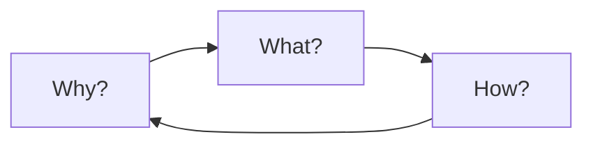

# Training Compass

Before diving into technical details, let's establish a **methodological framework** for making training decisions.

## The Three Questions

Every training decision should answer three questions:



### 1. Why? (Rationale)

- What problem are we solving?
- Why this approach vs alternatives?
- What evidence supports this choice?

### 2. What? (Specification)

- What are we actually building?
- What are the key components?
- What does success look like?

### 3. How? (Implementation)

- How do we implement this?
- How do we verify it works?
- How do we iterate based on results?

## Decision Framework

| Question | Key Considerations |
|----------|-------------------|
| **Why this architecture?** | Performance, efficiency, scalability |
| **Why this data?** | Quality, quantity, diversity |
| **Why this hyperparameters?** | Prior experiments, theoretical motivation |
| **Why this training duration?** | Convergence, compute budget |

## The Iteration Cycle

Training is fundamentally an **iterative process**:

```
┌─────────┐     ┌─────────┐     ┌─────────┐
│  Plan   │ ──▶ │  Act    │ ──▶ │ Observe │
└─────────┘     └─────────┘     └─────────┘
     ▲                           │
     └───────────────────────────┘
```

1. **Plan**: Hypothesize based on evidence
2. **Act**: Run experiments (small scale first!)
3. **Observe**: Collect metrics and qualitative feedback
4. **Iterate**: Refine hypothesis based on observations

## Small Before Large

> "Never run a large experiment before running a small one."

Our key principle: **validate cheaply before scaling**.

### The Ablation Pyramid

```
        ▲
       /│\        Large Scale (expensive)
      / │ \       Full training runs
     /  │  \
    /───┼──-\      Medium Scale
    │   │   │
    │   │   │      Small Scale (cheap)
    │   │   │
    └────────┘     Tiny Scale (quick)
```

Always start at the bottom and work your way up only when you've validated each level.

## Key Takeaways

1. **Ask "why" first** – understand the rationale before implementation
2. **Start small** – validate hypotheses cheaply
3. **Measure everything** – you can't improve what you can't measure
4. **Document decisions** – future you will thank present you

---

*Next: [Small Ablations →](/en/03-ablations)*
