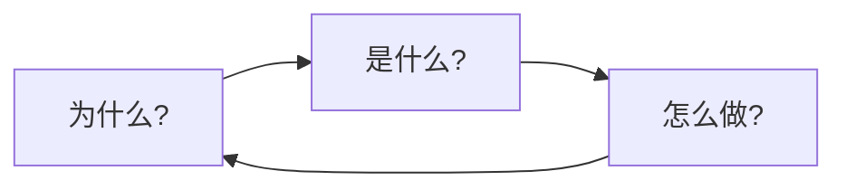

# 训练罗盘

在深入技术细节之前，让我们建立一个**方法论框架**，用于做出训练决策。

## 三个关键问题

每个训练决策都应回答三个问题：



### 1. 为什么？ (理由)

- 我们要解决什么问题？
- 为什么用这种方法而不是其他方案？
- 什么证据支持这个选择？

### 2. 是什么？ (规格)

- 我们实际上要构建什么？
- 关键组件是什么？
- 成功的标准是什么？

### 3. 怎么做？ (实现)

- 我们如何实现？
- 我们如何验证它是否有效？
- 我们如何根据结果迭代？

## 决策框架

| 问题 | 关键考量 |
|------|---------|
| **为什么用这个架构？** | 性能、效率、可扩展性 |
| **为什么用这个数据？** | 质量、数量、多样性 |
| **为什么用这组超参数？** | 先前实验、理论动机 |
| **为什么训练这么久？** | 收敛性、算力预算 |

## 迭代循环

训练本质上是**迭代过程**：

```
┌─────────┐     ┌─────────┐     ┌─────────┐
│  计划   │ ──▶ │  执行   │ ──▶ │  观察   │
└─────────┘     └─────────┘     └─────────┘
     ▲                           │
     └───────────────────────────┘
```

1. **计划**：基于证据提出假设
2. **执行**：运行实验（先从小规模开始！）
3. **观察**：收集指标和定性反馈
4. **迭代**：根据观察结果优化假设

## 先小后大

> "永远不要在大规模实验之前不先做小规模实验。"

我们的核心原则：**在规模化之前先低成本验证**。

### 消融金字塔

```
        ▲
       /│\        大规模 (昂贵)
      / │ \       完整训练运行
     /  │  \
    /───┼──-\      中等规模
    │   │   │
    │   │   │      小规模 (便宜)
    │   │   │
    └────────┘     极小规模 (快速)
```

始终从底部开始，只有在每个层级都验证通过后才向上推进。

## 关键要点

1. **先问"为什么"** – 在实现之前理解理由
2. **从小开始** – 低成本验证假设
3. **测量一切** – 无法测量的就无法改进
4. **记录决策** – 未来的你会感谢现在的你

---

*下一章：[小型消融实验 →](/zh/03-xiaoxiao)*
